<!--toc:start-->
- [Intro](#intro)
- [January 9, 2025 - Printing an AMS Stacker](#january-9-2025-printing-an-ams-stacker)
- [January 12, 2025 - Capstone Prototype v1](#january-12-2025-capstone-prototype-v1)
- [January 14, 2025 - 3rd Place in Ontario Engineering Competition](#january-14-2025-3rd-place-in-ontario-engineering-competition)
- [February 4, 2025 - Capstone Prototype v2](#february-4-2025-capstone-prototype-v2)
- [February 13, 2025 - Capstone Prototype v3](#february-13-2025-capstone-prototype-v3)
- [March 1, 2025 - Capstone Prototype v4](#march-1-2025-capstone-prototype-v4)
- [March 23, 2025 - 1st Place in Figma Challenge](#march-23-2025-1st-place-in-figma-challenge)
- [March 28, 2025 - Pokemon Journey Together ETBs](#march-28-2025-pokemon-journey-together-etbs)
- [April 4, 2025 - 1st Place in Capstone Exhibition](#april-4-2025-1st-place-in-capstone-exhibition)
- [May 15, 2025 - Consensus Conference](#may-15-2025-consensus-conference)
- [June 5, 2025 - Graduation](#june-5-2025-graduation)
- [June 15, 2025 - Prince Edward Island](#june-15-2025-prince-edward-island)
- [June 27, 2025 - Pulling a Greninja ex SIR](#june-27-2025-pulling-a-greninja-ex-sir)
- [June 29, 2025 - Stray Kids Concert](#june-29-2025-stray-kids-concert)
- [October 1, 2025 - Presenting at SecTor 2025](#october-1-2025-presenting-at-sector-2025)
- [October 4, 2025 - 2nd Place NASA Space Apps 2025](#october-4-2025-2nd-place-nasa-space-apps-2025)
- [October 17 to 24, 2025 - Singapore Trip 1](#october-17-to-24-2025-singapore-trip-1)
- [November 18, 2025 - Building a new gaming PC](#november-18-2025-building-a-new-gaming-pc)
- [November 29, 2025 - Making Trophies and Judge Advising for LEGO Robotics Tournament](#november-29-2025-making-trophies-and-judge-advising-for-lego-robotics-tournament)
- [November 30 to December 7, 2025 - Singapore Trip 2](#november-30-to-december-7-2025-singapore-trip-2)
- [December 14, 2025 - Building another PC for my other nephew](#december-14-2025-building-another-pc-for-my-other-nephew)
- [December 21, 2025 - AMS v2 Stacker](#december-21-2025-ams-v2-stacker)
- [December 23, 2025 - PSA 10 Greninja ex](#december-23-2025-psa-10-greninja-ex)
<!--toc:end-->

## Intro

Happy New Year's everyone! Ever year I like to write a career wrap up blog.
This marks my second wrap up blog.

Check out last year's:
"[Jeremy's 2024](https://medium.com/@madivoso/jeremys-2024-7694be03c79e)"
on Medium.

I like to mention at least one thing each month.

If you have any questions, feel free to reach out to me on 
[LinkedIn](https://jeremytubongbanua.github.io/contact)!

## January 9, 2025 - AMS v1 Stacker

I printed an AMS stacker for stacking my two AMS units which
sat nicely next to my 3D printer.

This was Jaxel's V1 of his AMS Stacking System and his files can be found on [MakerWorld](https://makerworld.com/en/models/105669-v1-ams-stacking-system?from=search).

(In December, you'll find that I upgraded this stacker the same author's version 2)

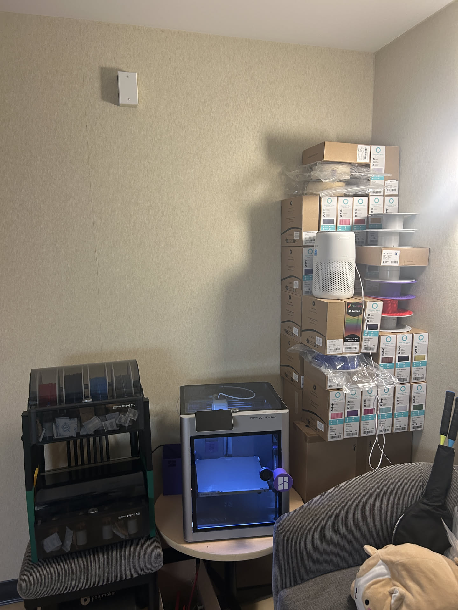

While on that topic, I tried some other 3D printing mods like this lid riser and screen cover. I didn't end up keeping those mods as I didn't find much utility from them.

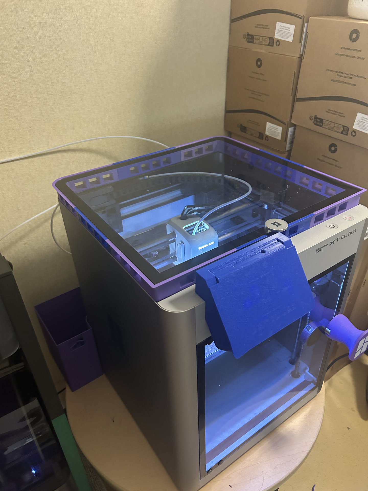

## January 12, 2025 - Capstone Prototype v1

January marked my final semester of my university undergraduate degree. All engineering disciplines require you to complete a final year eight month long capstone project. For my capstone project, we were tasked with creating a "Blind Person Assistant" which will assist the visually impaired with navigation.

More specifically, my group decided to focus on indoor navigation, as we felt there was a gap in that area of visually impaired navigation assistants. Our solution (as you will later find out) involves a smart headset (camera and sensors), a white cane attachments (buttons and motors) and a raspberry pi/router that clips onto your belt. The project involved machine learning, 3D printing, sensors and actuators, and Raspberry Pis.

This is what the first prototype of my capstone looked like. Continue reading until April to see the final version of my capstone project. Below is a picture of my wearing the 3D printed headset with a [Luxonis Oak-D Lite](https://shop.luxonis.com/products/oak-d-lite-1?srsltid=AfmBOoo5z4KmMnoOSoCjYhDvwlmJbwvkKhePnjVQZcSx6laPt7XJblYL) mounted on.

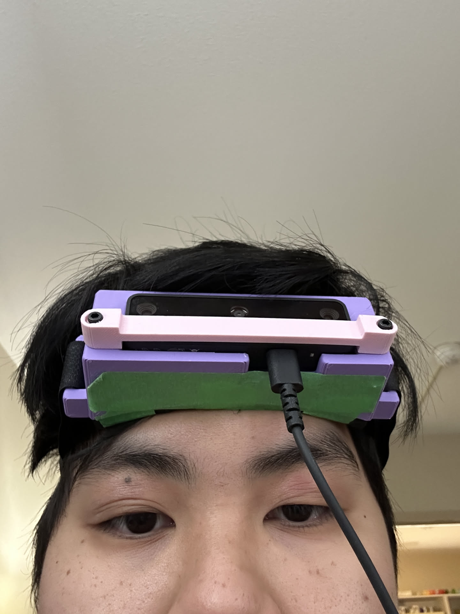

Below is me training the machine learning model on pictures me and my group took around campus.

We wanted the machine learning model to work on campus objects (like doors and signs) so that during the exhibition, the model would work best.

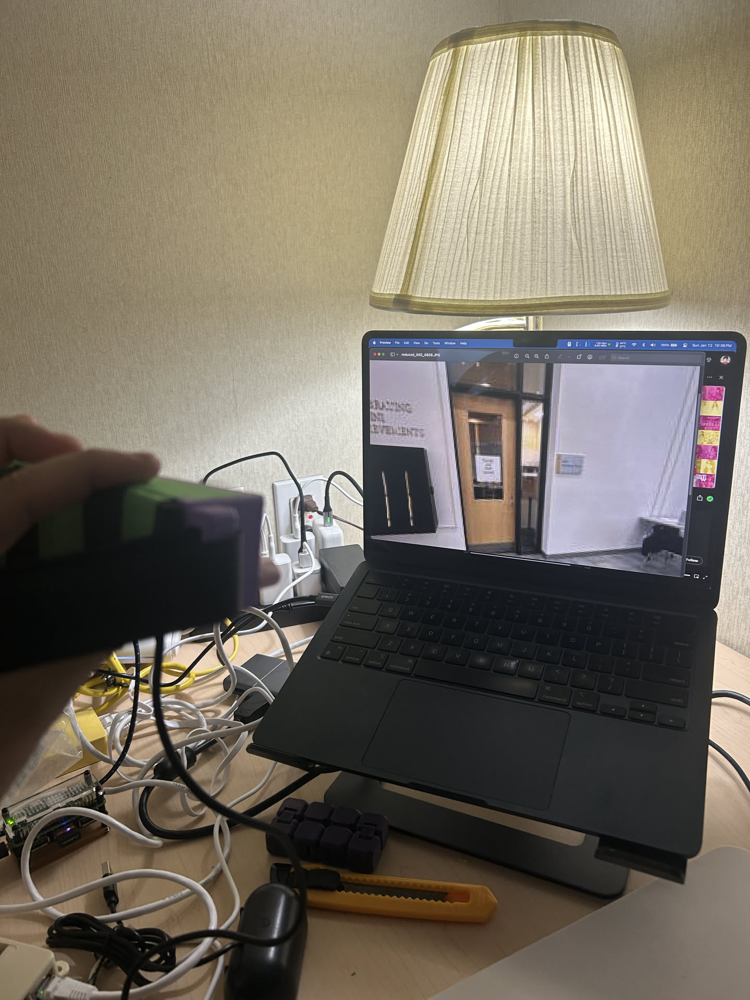

## January 14, 2025 - 3rd Place in Ontario Engineering Competition

Every year, Ontario hosts a highly competitive engineering competition open only to engineering students who are chosen by their respective Engineering societies.

Me along with three other friends won the internal engineering competition which allowed us to move onto the ontario level.

Below is a picture of my nametag. I competed in the Programming division along with three other friends.

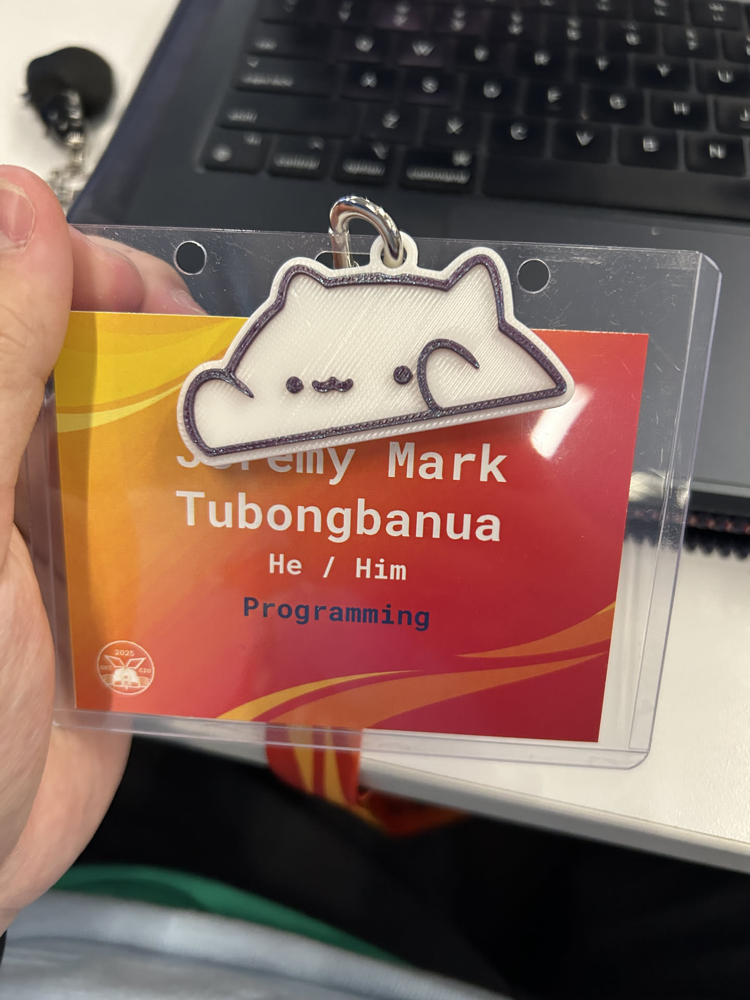

My team ended up placing 3rd overall (beating Waterloo!)

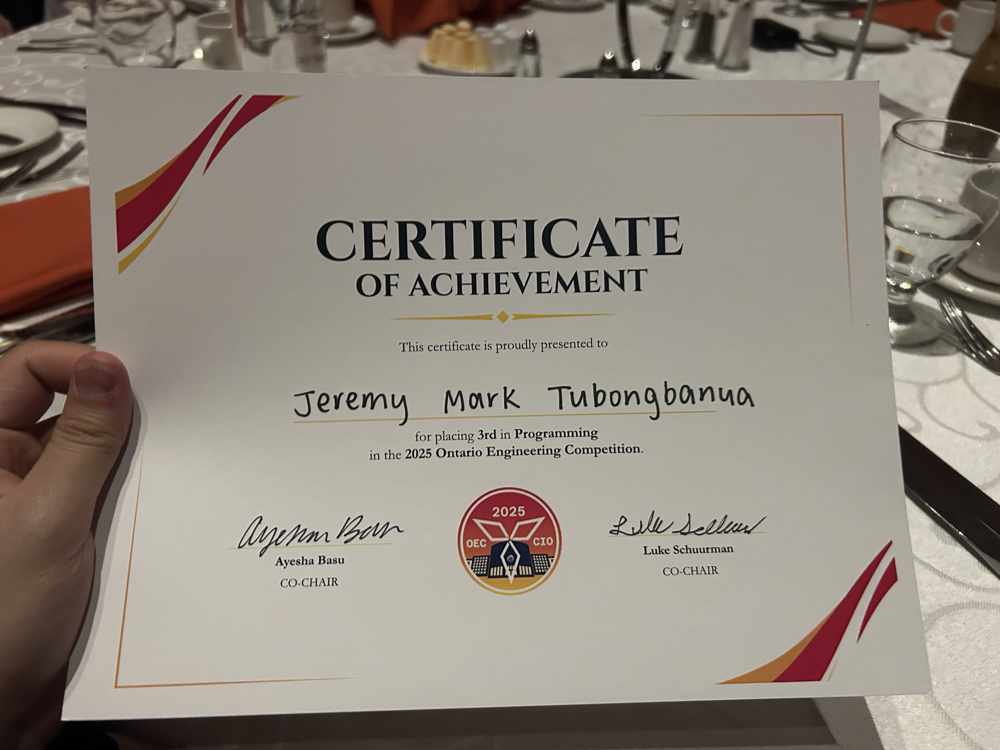

Our project helped with reporting and categorizing natural disasters. We dockerized and implemented a distributed system-like architecture for scalability and longevity.

[GitHub Link](https://github.com/jeremytubongbanua/oec_2025)

## February 4, 2025 - Capstone Prototype v2

This is the second prototype of my capstone project. It's an improved headset with more electronics mounted on.

The camera is now mounted upside down. Alongside that, there's also a speaker and a IMU mounted on.

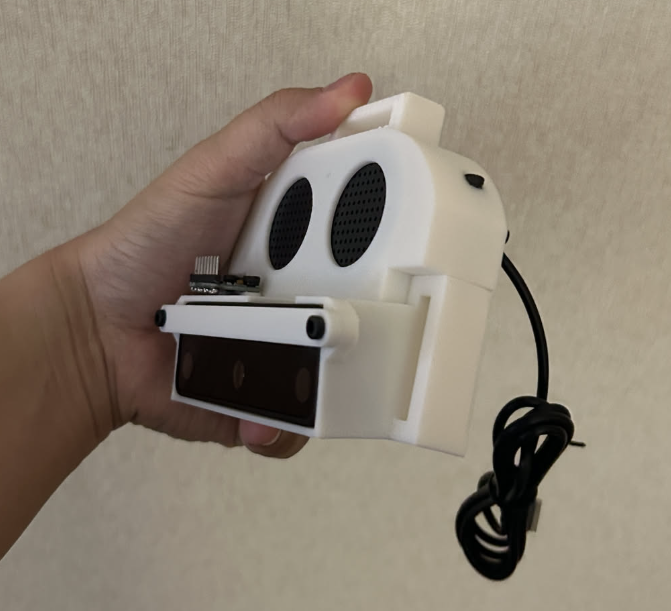

As I continued the physical development of the capstone through 3D printing, I became very comforatble with tolerances between parts and designing modular 3D printed parts together using M3 heated inserts and screws.

## February 13, 2025 - Capstone Prototype v3

This is the final prototype of the headset that we went with. The IMU is mounted on its side now, and we can just tweak the software and flip some axes for the IMU to act the same way we want it to.

Additionally, there's a velcro strap so that you can actually wear it.

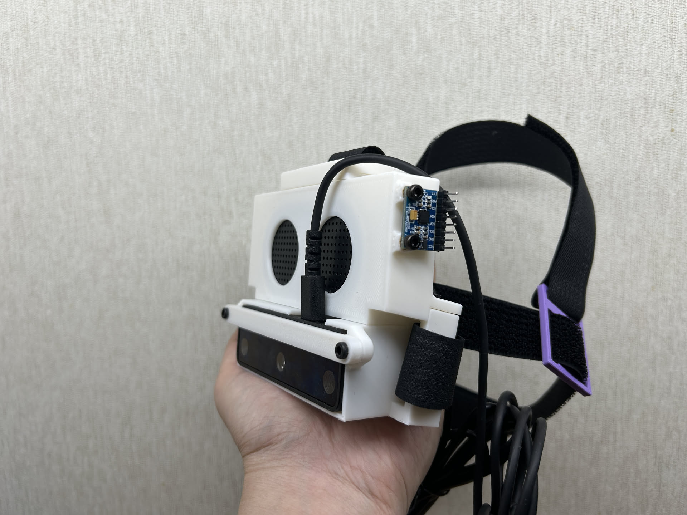

Alongside the headset, the cane attachment and belt attachment began to take shape.

The cane has two buttons, a Raspberry Pi 0, a power bank, and vibration motors controlled by relay modules.

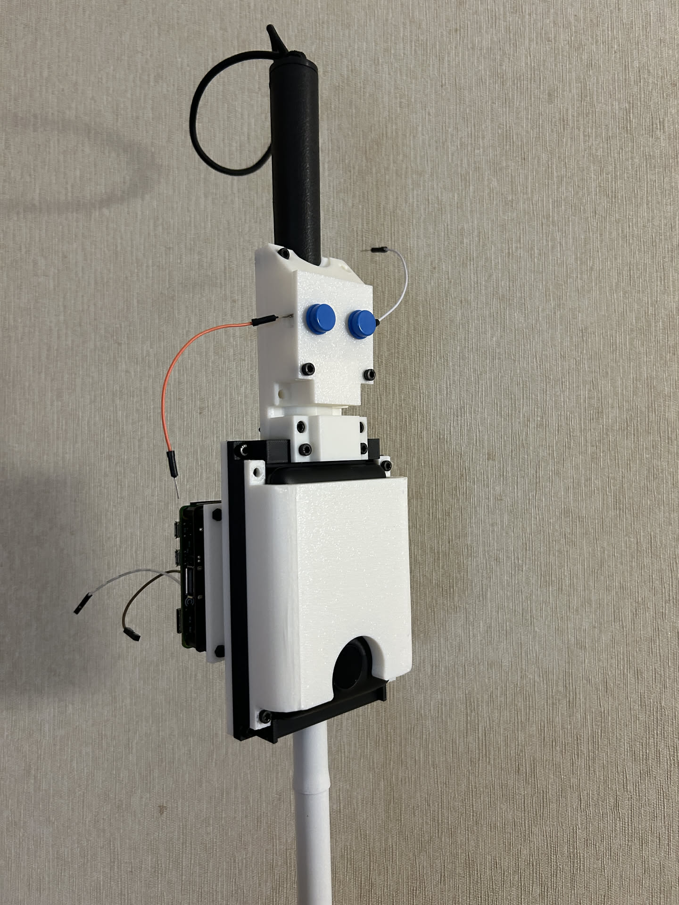

Below is the Raspberry Pi and Mini Router that you would clip onto your belt.

Hidden behind it is also a power bank to power both devices.

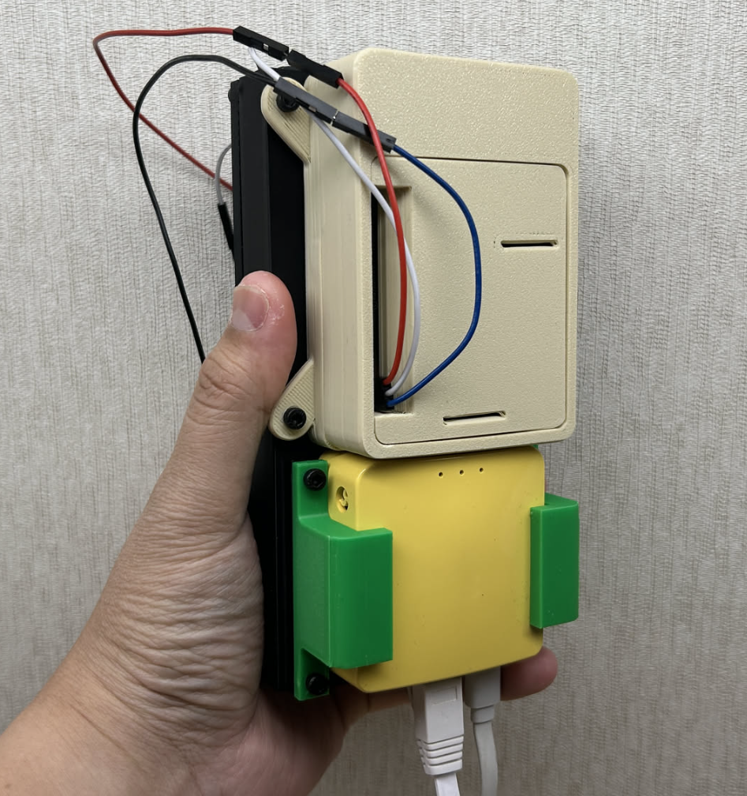

## March 1, 2025 - Capstone Prototype v4

We finished wiring up the cane. Now the raspberry pi can actuate the vibration motors through the relay modules. We used WAGO connectors as 5V and GND terminals.

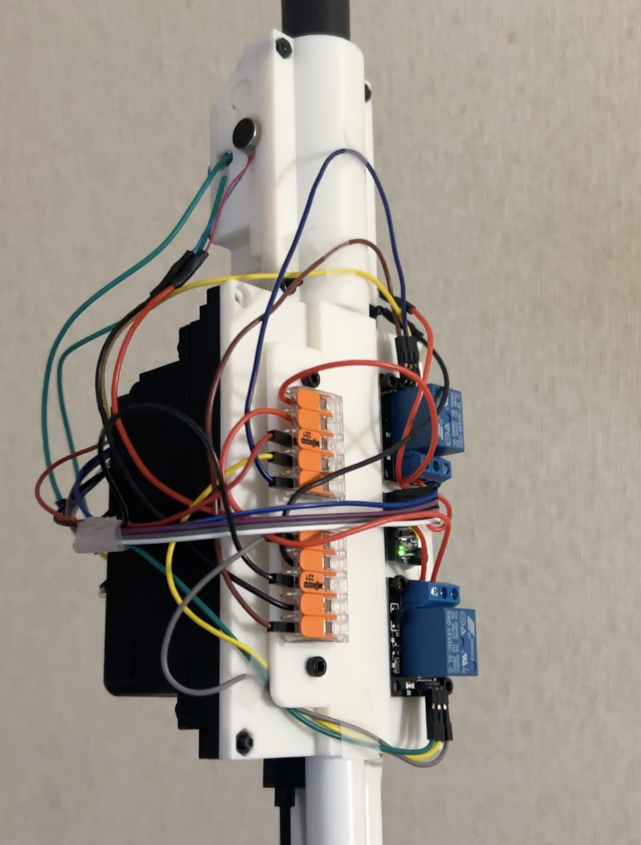

## March 23, 2025 - 1st Place in Figma Challenge

Won 1st place in a Figma design challenge hosted by the Autonomous Drive Club at OTU. It was a 2-hour quick design competition where groups had to design a rich user interface/experience for autonomous vehicles. I was in a group with my sister and one of my peers, and won 1st overall! I think we won a $50 gift card or something.

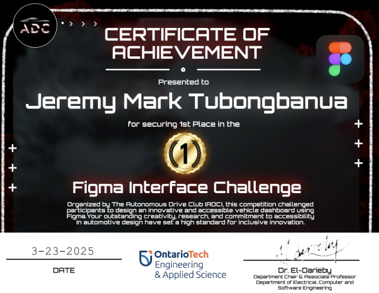

## March 28, 2025 - Pokemon Journey Together ETBs

Me and a couple of friends woke up early and lined up for the new Journey Together ETB release!

ETB stands for "Elite Trainer Box" and contains 9-11 pokemon booster packs and accessories for playing the Pokemon Trading Card game. Most people want this product for the packs, which is the hot commodity nowadays.

I also pulled two Iono's Bellibolt ex SIRs!!!

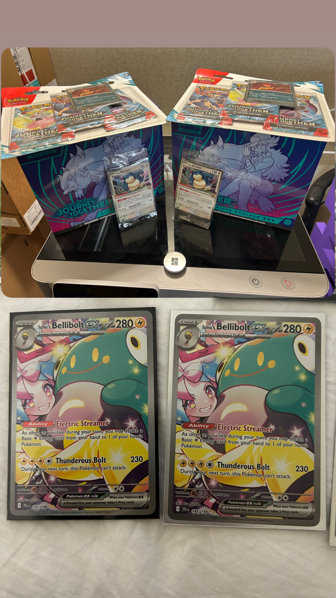

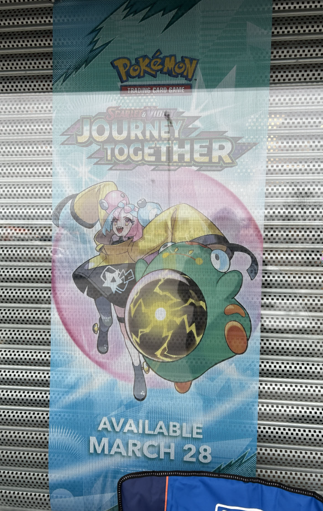

## April 4, 2025 - 1st Place in Capstone Exhibition

My capstone group won 1st place out of all electrical and software capstone projects! We won first place out of [32 capstone groups](https://engineering.ontariotechu.ca/current-students/current-undergraduate/capstone/2025-ecse-capstone-projects.php).

The capstone project is a lot to explain, so I recommend checking out the GitHub repository and 3 minute YouTube video below.

Links:
- GitHub Link - [https://github.com/jeremytubongbanua/blind_person_assistant](https://github.com/jeremytubongbanua/blind_person_assistant)
- 3 minute YouTube video - [https://www.youtube.com/watch?v=-XyYb4GPD1U](https://www.youtube.com/watch?v=-XyYb4GPD1U)

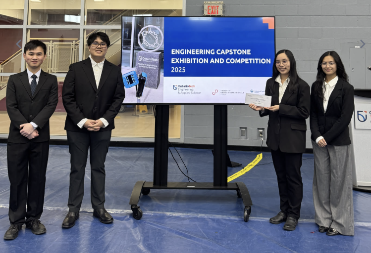

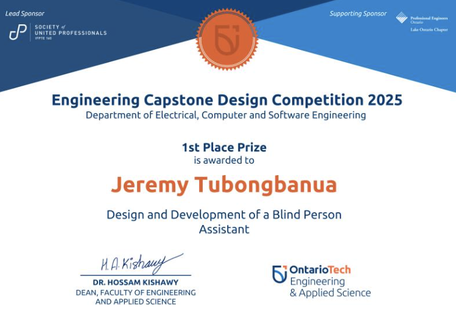

## May 15, 2025 - Consensus Conference

Not much happened in May. I received a return offer from my company and began working full time.

But I did attend a crypto conference. Lots of students were attending because of the hackathon they were also running. I left half way through the day as I still had work left to do and there wasn't much for me to do at this conference except for collect some free socks.

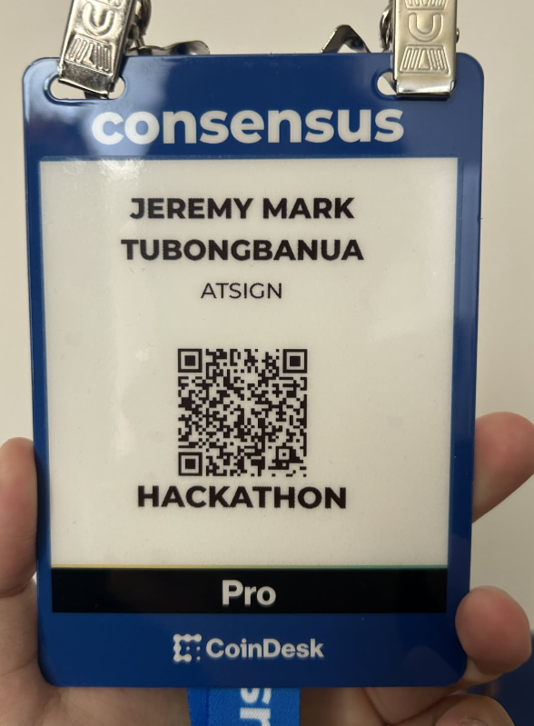

## June 5, 2025 - Graduation

Graduated with a bachelor's of software engineering from Ontario Tech University.

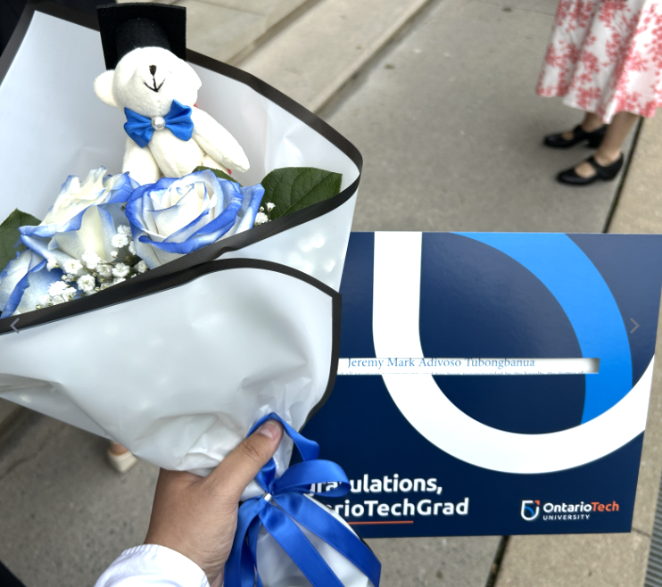

My degree that I spent $30,000 CAD and 4 years getting:

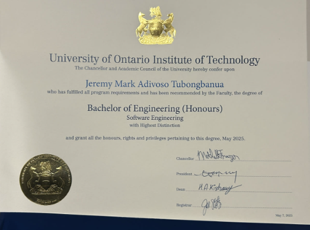

## June 15, 2025 - Prince Edward Island

My family went on a weekend trip to Prince Edward Island. We visited lots of places and pokemon card shops.

I like to open packs in random places during vacation trips..

I got a team rocket's giovanni on Charlottetown Waterfront:

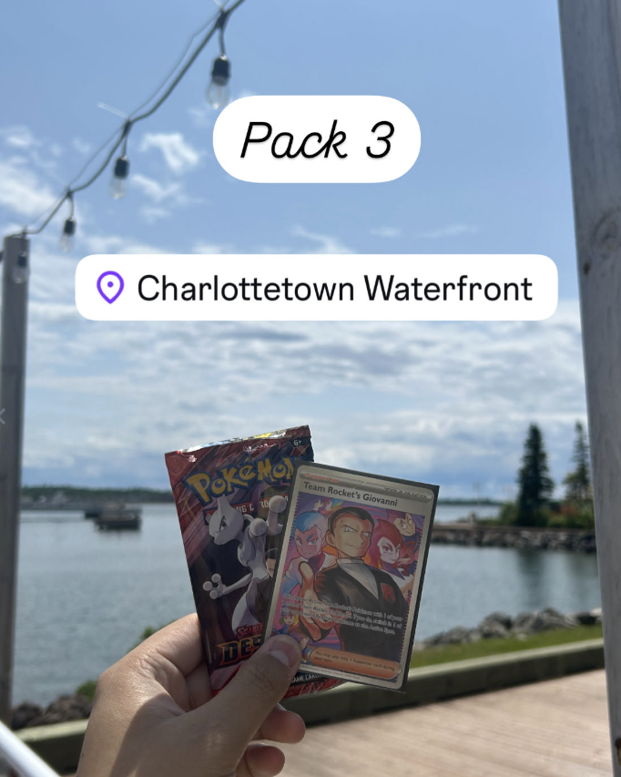

and a full-art Team Rocket's Mewtwo Ex at the French River:

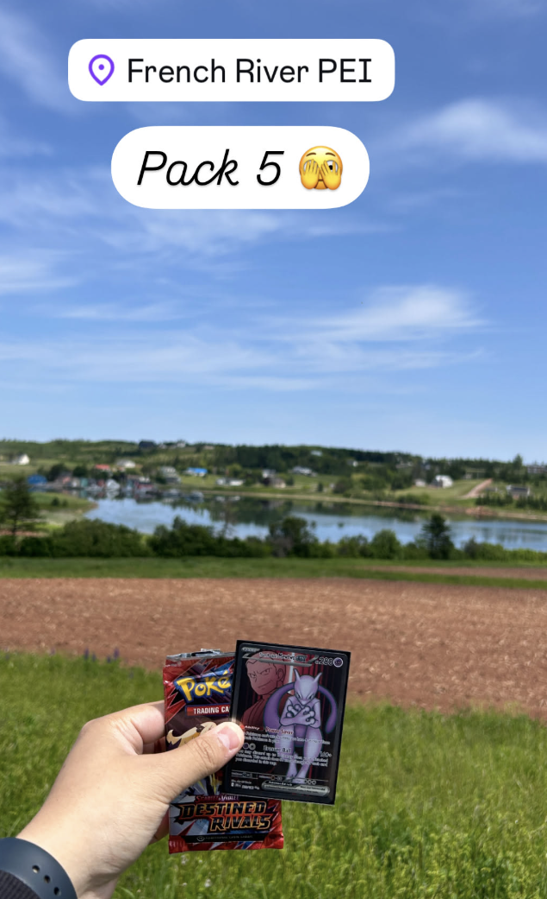

Here are some nice photos from PEI. A local told us that the weekend we arrived was the first weekeend without rain in months. Lucky!

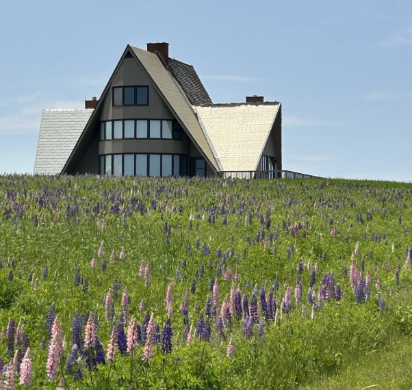

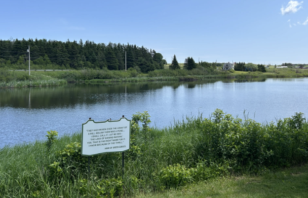

## June 27, 2025 - Pulling a Greninja ex SIR

Pulled the chase card from Twilight Masquerade.

The pack came from a Lillie's Premium Collection that I bought off someone from Facebook marketplace. This product just so happens to have only one twilight masquerade pack inside so I got very lucky with this pull.

Raw, this card goes for $100-$200...

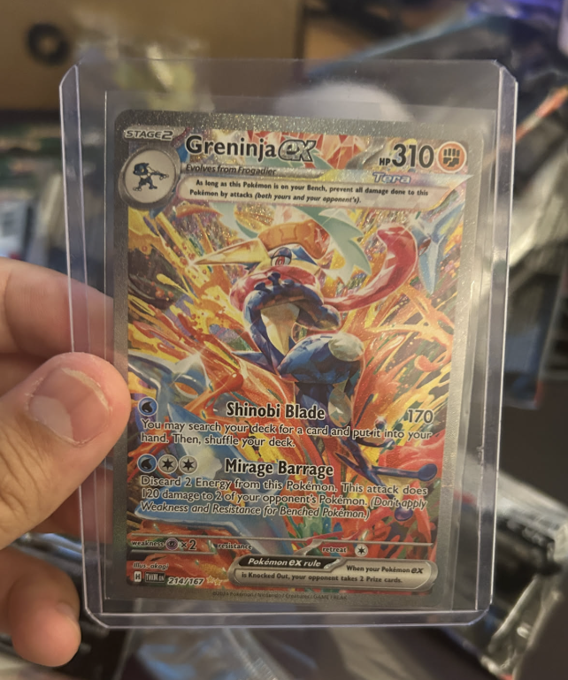

## June 29, 2025 - Stray Kids Concert

Went to my first ever concert - Stray Kids in Toronto.

I went to a total of three concerts this year, and this was my favourite. I ended up having multiple SKZ songs in final year Spotify Wrapped.

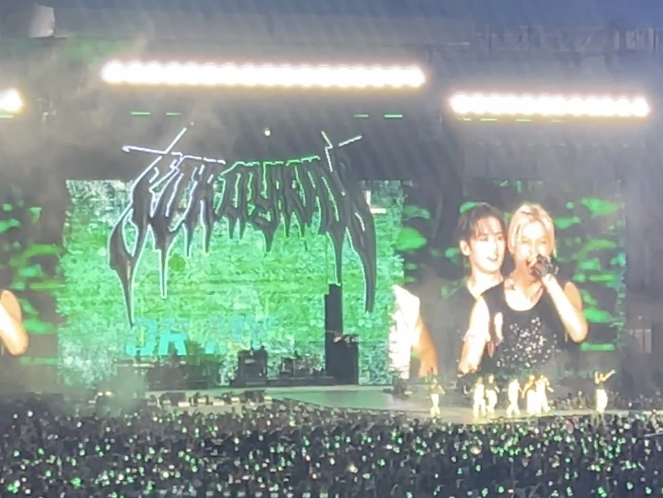

## October 1, 2025 - Presenting at SecTor 2025

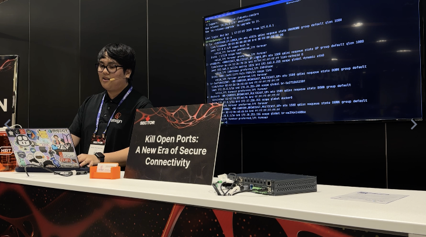

## October 4, 2025 - 2nd Place NASA Space Apps 2025

This is the 4th competition win this year.

This time, it was 2nd place in a NASA hackathon hosted by the business faculty from Ontario Tech University. I think our team won a total of $200 in Amazon gift cards.

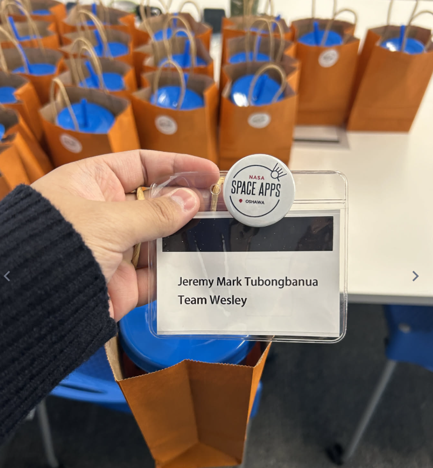

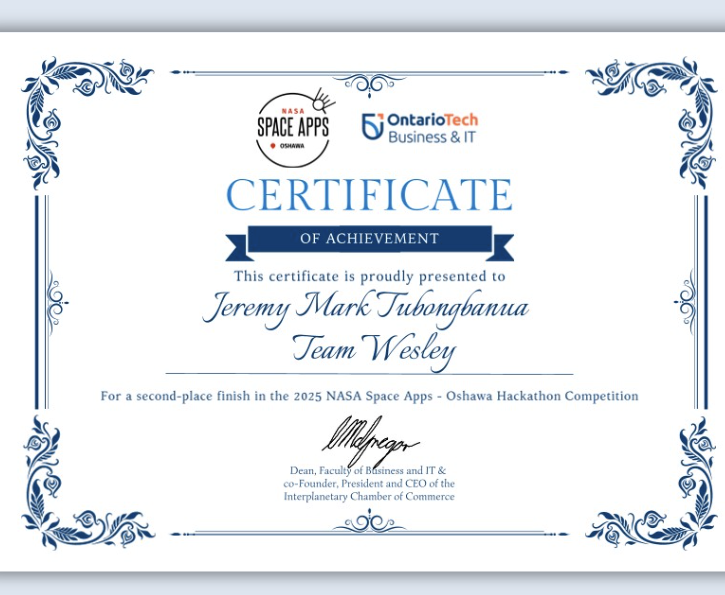

## October 17 to 24, 2025 - Singapore Trip 1

This was my first singapore trip this year. It was a week long, but I arrived a little earlier to do some tourism. I did all the usual Singapore things like go to the Marina Bay, Gardens by the Bay, visit the big malls, and go to Sentosa Island.

During this trip, I was the technical rep for my company at GovWare. GovWare is a very big annual cybersecurity conference in Singapore.

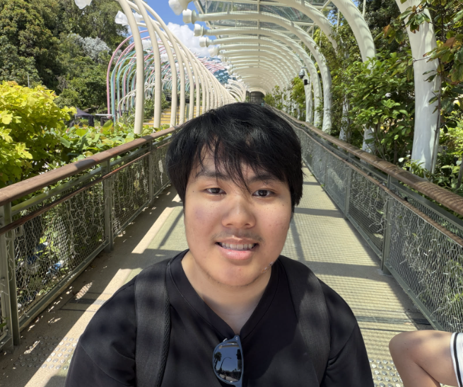

Representing the company at the conference was fun. Compared to other conferences, this is my most second favourite, right behind CES in 2024.

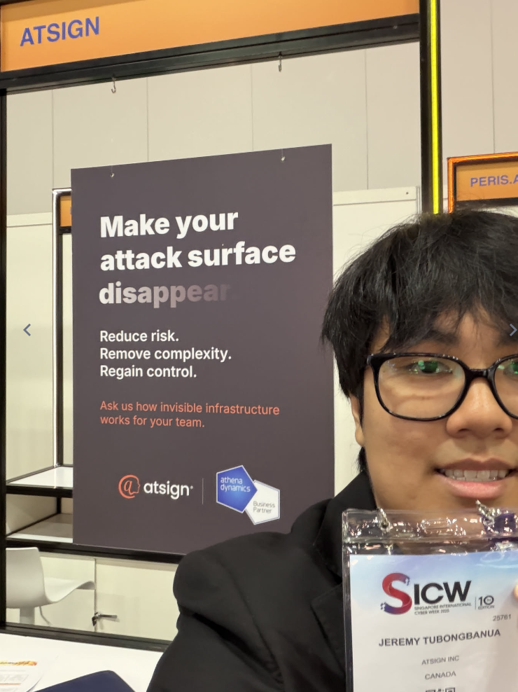

Of course, at the end of the trip I had to visit the Pokemon Center!

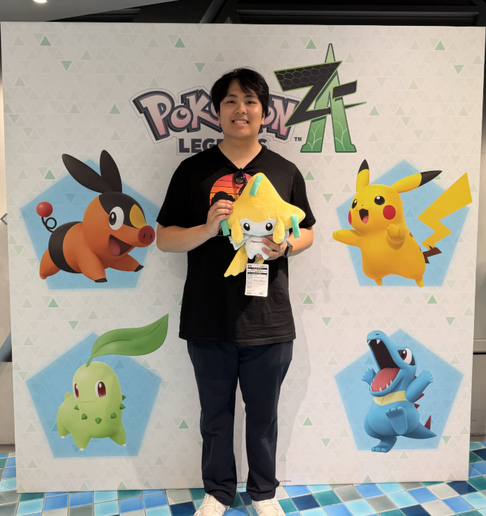

Jewel Changi Airport

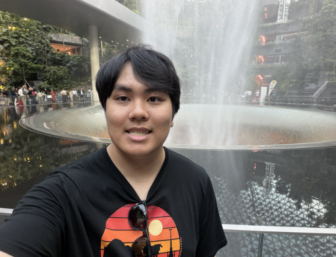

Hotel View was amazing as well

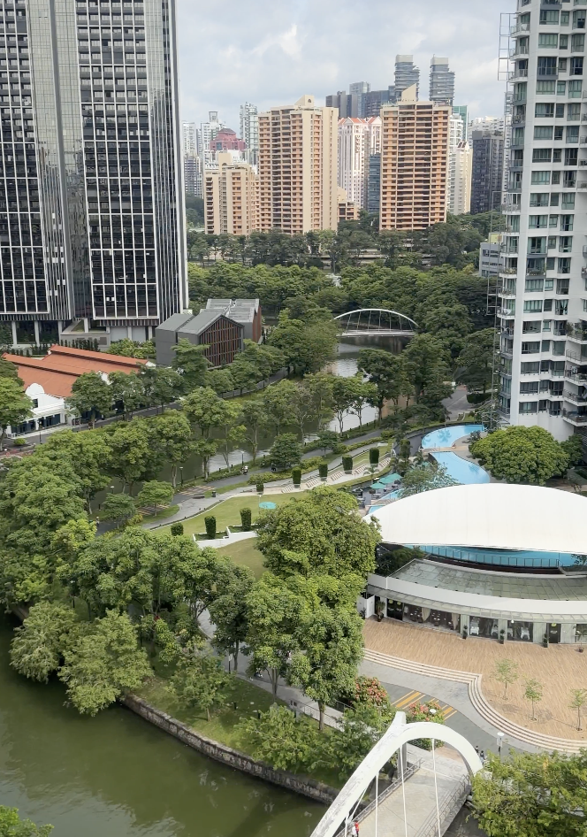

## November 18, 2025 - Building a New Gaming PC

I haven't upgraded my PC parts in 5 years (now becoming 6 years by 2026) so I thought it was finally time to upgrade, especially now that Hytale will be coming out soon.

I was lucky enough to buy a CPU+Motherboard+32GB RAM bundle from Canada Computers for $500 CAD. It has since now jumped to $600-$800 CAD now that RAM prices have jumped due to the AI buzz lately. I am very happy I bought the parts when I did.

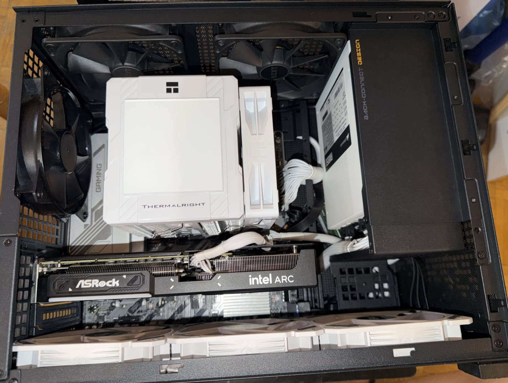

The PC parts are all mostly new, except for the fans which were salvaged from my old build.

Spec List:

- CPU: Ryzen 5 7600x3D (4.1 GHz 6-Core Processor)
- CPU Cooler: Thermalright Peerless Assassin 120
- MOBO: Gigabyte B650M Gaming Plus WiFi Micro ATX AM5
- RAM: T-Force Vulcan 2 x 16 GB DDR5-6000 
- SSD: Samsung 990 Pro w/ Heatsink 2 TB
- GPU: ASRock Challenger OC Arc B580 12 GB
- Case: Jonsbo D32 Pro MicroATX
- PSU: Corsair RM850e (2025) 850W Fully Modular ATX
- 6 120mm fans (3x RGB, 2x NZXT case fans, and 1 coolermaster fan)

## November 29, 2025 - Making Trophies and Judge Advising for LEGO Robotics Tournament

Every year, I like to volunteer at my high school's annual FIRST Lego League Tournament. This tournament serves as both an action-packed community event with competitive lego robotics and as a fundraiser for my high school's [FRC](https://firstroboticscanada.org/frc/) team.

For this year, I helped them design and 3D print the 9 awards to be given out at this competition. Below is a picture of the 9 awards that were given out at our event. They are different colours because we underestimated how much filament we needed for the awards. Next time, I will remember to use less infill. 

The design of the trophy went through 5-7 iterations. The final iteration is printed in 3 parts: the trophy lego brick base, the FIRST logo trophy topper, and the award plate with the text. Then, these parts are super-glued together.

During the actual tournament, I played a key volunteer role as the Judge Advisor - leading a batch of 12 adult judges. Judging is the best volunteer role in any FIRST Robotics tournament. It's a chill role because you get some peaceful time with other passionate adults.

I was awarded the Volunteer Appreciation Award as well

## November 30 to December 7, 2025 - Singapore Trip 2

Right after the robotics tournament, I rushed back home to pack for my second Singapore trip this year.

This was another fun business trip, doing solutions engineering for Atsign.

I had a lot of fun meeting Atsign's clients and business partners. 

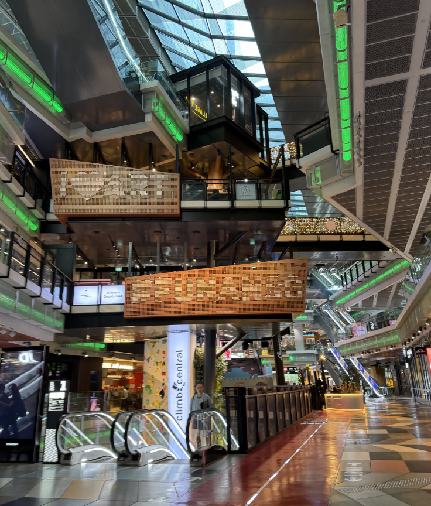

There was this fun Mofusand event going on in Singapore and Mofusand was everywhere!!!

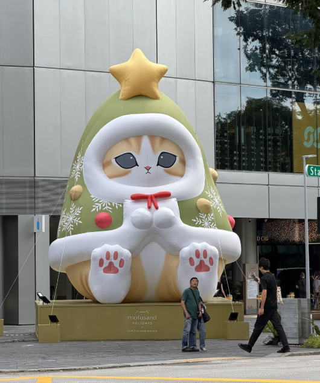

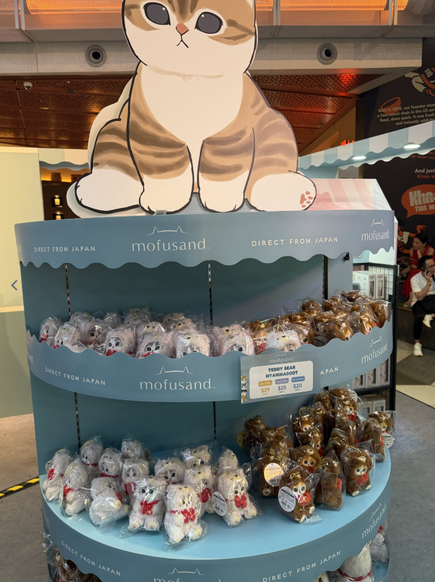

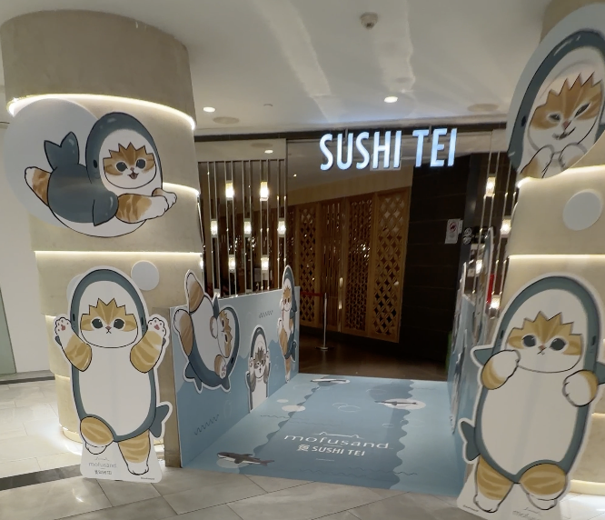

During the trip, I brought some cool gadgets:

- GL-INet Travel Router
- Beelink Mini PC (500GB)

It's so much fun bringing these two little guys around because I can spin up some VMs without having to run them on my laptop to save memory, space, and just overall keeping those things separate is great.

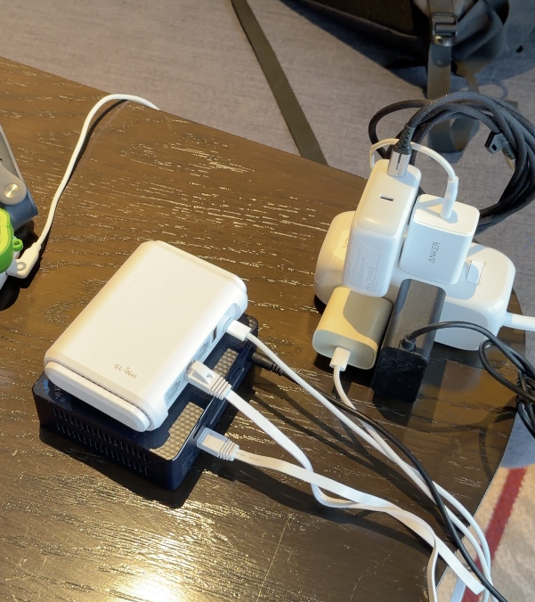

This was the view from the swimming pool

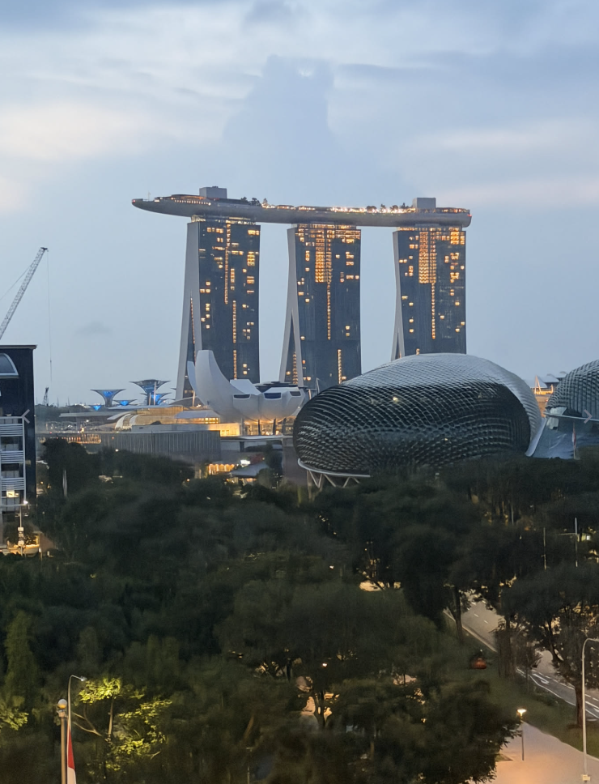

## December 14, 2025 - Building Another PC For My Other Nephew

In my 2024 blog, I built a PC for my nephew. This time I'm building another PC for his brother.

This time, it's out of spare parts I had lying around the house. I'm quite happy with this build because I feel it delivers great performance with such a low budget.

It has a Ryzen 3 3200G with Stock Cooler, Kingston 240GB SSD, CX450 PSU, Pro M-2 MSI Motherboard and a Q300L Cooler Master case. The PC isn't the flashiest, but I did not spend any additional money making this computer and it delivers more performance than his current one, so I call that a huge win!

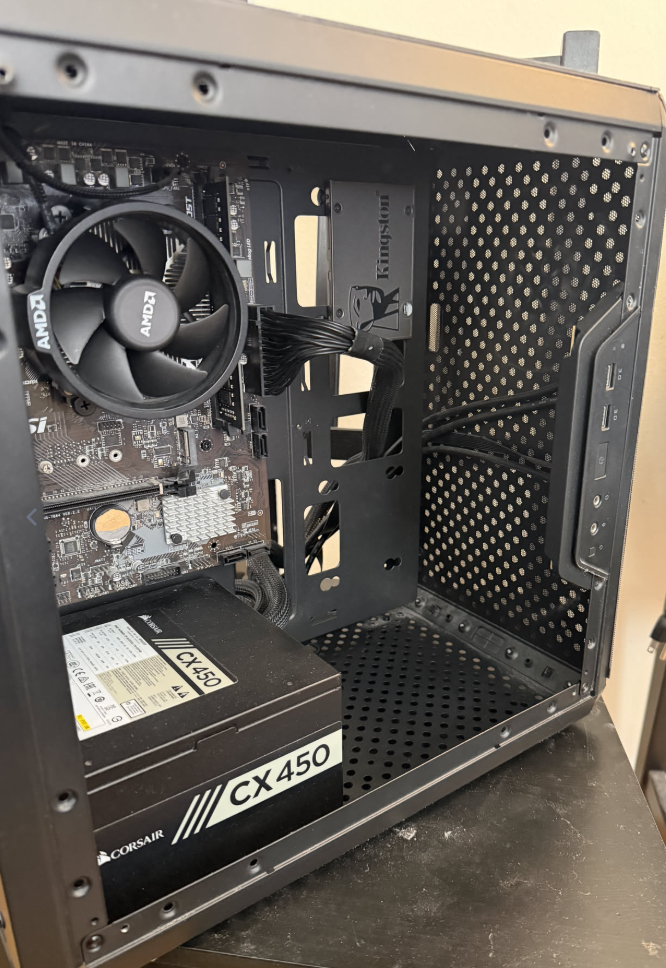

## December 21, 2025 - AMS v2 Stacker

I finished building the version two of the AMS stacker. I had to buy drawer slides from Rona (the hardware store) and screw them into the 3D printed parts. 

The filament of choice is [Polymaker's Black HT-PLA](https://ca.polymaker.com/products/polymaker-ht-pla?srsltid=AfmBOooGGTyw1mqEsE1MEsm93vHsbi3gqn7BxnE5kRD8NelrfMkFQMz6&variant=51950260060530). I love their high temperature PLA formula. It does the trick (lives in hot environments) and keeps its form. I expect this AMS stacker to last a long time.

The files are from Jaxel and can be found on [Makerworld](https://makerworld.com/en/models/1531539-v2-am4xs-ams-sliding-stacking-system#profileId-1610646).

## December 23, 2025 - PSA 10 Greninja ex

The Greninja (which is the chase card from Twilight Masquerade) that I pulled earlier in the year finally came back from grading with PSA.

It for some reason came back a 10. What's funny is that I even dropped the card after I pulled it, and it still somehow came back a perfect 10.

I am not complaining though, because this card peaked at $1100 CAD but is now around $750 as of writing this.

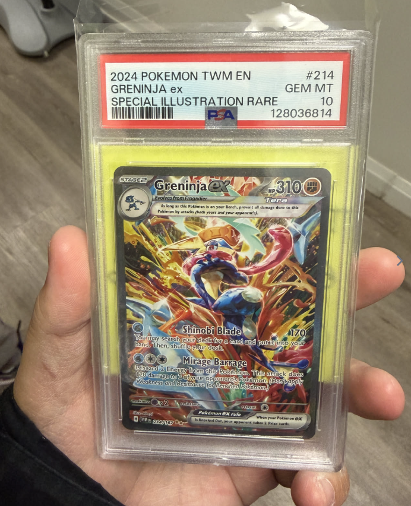

