## Intro

Happy New Year's everyone! Ever year I like to write a career wrap up blog.
This marks my second wrap up blog.

Check out last year's wrapped on Medium:
"[Jeremy's 2024](https://medium.com/@madivoso/jeremys-2024-7694be03c79e)". From now on, I will likely be writing the rest of my blogs on my website.

## January 9, 2025 - AMS v1 Stacker

I printed an AMS stacker for stacking my two AMS units which
sat nicely next to my 3D printer.

This was Jaxel's V1 of his AMS Stacking System and his files can be found on [MakerWorld](https://makerworld.com/en/models/105669-v1-ams-stacking-system?from=search).

(In December, you'll find that I upgraded this stacker the same author's version 2)

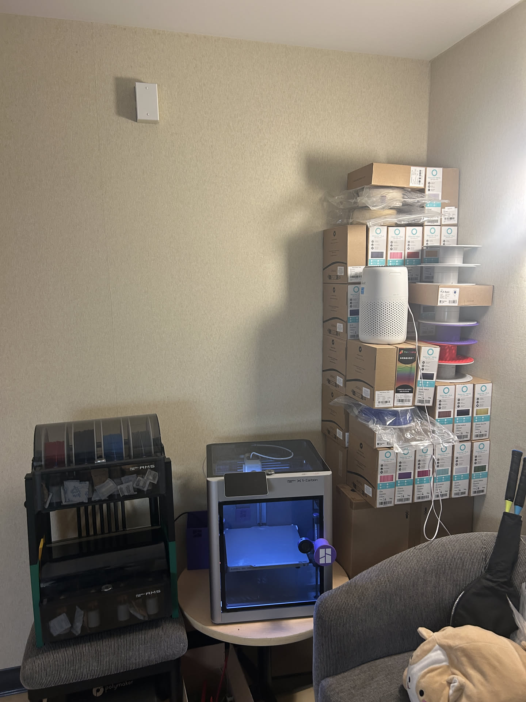

While on that topic, I tried some other 3D printing mods like this lid riser and screen cover. I didn't end up keeping those mods as I didn't find much utility from them.

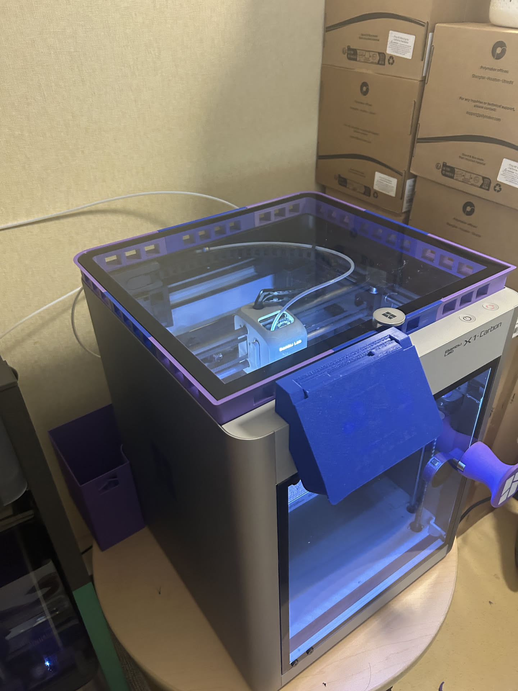

## January 12, 2025 - Capstone Prototype v1

January marked my final semester of my university undergraduate degree. All engineering disciplines require you to complete a final year eight month long capstone project. For my capstone project, we were tasked with creating a "Blind Person Assistant" which would assist the visually impaired with navigation.

More specifically, my group decided to focus on indoor navigation, as we felt there was a gap in that area of visually impaired navigation assistants. Our solution (as you will later find out) involves a smart headset (camera and sensors), a white cane attachments (buttons and motors) and a raspberry pi/router that clips onto your belt. The project involved machine learning, 3D printing, sensors and actuators, and Raspberry Pis.

This is what the first prototype of my capstone looked like. Continue reading until April to see the final version of my capstone project. Below is a picture of my wearing the 3D printed headset with a [Luxonis Oak-D Lite](https://shop.luxonis.com/products/oak-d-lite-1?srsltid=AfmBOoo5z4KmMnoOSoCjYhDvwlmJbwvkKhePnjVQZcSx6laPt7XJblYL) mounted on. Later on, we added a couple more electronics to the headset. But for now, this was just a simple test to see how we would design the general form factor of the headset.

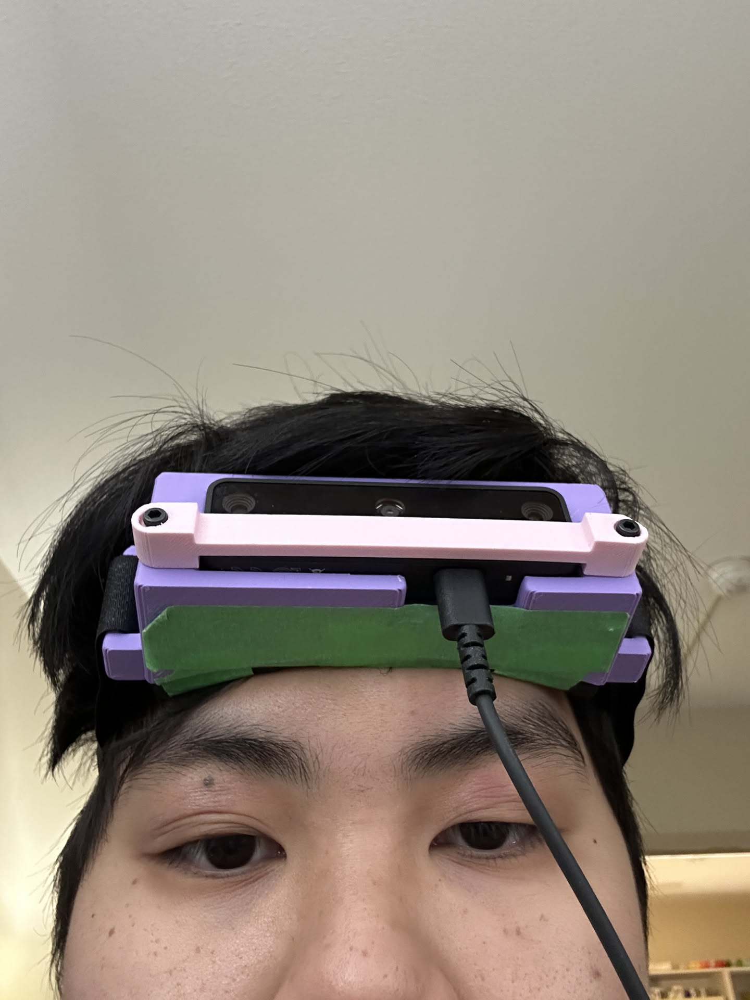

Below is me training the machine learning model on pictures me and my group took around campus.

We wanted the machine learning model to work on campus objects (like doors and signs) so that during the exhibition, the model would work best.

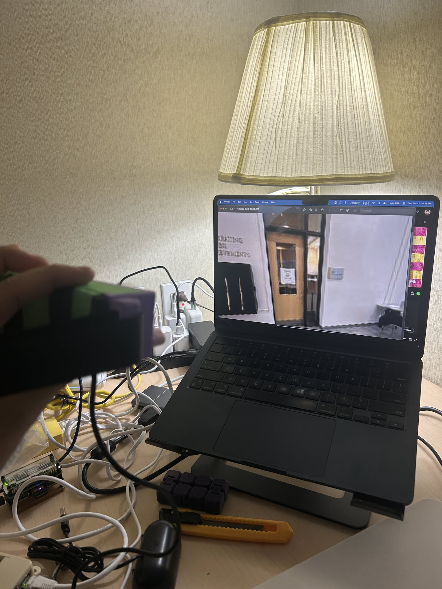

## January 14, 2025 - 3rd Place in Ontario Engineering Competition

Every year, Ontario hosts a highly competitive engineering competition open only to engineering students who are chosen by their respective Engineering societies.

Me along with three other friends won the internal engineering competition which allowed us to move onto the ontario level.

Below is a picture of my nametag. I competed in the Programming division along with three other friends.

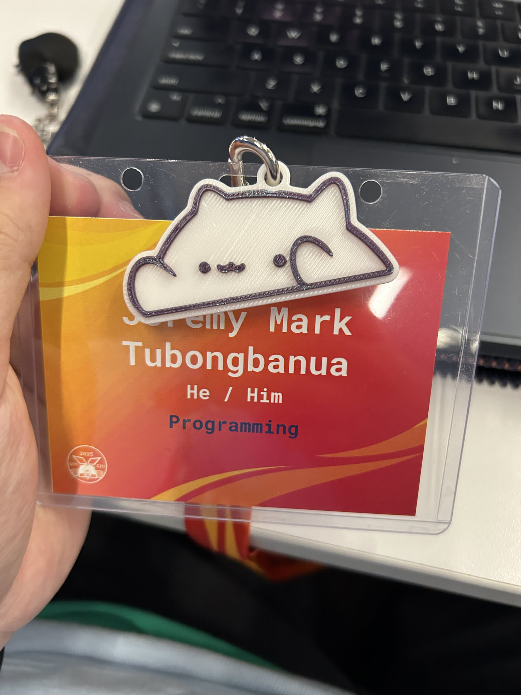

My team ended up placing 3rd overall (beating Waterloo!)

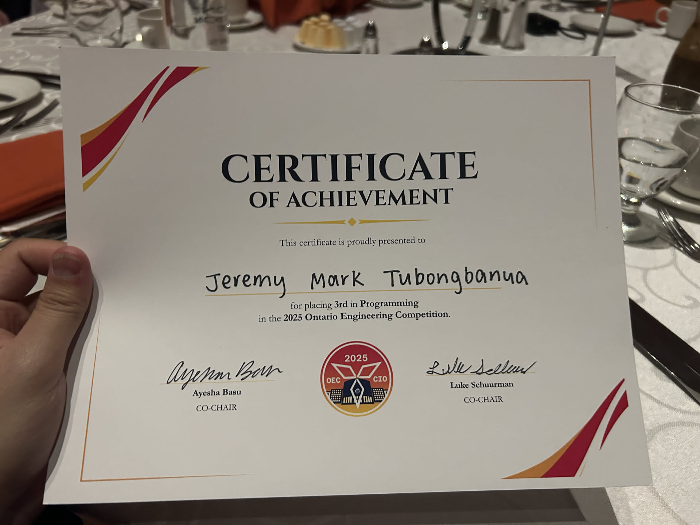

Our project helped with reporting and categorizing natural disasters. We dockerized and implemented a distributed system-like architecture for scalability and longevity.

[GitHub Link](https://github.com/jeremytubongbanua/oec_2025)

## February 4, 2025 - Capstone Prototype v2

This is the second prototype of my capstone project. It's an improved headset with more electronics mounted on.

The camera is now mounted upside down. Alongside that, there's also a speaker and a IMU mounted on.

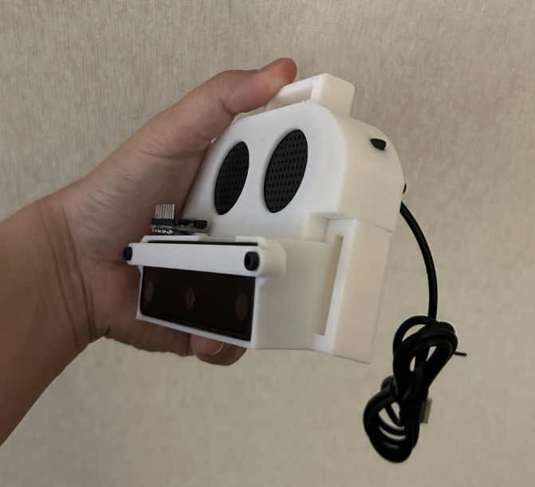

As I continued the physical development of the capstone through 3D printing, I became very comforatble with tolerances between parts and designing modular 3D printed parts that would be held together using M3 heated inserts and screws.

## February 13, 2025 - Capstone Prototype v3

This is the final prototype of the headset that we went with. The IMU is mounted on its side now, and we can just tweak the software and flip some axes for the IMU to act the same way we want it to.

Additionally, there's a velcro strap so that you can actually wear it.

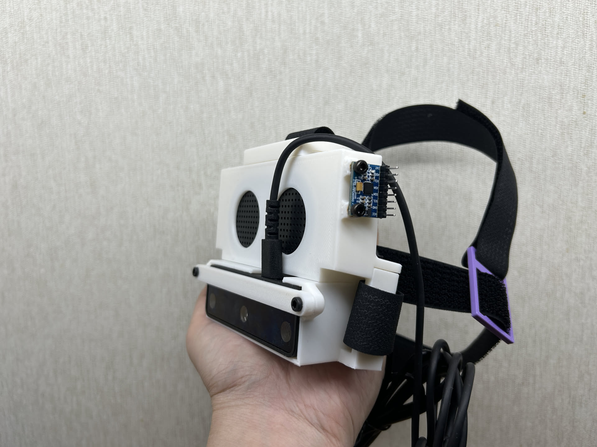

Alongside the headset, the cane attachment and belt attachment began to take shape.

The cane has two buttons, a Raspberry Pi 0, a power bank, and vibration motors controlled by relay modules.

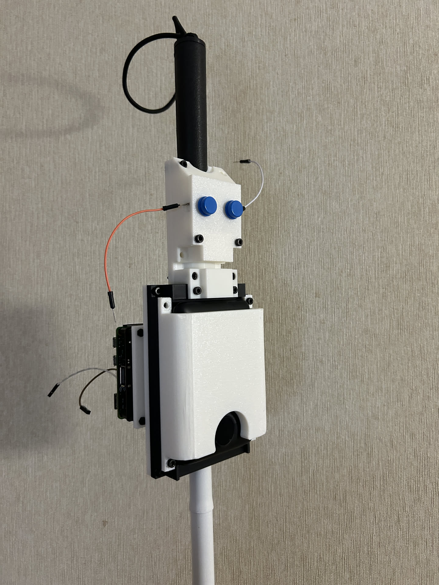

Below is the Raspberry Pi and Mini Router that you would clip onto your belt.

Hidden behind it is also a power bank to power both devices.

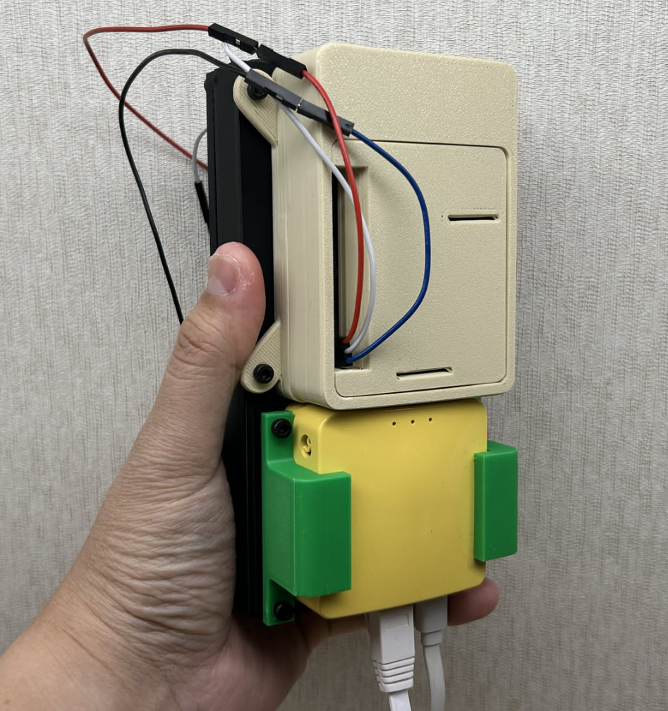

The overall idea here is to use the two IMUs (one on the headset and one on the cane) to determine the orientation of the user and the cane. Then using computer vision, we can detect objects and the relative angle of those objects to the direction that the user is facing. Finally, we can use the cane to give haptic feedback by vibrating and indicating the direction of the object.

## March 1, 2025 - Capstone Prototype v4

We finished wiring up the cane. Now the raspberry pi can actuate the vibration motors through the relay modules. We used WAGO connectors as 5V and GND terminals.

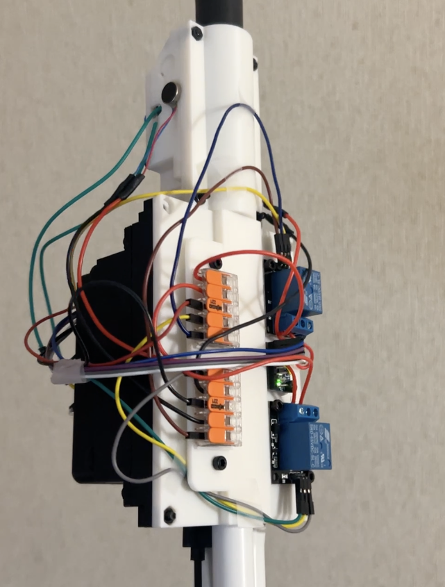

## March 23, 2025 - 1st Place in Figma Challenge

Won 1st place in a Figma design challenge hosted by the Autonomous Drive Club at OTU. It was a 2-hour quick design competition where groups had to design a rich user interface/experience for autonomous vehicles. I was in a group with my sister and one of my peers, and won 1st overall! I think we won a $50 gift card or something.

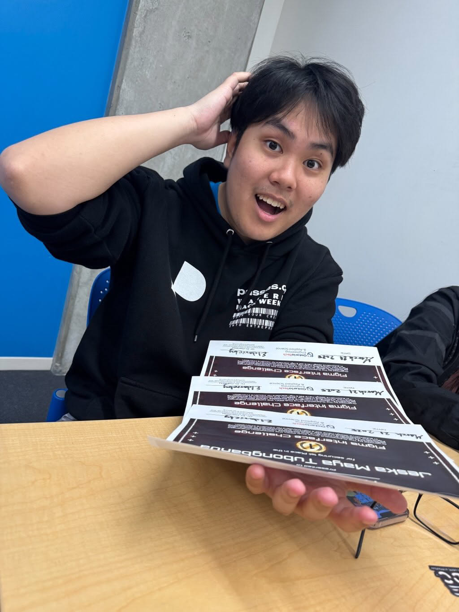

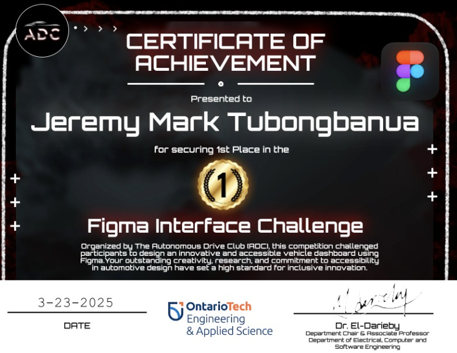

## March 28, 2025 - Pokemon Journey Together ETBs

Me and a couple of friends woke up early and lined up for the new Journey Together ETB release!

ETB stands for "Elite Trainer Box" and contains 9-11 pokemon booster packs and accessories for playing the Pokemon Trading Card game. Most people want this product for the packs, which is the hot commodity nowadays.

I also pulled two Iono's Bellibolt ex SIRs!!!

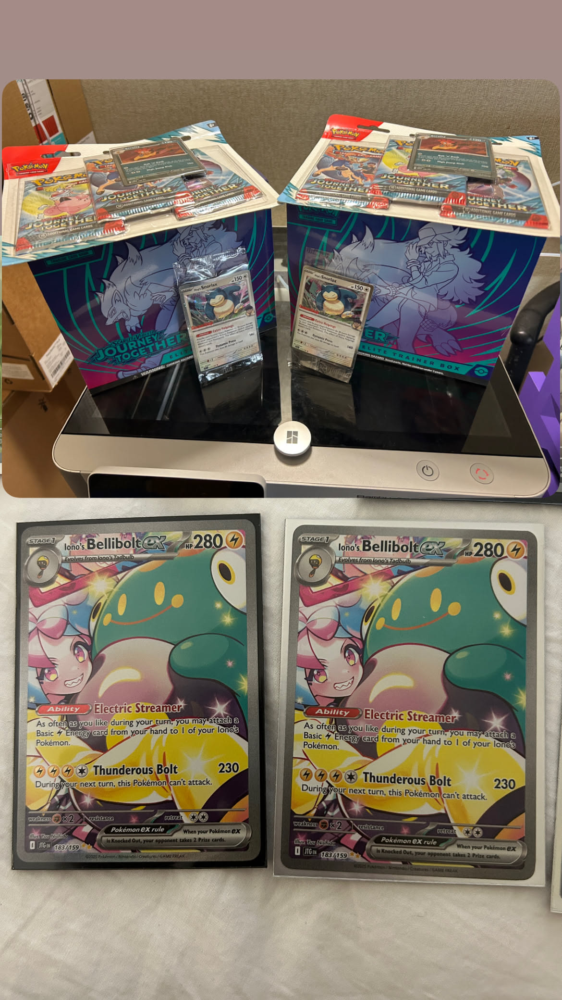

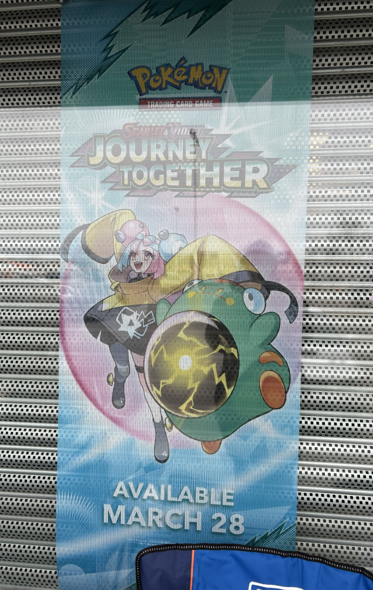

## April 4, 2025 - 1st Place in Capstone Exhibition

My capstone group won 1st place out of all electrical and software capstone projects! We won first place out of [32 capstone groups](https://engineering.ontariotechu.ca/current-students/current-undergraduate/capstone/2025-ecse-capstone-projects.php).

The capstone project is a lot to explain, so I recommend checking out the GitHub repository and 3 minute YouTube video below.

Links:
- GitHub Link - [https://github.com/jeremytubongbanua/blind_person_assistant](https://github.com/jeremytubongbanua/blind_person_assistant)
- 3 minute YouTube video - [https://www.youtube.com/watch?v=-XyYb4GPD1U](https://www.youtube.com/watch?v=-XyYb4GPD1U)

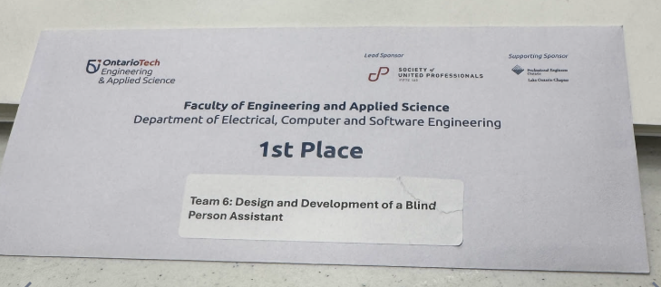

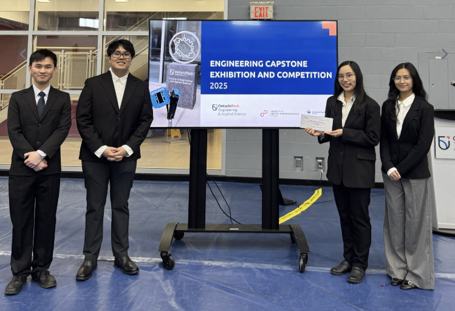

## May 15, 2025 - Consensus Conference

Not much happened in May. I received a return offer from my company and began working full time.

But I did attend a crypto conference. Lots of students were attending because of the hackathon they were also running. I left half way through the day as I still had work left to do and there wasn't much for me to do at this conference except for collect some free socks.

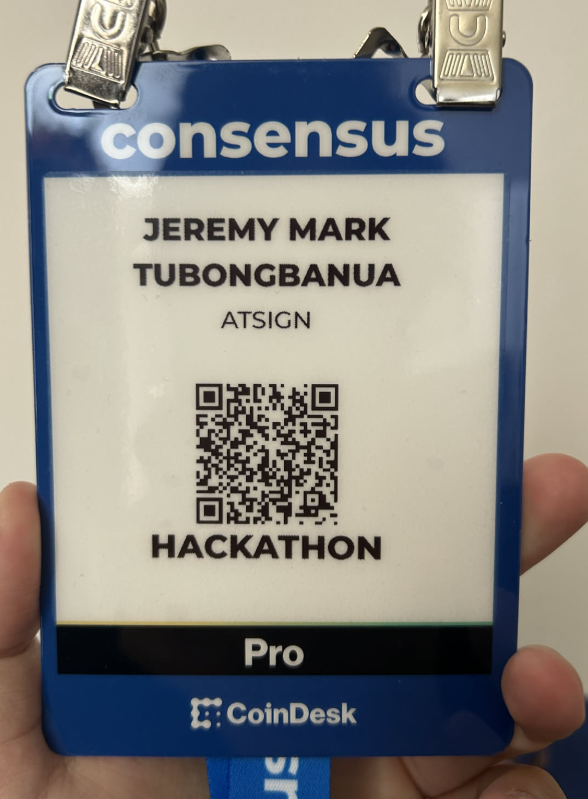

## June 5, 2025 - Graduation

Graduated with a bachelor's of software engineering from Ontario Tech University.

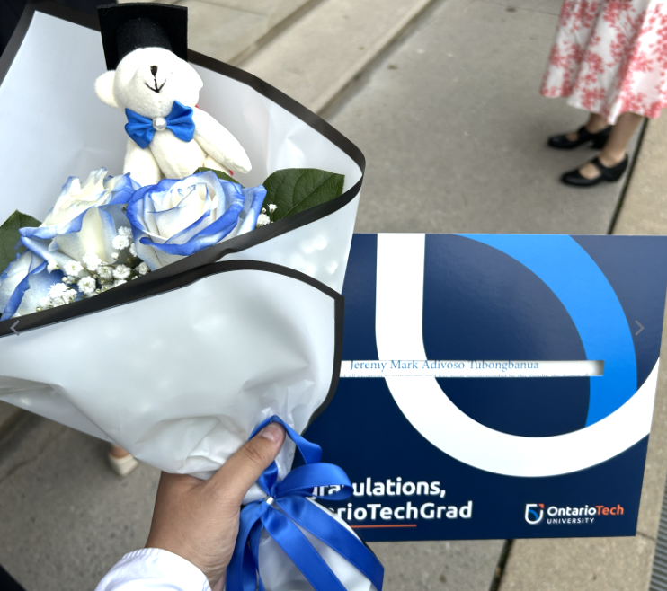

My degree that I spent $30,000 CAD and 4 years getting:

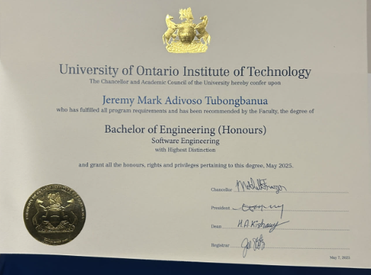

## June 13 to 16, 2025 - Prince Edward Island

My family went on a weekend trip to Prince Edward Island. We visited lots of places and pokemon card shops.

I like to open packs in random places during vacation trips..

I got a team rocket's giovanni on Charlottetown Waterfront:

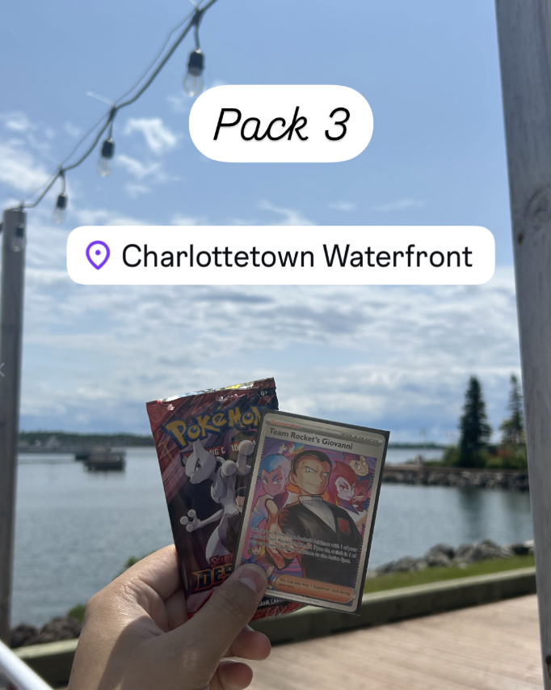

and a full-art Team Rocket's Mewtwo Ex at the French River:

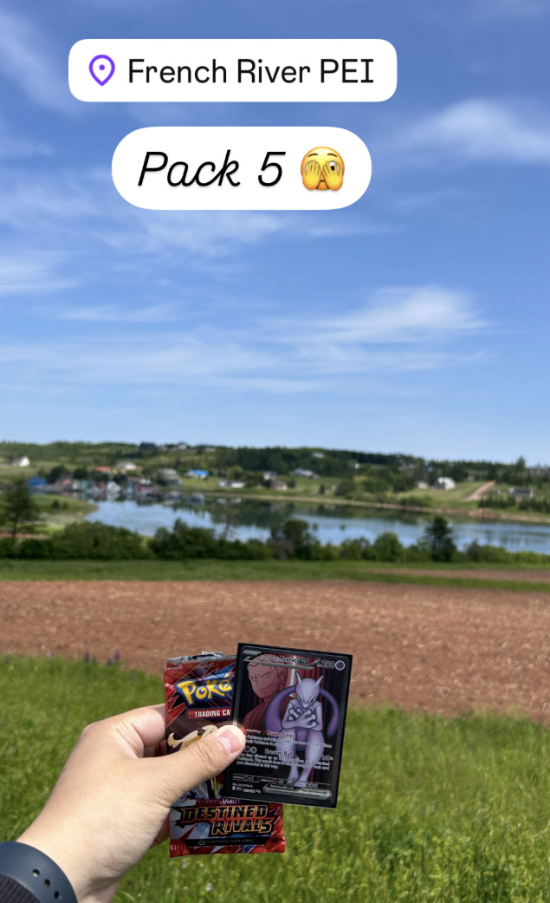

Here are some nice photos from PEI. A local told us that the weekend we arrived was the first weekeend without rain in months. Lucky!

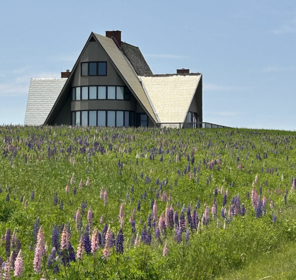

Cool scenery:

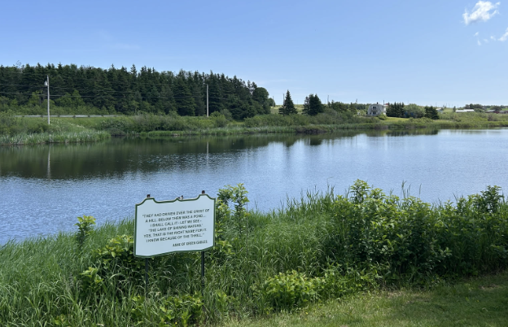

Weather was amazing :)

## June 27, 2025 - Pulling a Greninja ex SIR

Pulled the chase card from Twilight Masquerade.

The pack came from a Lillie's Premium Collection that I bought off someone from Facebook marketplace. This product just so happens to have only one twilight masquerade pack inside so I got very lucky with this pull.

Raw, this card goes for $100-$200...

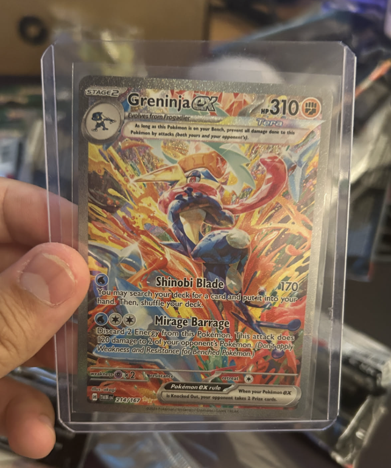

## June 29, 2025 - Stray Kids Concert

Went to my first ever concert - Stray Kids in Toronto.

I went to a total of three concerts this year, and this was my favourite. I ended up having multiple SKZ songs in final year Spotify Wrapped.

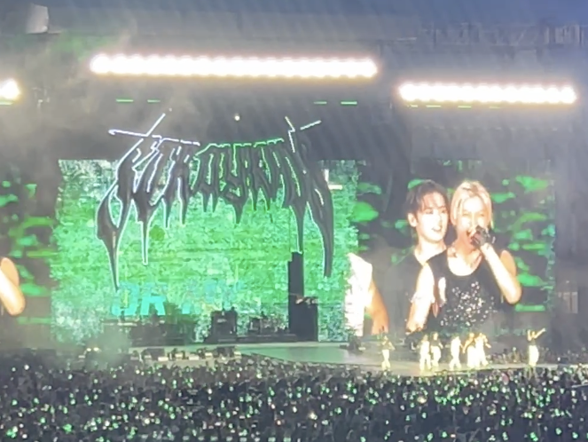

## October 1, 2025 - Presenting at SecTor 2025

I represented Atsign at Blackhat SecTor 2025 in Toronto. Along with my colleagues, we did a 1hr30min long presentation called "Kill Open Ports: A New Era of Secure Connectivity" at the conference.

More specifically, we were in the "Arsenal" area which is a place where open-source security tools/software are presented. Atsign's NoPorts is fully open source, so we presented alongside others. My presentation consisted of 30-40 slides and a live demo, where I SSH'd into a Linux container (running in my homelab at home) and showing the ports closed using nmap. Most people were impressed, as usual, and it raised a lot of eyebrows. I found that I lost the attention of many folks during the initial slides portion, but quickly gained attention and confused heads once the demo was presented. It's a typical response because there is nothing else like it out there. My takeaway from this presentation for next year is to maybe lead with the demo, then in the latter half dive into the "how".

The more I go to conferences and do presentations., the better I get at talking to people. I was nervous at first, but after maybe the first twenty minutes of presenting, it felt natural. My biggest takeaway is to just by myself and be organic and I find that less energy taxing on my mind. School never prepared me for things like these, and it's best to just jump in, do your best, and make mistakes with humility along the way.

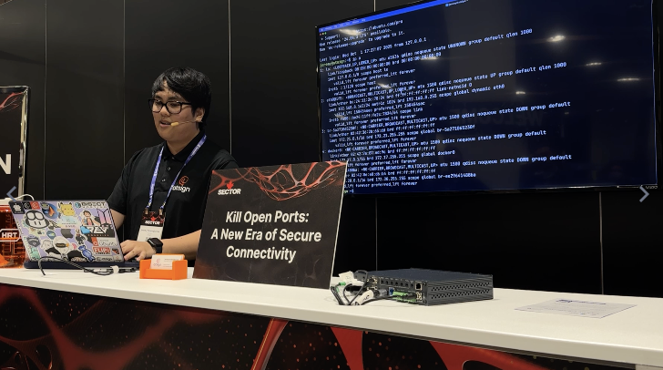

## October 4, 2025 - 2nd Place NASA Space Apps 2025

This is the 4th competition win this year.

This time, it was 2nd place in a NASA hackathon hosted by the business faculty from Ontario Tech University. I think our team won a total of $200 in Amazon gift cards.

Our project was a simple front-end to a database filled with NASA data called "Sky Dashboard." Check it out on GitHub: [GitHub Link](https://github.com/JeremyTubongbanua/nasa_space_apps_2025)

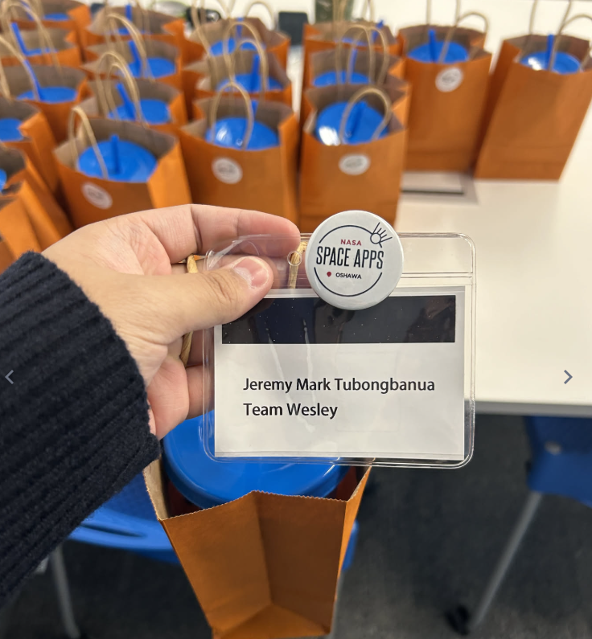

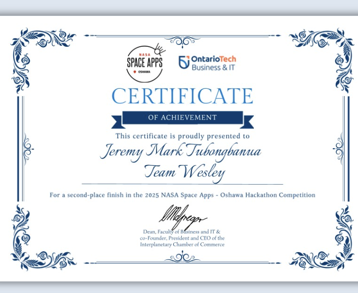

## October 17 to 24, 2025 - Singapore Trip 1

This was my first singapore trip this year. It was supposed to be a week long business trip, but I arrived a little earlier to do some tourism. I did all the usual Singapore things like go to the Marina Bay, Gardens by the Bay, visit the big malls, and go to Sentosa Island. The weather was very very hot and humid that I would start sweating after a minute of standing outside. Other than that, Singapore felt very safe and was able to do things like walk outside at 2 in the morning. I also met with my cousin after 7 years of not seeing each other, and even she does things like leave her shoes outside without worry of it getting stolen. Meanwhile here in Canada, my packages would get stolen after being outside for a couple of hours.

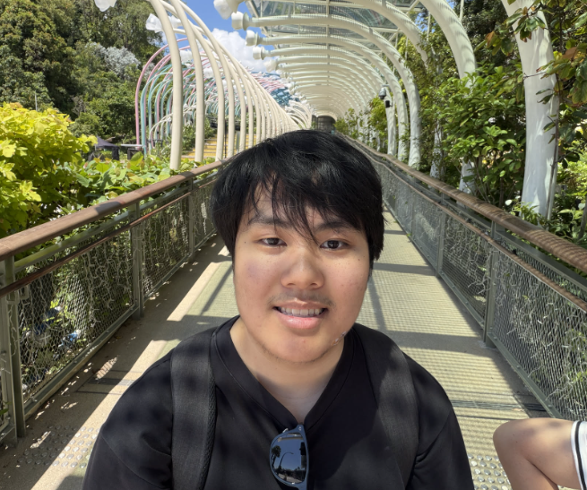

Singapore has a rich [hawker culture](https://www.nationalgeographic.com/travel/article/partner-content-all-Singapore-under-one-roof) where there are many cheap asian street food vendors located everywhere (you can't miss it). When I first saw these, I was hesitant and questioned their safety and bringing my laptop bag with me to one of these, but Singapore is known to be a pretty safe country. The food was excellent and cheap.

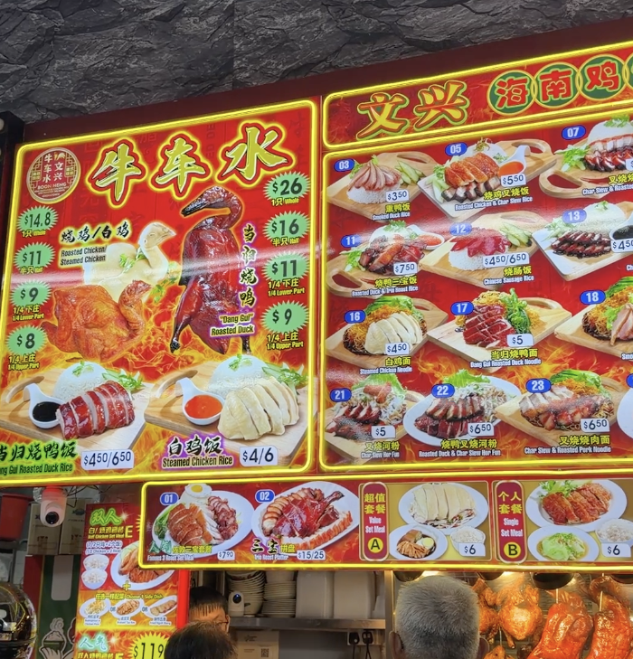

Hotel had a nice river view.

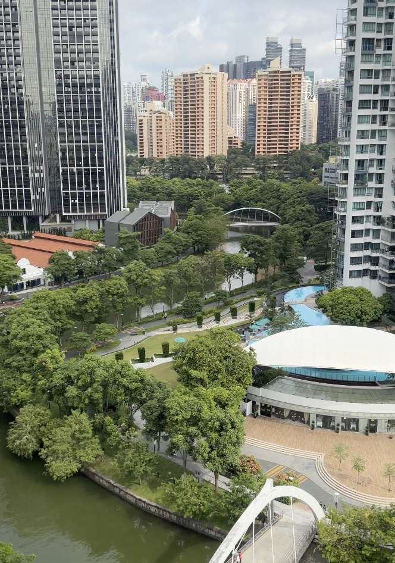

During this trip, I was the technical rep for my company at GovWare. GovWare is a very big annual cybersecurity conference in Singapore. 
I presented the comapny's demo to many cybersecurity enthusiasts visiting our booth, as well as answer technical questions about our company and product. I was demo-ing SSH without open ports; accessing a container I had back home in Canada running in my homelab without opening ports to the Internet. We had a second AI arbitrage/cloud fluidity demo that I presented at the conference as well. The first demo was more successful in showing people because it was easier to show that the ports were closed using [nmap](https://nmap.org/).

Representing the company at the conference was fun. Compared to other conferences, this is my most second favourite, right behind CES in 2024.

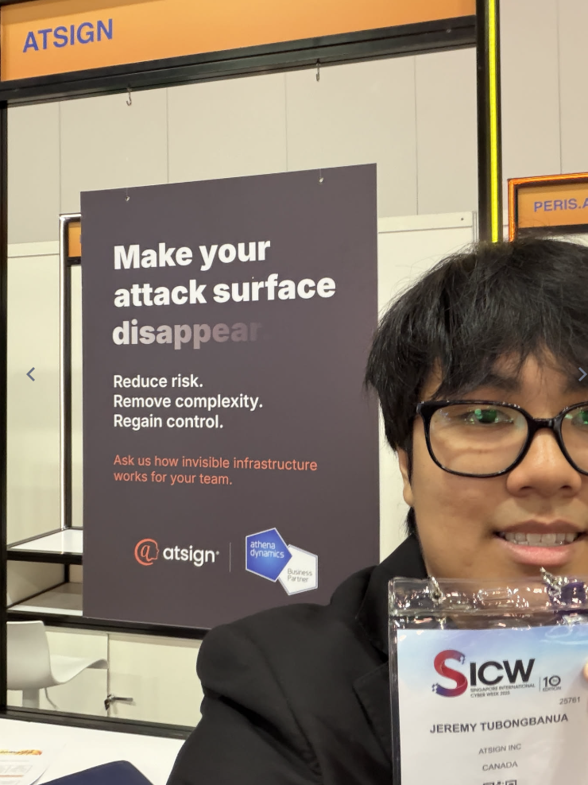

On my way back, I visited Jewel Changi Airport mall (also known as Jewel) which is a famous mall next to the Changi Airport. It's a convenient place for people to go to do shopping and eat food while waiting for their flights.

They had this cool waterfall thingy, which is a popular tourist attraction.

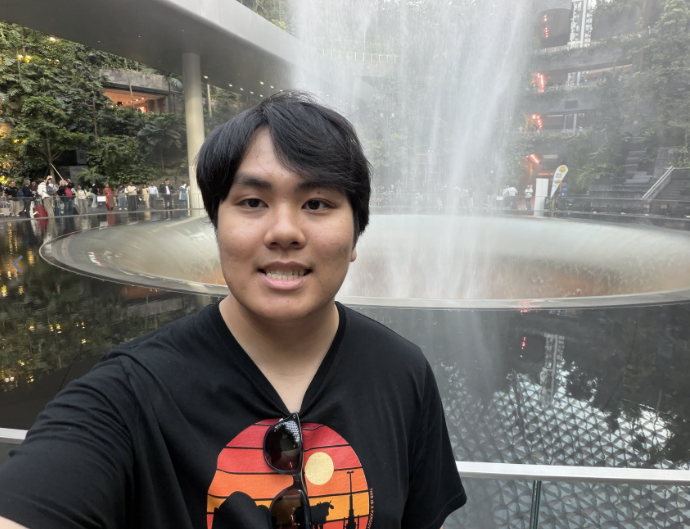

The airport mall had a Pokemon Center, which I absolutely had to visit. This Pokemon Center had an event where if you took a picture and posted it on social media, they would give you a sticker, and so of course I had to.

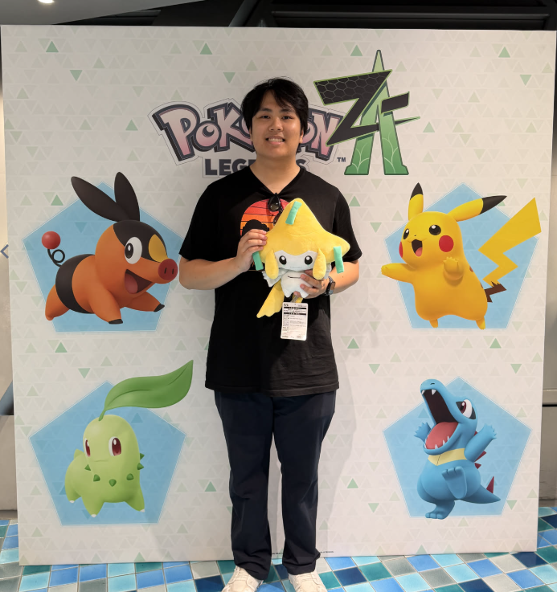

I learned that doing tech business in Asia is much more different than doing it in Canada/US; culture and background matters a lot. I got to speak to so many tech-focused business owners and engineers in Singapore and am grateful for this rich learning experience.

## November 18, 2025 - Building a New Gaming PC

I haven't upgraded my PC parts in 5 years (now becoming 6 years by 2026) so I thought it was finally time to upgrade, especially now that Hytale will be coming out soon.

I was lucky enough to buy a CPU+Motherboard+32GB RAM bundle from Canada Computers for $500 CAD. It has since now jumped to $600-$800 CAD now that RAM prices have jumped due to the AI buzz lately. I am very happy I bought the parts when I did.

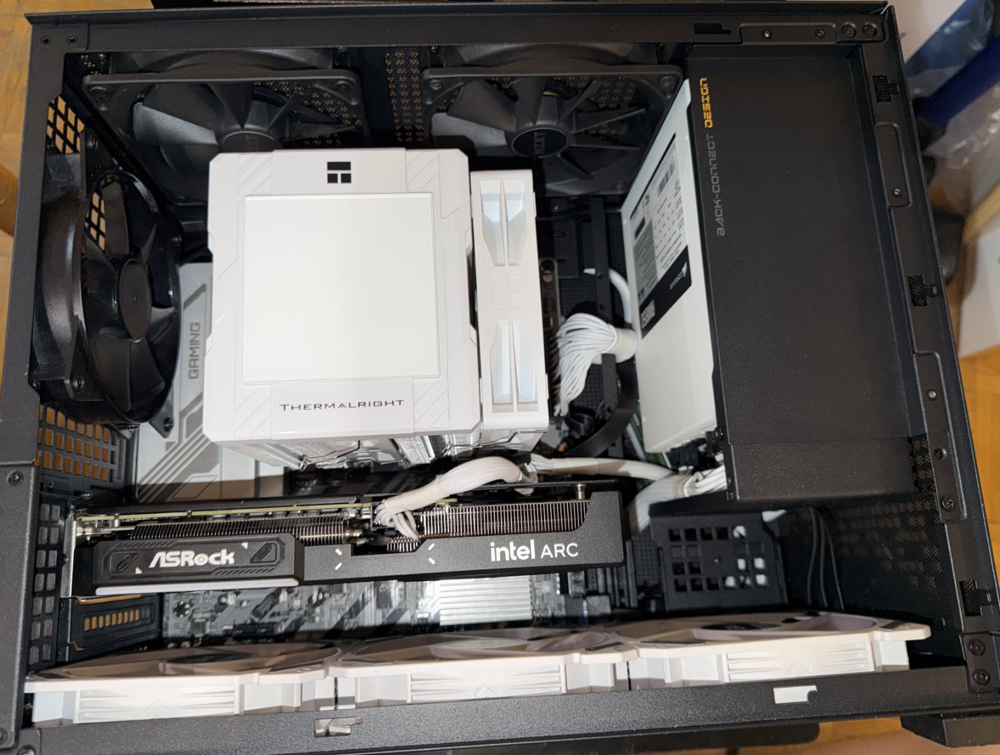

The PC parts are all mostly new, except for the fans which were salvaged from my old build.

Spec List:

- CPU: Ryzen 5 7600x3D (4.1 GHz 6-Core Processor)
- CPU Cooler: Thermalright Peerless Assassin 120
- MOBO: Gigabyte B650M Gaming Plus WiFi Micro ATX AM5
- RAM: T-Force Vulcan 2 x 16 GB DDR5-6000 
- SSD: Samsung 990 Pro w/ Heatsink 2 TB
- GPU: ASRock Challenger OC Arc B580 12 GB
- Case: Jonsbo D32 Pro MicroATX
- PSU: Corsair RM850e (2025) 850W Fully Modular ATX
- 6 120mm fans (3x RGB, 2x NZXT case fans, and 1 coolermaster fan)

## November 29, 2025 - Making Trophies and Judge Advising for LEGO Robotics Tournament

Every year, I like to volunteer at my high school's annual FIRST Lego League Tournament. This tournament serves as both an action-packed community event with competitive lego robotics and as a fundraiser for my high school's [FRC](https://firstroboticscanada.org/frc/) team.

For this year, I helped them design and 3D print the 9 awards to be given out at this competition. Below is a picture of the 9 awards that were given out at our event. They are different colours because we underestimated how much filament we needed for the awards. Next time, I will remember to use less infill. 

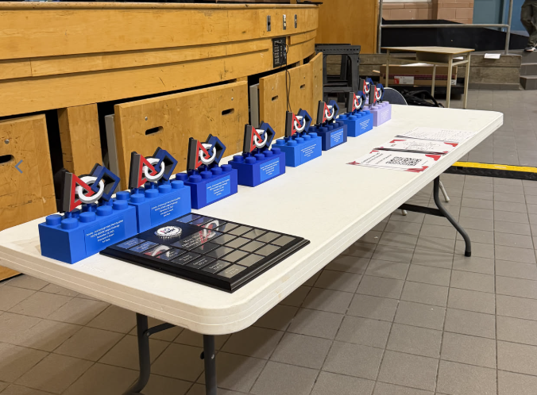

The design of the trophy went through 5-7 iterations. The final iteration is printed in 3 parts: the trophy lego brick base, the FIRST logo trophy topper, and the award plate with the text. Then, these parts are super-glued together.

During the actual tournament, I played a key volunteer role as the Judge Advisor - leading a batch of 12 adult judges. Judging is the best volunteer role in any FIRST Robotics tournament. It's a chill role because you get some peaceful time with other passionate adults.

I was awarded the Volunteer Appreciation Award as well

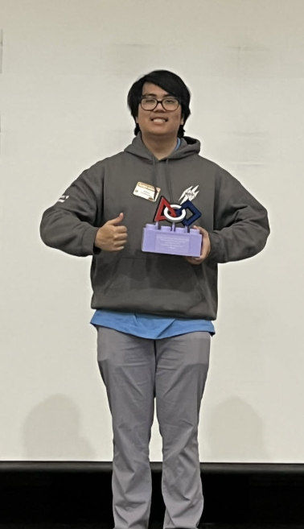

## November 30 to December 7, 2025 - Singapore Trip 2

Right after the robotics tournament that happened on the 29th, I rushed back home to pack for my second Singapore trip this year. The tournament was so exhausting I nearly slept through my flight, but luckily I woke up just 2 hours before I had to leave for the airport.

This was another fun business trip, representing Atsign in sales/business focused meetings as a technical rep. I had a lot of fun meeting Atsign's clients and business partners, alongside doing a three-hour long presentation showcasing NoPorts and Atsign on a deep technical level.

There was this fun Mofusand event going on in Singapore and Mofusand was everywhere!!!

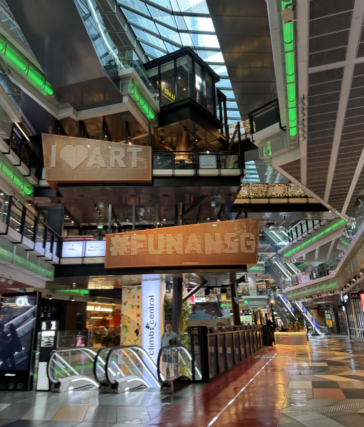

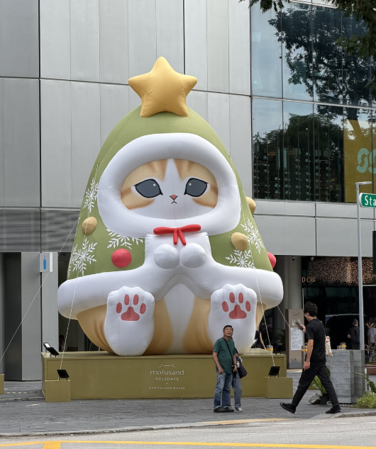

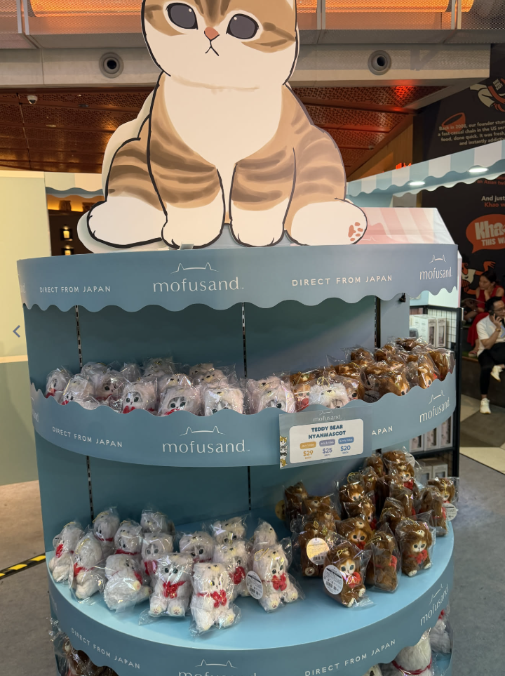

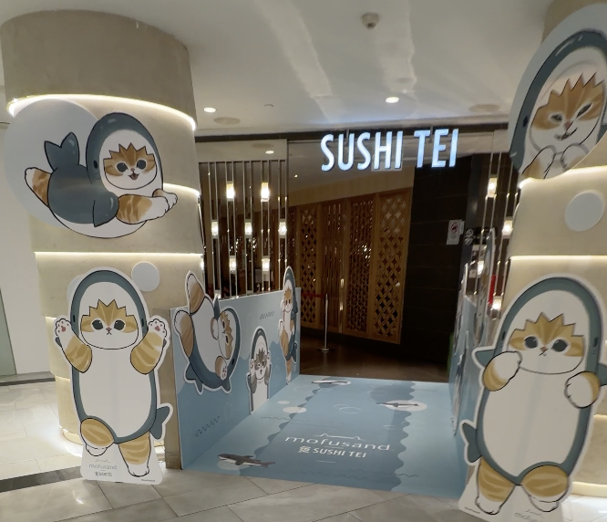

During the trip, I brought some cool gadgets:

- GL-INet Travel Router
- Beelink Mini PC (500GB)

It's so much fun bringing these two little guys around because I can spin up some VMs without having to run them on my laptop to save memory, space, and just overall keeping those things separate is great. They were also handy when doing the three-hour long presentation, because then I could allow attendees to connect to the router and experiment with NoPorts themselves on my VMs without having to get them setup on their own local environment.

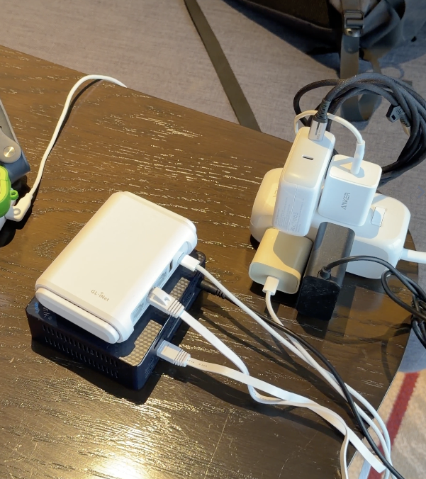

This was the view from the hotel swimming pool.

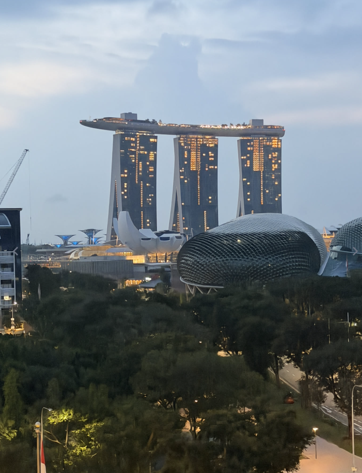

My hotel view was just as good as the other one.

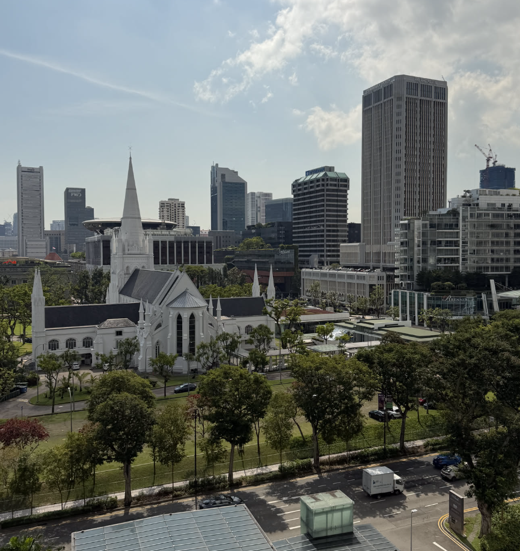

Throughout the trip, I also took advantage of the hotel gym. It was one of the best hotel gym's I've ever been to. Lots of machines, lots of space, and high quality and clean equipment. and going early in the morning (at 5AM) guaranteed the gym to be empty.

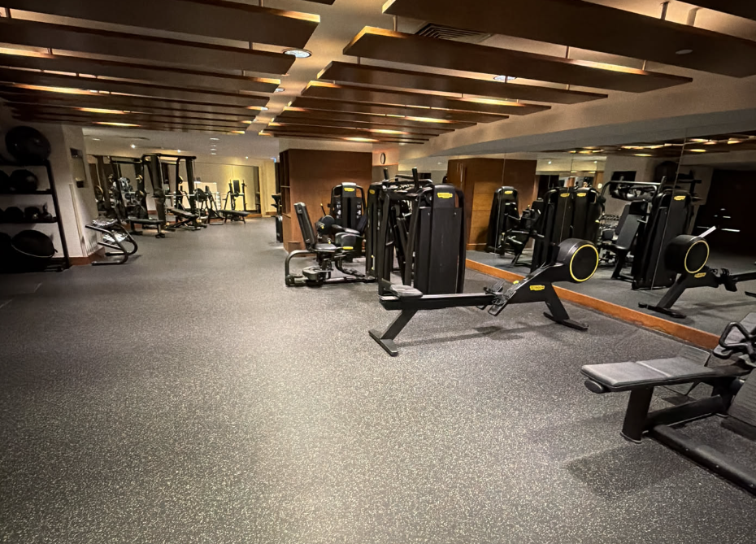

I took time to visit the national library of Singapore, and it was packed with students studying. I accidentally took a girl's seat because I did not know you had to book tables; even solo cubicles. This was the view from one of the top floors. What annoyed me the most was that food was not allowed in the library, so you had to leave any food or drinks in the lockers outside. Then, they checked your bags to make sure you weren't sneaking food in either. They had this level of security for every floor of the library so it was a big hassle bringing this one probiotic can around that I had.

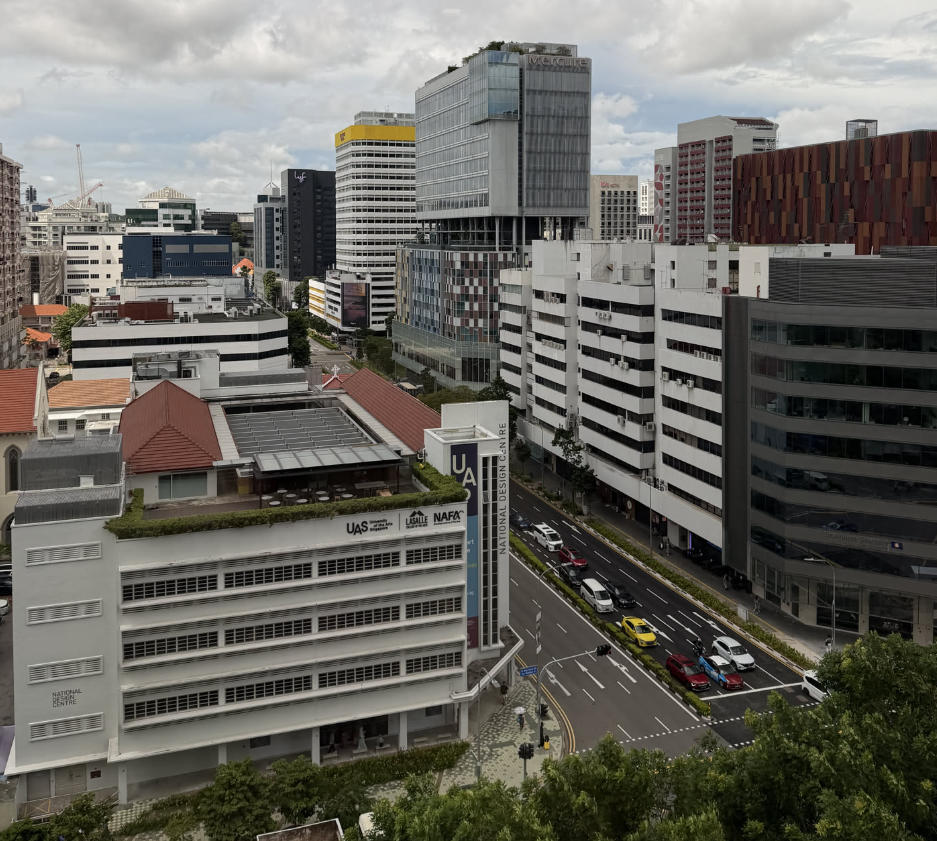

I've noticed that the flight back from Singapore back to Canada is always faster because of the jet streams.

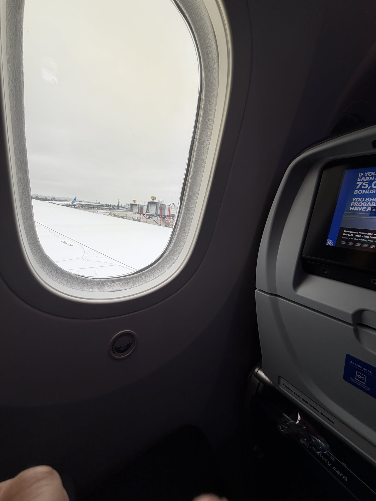

This was another great learning experience in the world of doing international business in cybersecurity/tech.

## December 14, 2025 - Building Another PC For My Other Nephew

In my 2024 blog, I built a PC for my nephew. This time I'm building another PC for his brother.

This time, it's out of spare parts I had lying around the house. I'm quite happy with this build because I feel it delivers great performance with such a low budget.

The PC isn't the flashiest, but I did not spend any additional money making this computer and it delivers more performance than his current one, so I consider that a huge win!

Spec List:

- CPU: Ryzen 3 3200G
- CPU Cooler: Stock Cooler with Ryzen 3
- MOBO: MSI Pro M-2 Motherboard microATX
- RAM: 8 GB of DDR4
- SSD: Kingston 240 GB SSD
- GPU: Integrated Graphics
- Case: Cooler Master Q300L MicroATX
- PSU: CX450 450W ATX

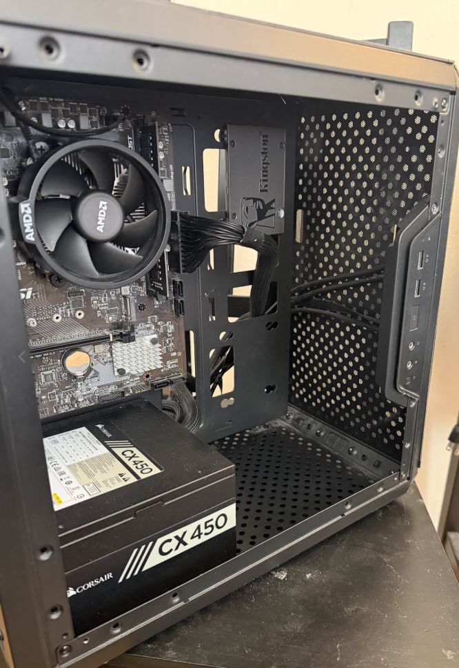

## December 21, 2025 - AMS v2 Stacker

I finished building the version two of the AMS stacker. I had to buy drawer slides from Rona (the hardware store) and screw them into the 3D printed parts. 

The filament of choice is [Polymaker's Black HT-PLA](https://ca.polymaker.com/products/polymaker-ht-pla?srsltid=AfmBOooGGTyw1mqEsE1MEsm93vHsbi3gqn7BxnE5kRD8NelrfMkFQMz6&variant=51950260060530). I love their high temperature PLA formula. It does the trick (lives in hot environments) and keeps its form. I expect this AMS stacker to last a long time.

The files are from Jaxel and can be found on [Makerworld](https://makerworld.com/en/models/1531539-v2-am4xs-ams-sliding-stacking-system#profileId-1610646).

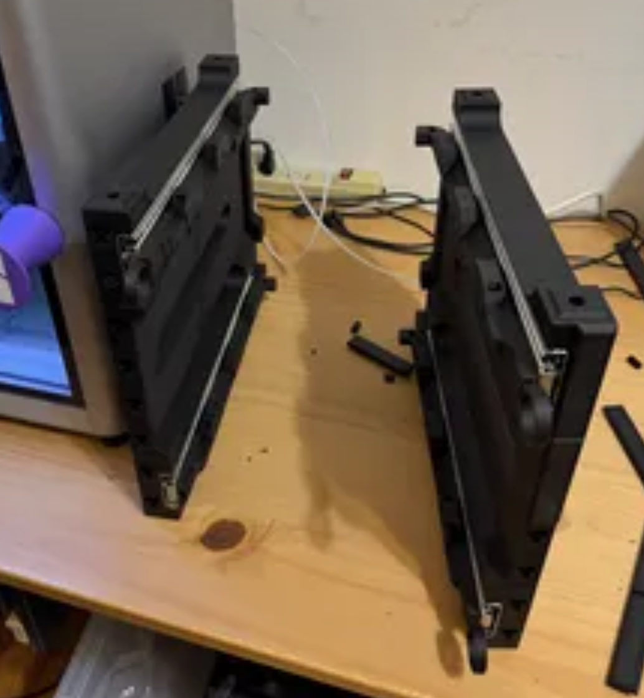

## December 23, 2025 - PSA 10 Greninja ex

The Greninja (which is the chase card from Twilight Masquerade) that I pulled earlier in the year finally came back from grading with PSA.

It for some reason came back a 10. What's funny is that I even dropped the card after I pulled it, and it still somehow came back a perfect 10.

I am not complaining though, because this card peaked at $1100 CAD but is now around $750 as of writing this.

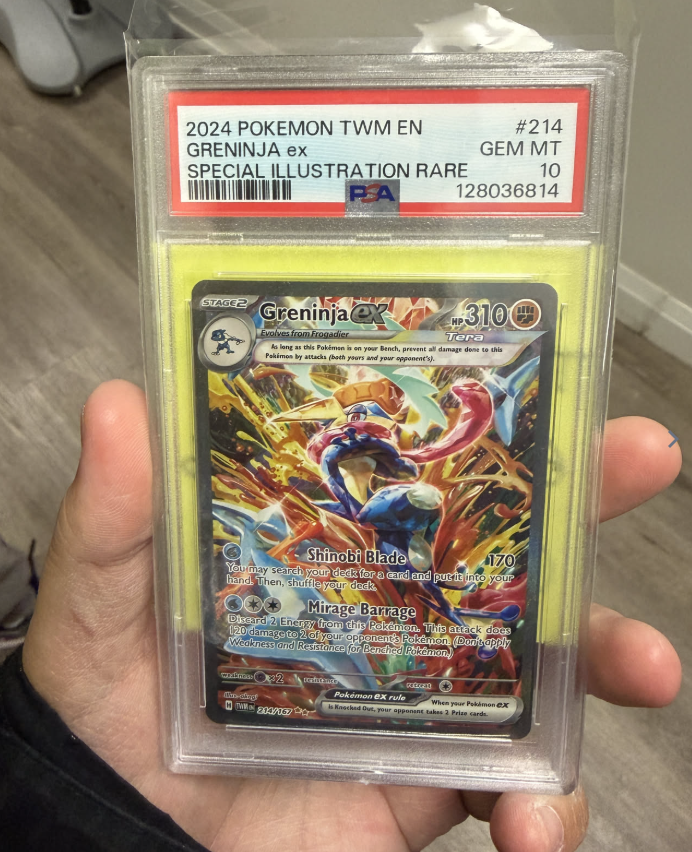

## Conclusion

Thank you for reading thus far, and especially thank you for making my 2025 amazing!

My predictions this 2026:
- XEQT hits $50 CAD/share 
- Companies realize AI can't replace juniours, and juniour hiring gets better
- GTA 6 will come out

My goals for 2026:
- Hit a V4 boulder
- Start a YouTube channel
- Get at least 5 GitHub stars on some project

