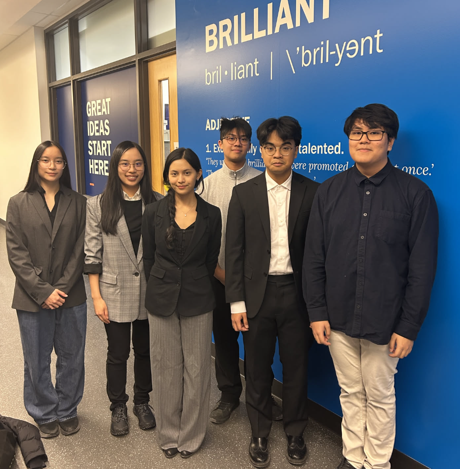
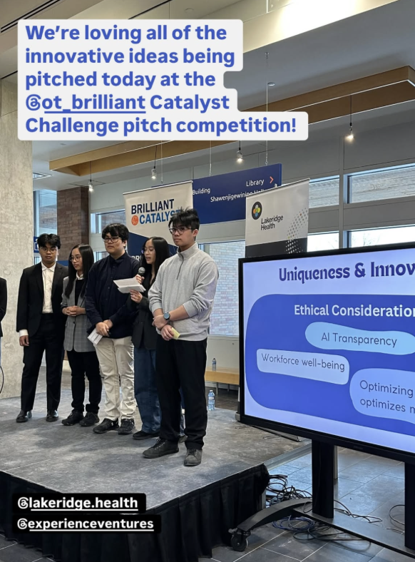
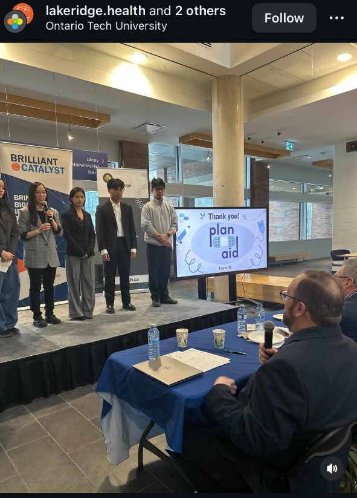

## Top 9 - Brilliant Catalyst Challenge 2025

While we did not win top 3, we still made the finalist stage.

A total of 18 groups participated in this challenge, and the top 9 got to present to a panel of judges.

Our solution was called plan_aid and to be honest I don't really remember what it does.

### Gallery

