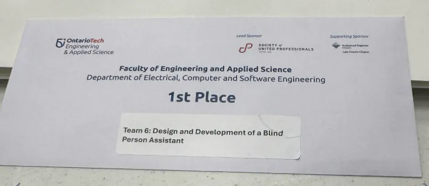

# Blind Person Assistant

I think we won some money too

## Project

[Project Link](/index/projects/capstone_blind_person_assistant/)

## Links

- <https://github.com/JeremYtubongbanua/blind_person_assistant>
- 3 minute video <https://www.youtube.com/watch?v=-XyYb4GPD1U>
- Official Ontario Tech Website: <https://engineering.ontariotechu.ca/current-students/current-undergraduate/capstone/2025-ecse-capstone-projects.php>
