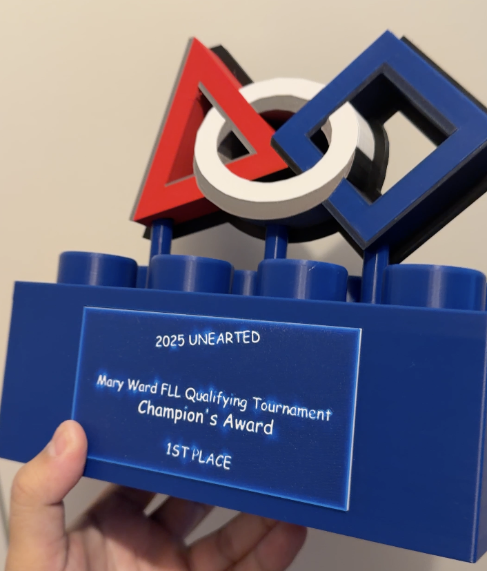
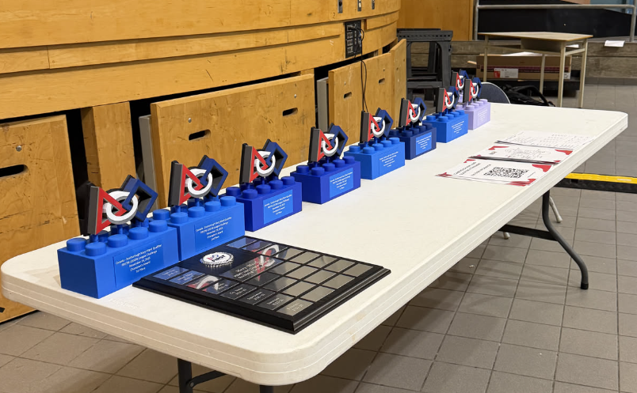
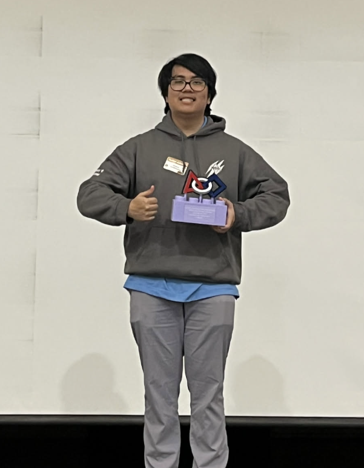

## Volunteer Appreciation Award

I volunteered at my ex-high school's annual lego robotics competition and was awarded the Volunteer Appreciation Award.

What's funny is that I made the awards myself. So I essentially made an award for myself.

I started off by prototyping them: 

We gave out 11 awards that day. All 3D printed using Polymaker's Panchroma Azure Blue PLA. Making all the awards took about 3 weeks of prototyping, printing, and super glueing.

### Picture of me holding the award

### After the tournament

Once the event was over, I had to immediately head home and pack for a week-long business trip to Singapore.

Read more about that in my [2025 Blog](/blog/jeremy_2025_wrapped)

