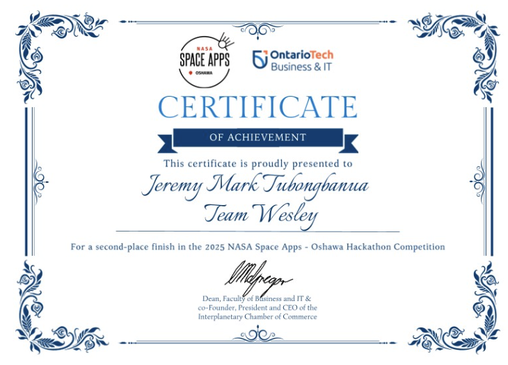

- Project [link](/index/projects/mapping_x/)
- Experience [link](/index/experiences/competition_nasa_space_apps_2025/)

Each group member also received a $33 Amazon gift card or something for winning

Also offered an internship at the CSA (Canadian Space Agency) upon completing the project.
