## Links

- [Previous Singapore Trip](/index/conference_atsign_govware_2025/)
- [Jeremy's 2025](/blog/jeremy_2025_wrapped/)

## Summary

My [first singapore trip](/index/conference_atsign_govware_2025/) was to be a tech rep for the infamous GovWare 2025 conference. This time, it was for meeting clients and business partners.

## Day 1

After the Mary Ward FLL tournament (read more about that experience [here](/index/experiences/fll_judge_advisor_2025/), I quickly went home to pack for a flight early in the morning going to Singapore!

The flight is typically 12 hours long.

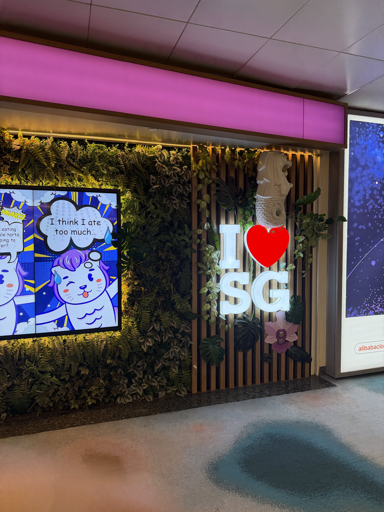

On this day, I took it to rest, do a litte bit of work, and go to the gym.

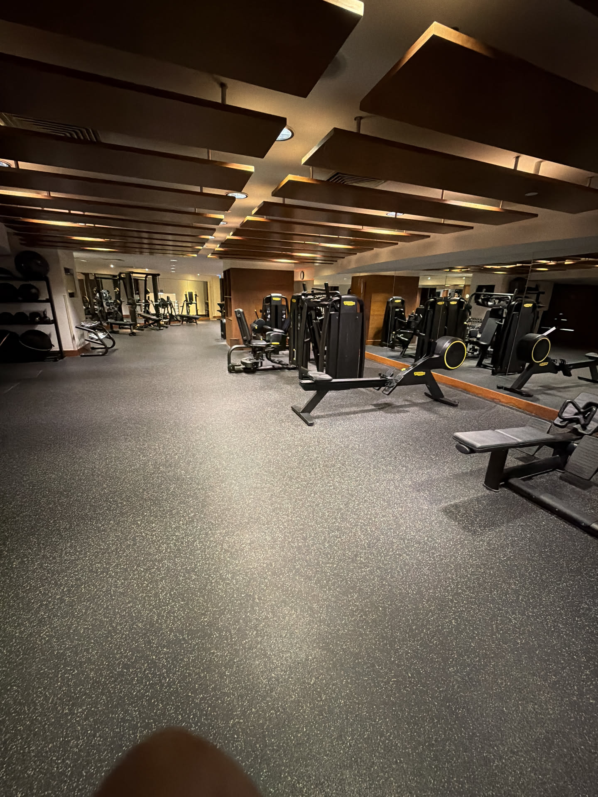

## Gallery

My remote work setup (Anker 3-in-1 charger, Flowlite 84 keyboard, Beelink Mini PC, GL-inet router, M2 MacBook air)

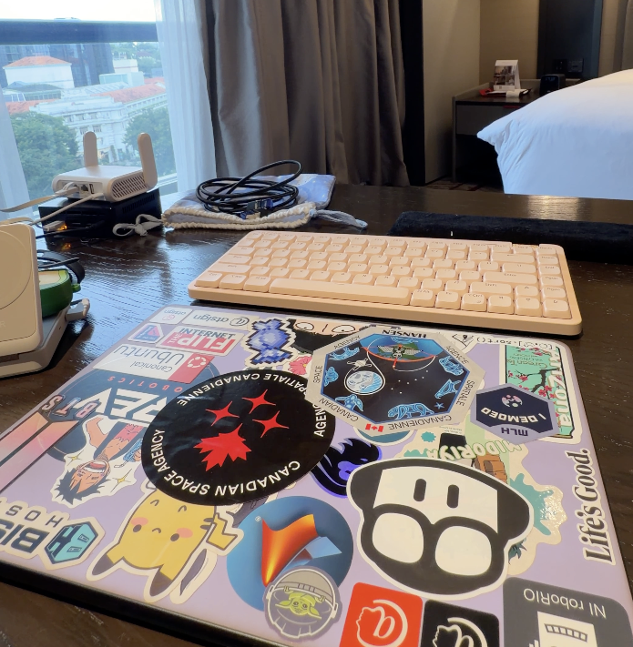

My neovim splash screen with a matcha latte from Kenangen coffee

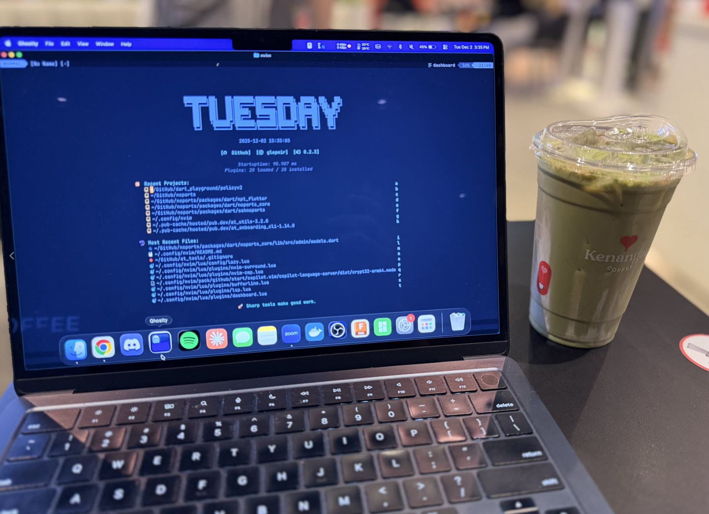

Fairmont hotel lobby.

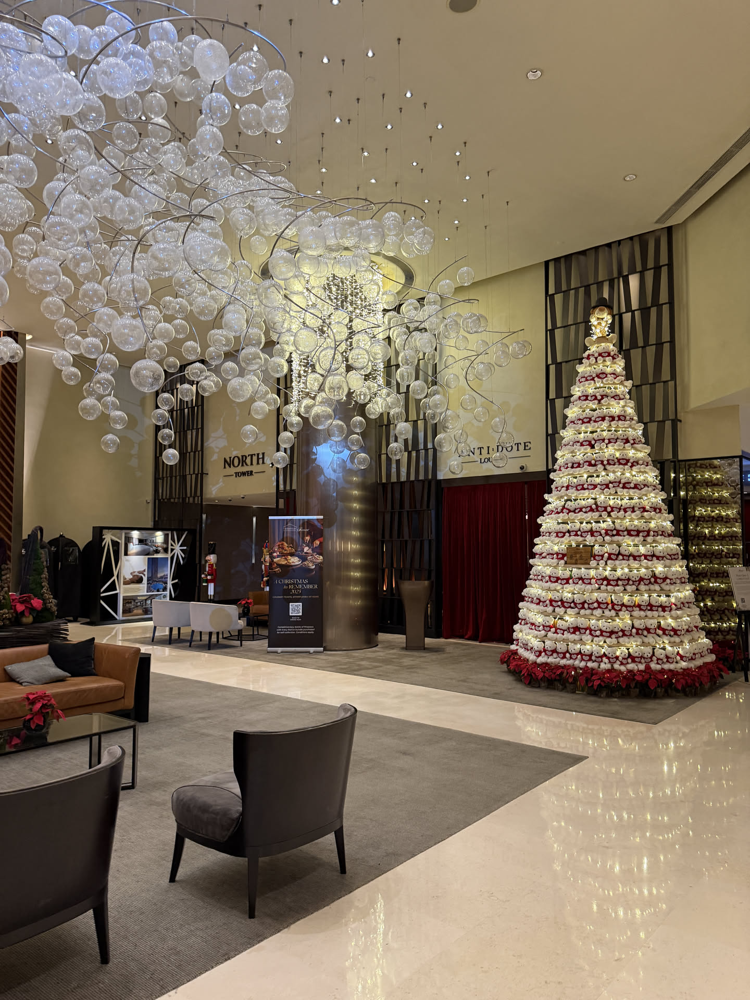

Pool view with the three buildings with a platform on top

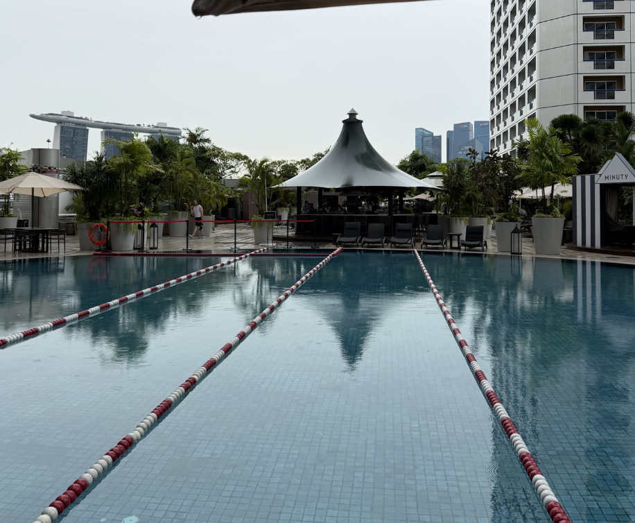

Funan SG Mall

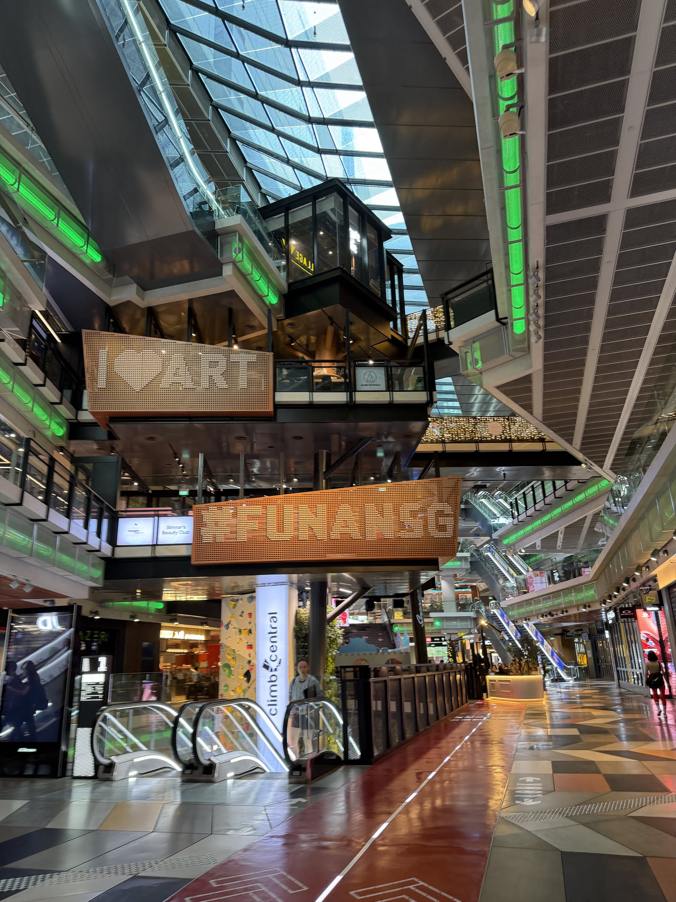

The climbing wall in Funan

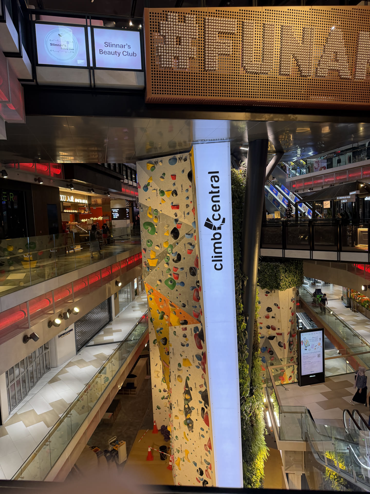

Big Mofusand thing that was outside my hotel

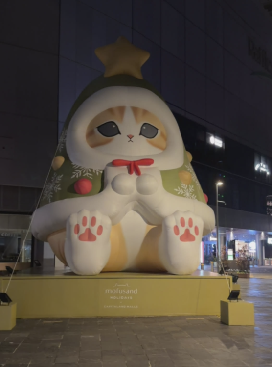

Hotel breakfast service

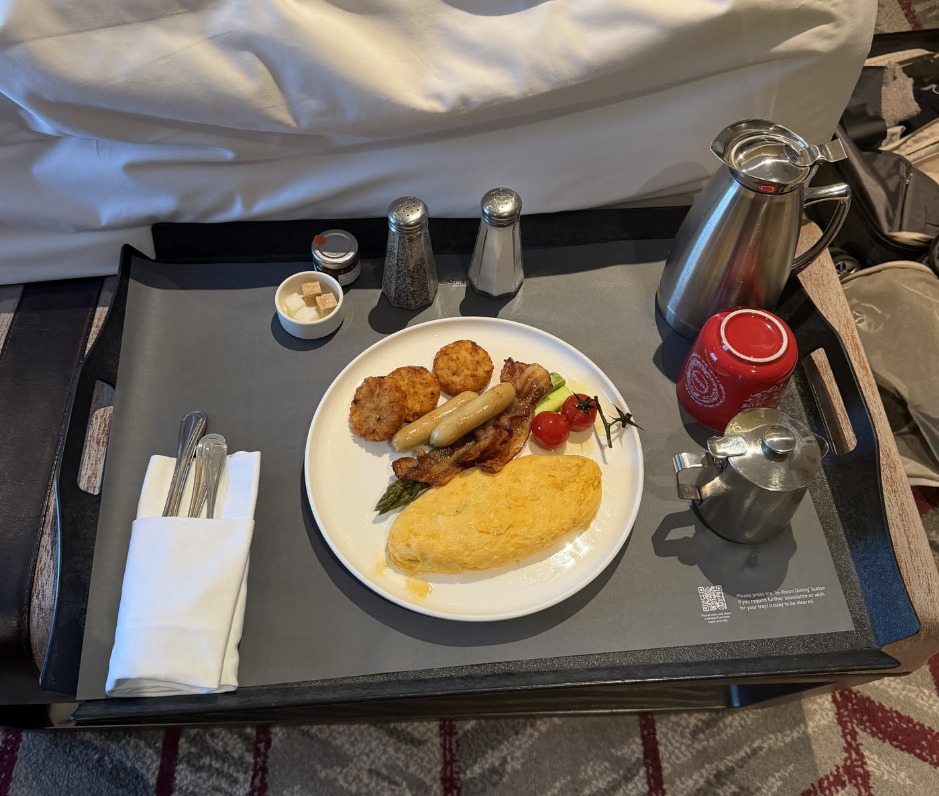

I managed to find some time to visit some of the Pokemon/hobby card stores in Singapore, and I was not surprised to find that there is also a scalper culture here too. Which effectively drove up the prices.

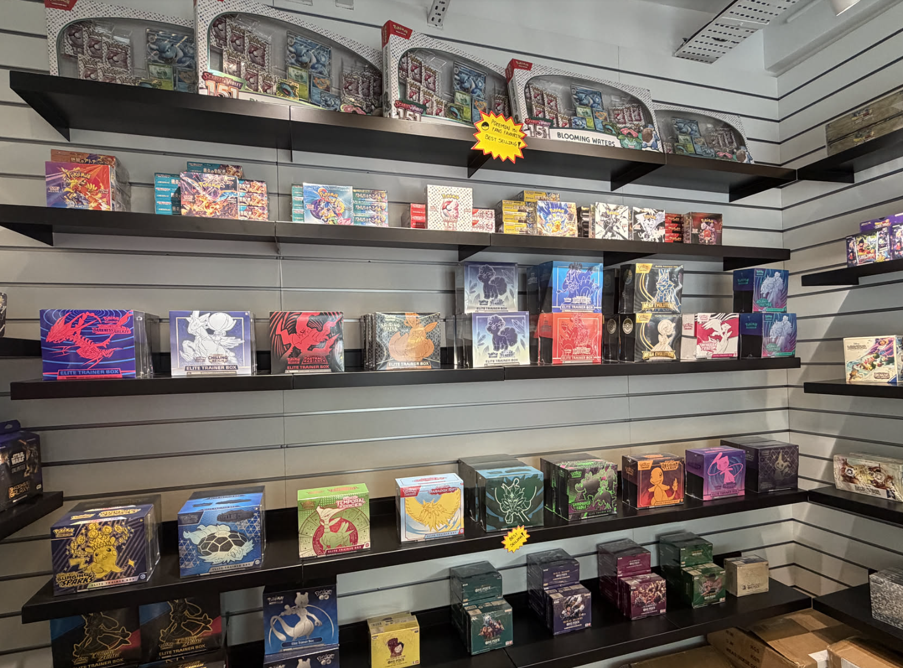

Cool room hub ad I found

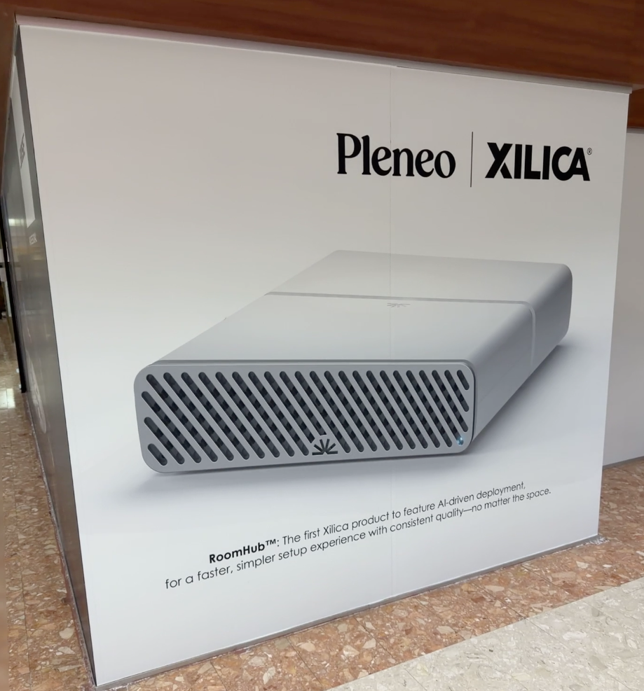

View from a top floor of the main Singapore library

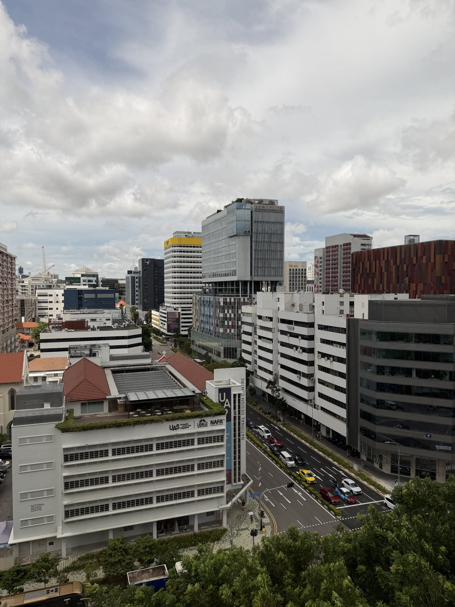
