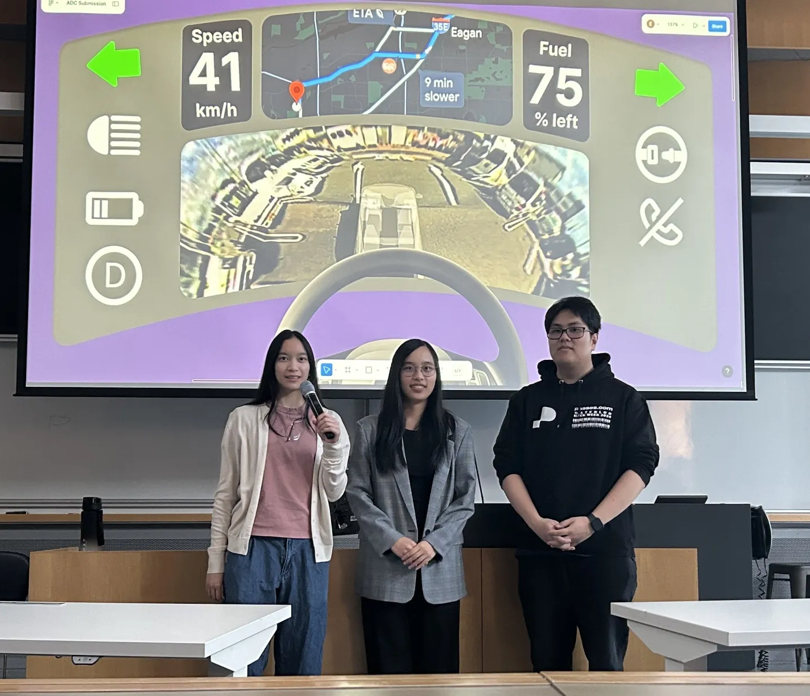
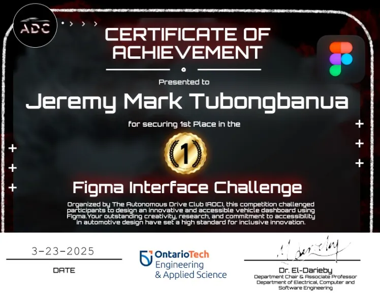

## Summary

I teamed up with my sister (Jeska) and friend Emily for this short competition. The competition (from my memory) only lasted a couple of hours. This was after exams so me and my team were more than willing to participate in this competition.

We were honestly shocked that we won. We asked the judges afterwards what they liked about ours and it was the accessibility consideration that went into it as well as the research. 

During the competition, the only thing I was focused on was the final product, and was confident that a final product would win. But the more I do hackathons, the more I realize it's actually more important to hit all points in the judging criteria and focus more on quality of presentation rather than the final product itself.

## Links

- [Award](/site/src/pages/index/awards/adc_figma_2025/)

## My teammates' posts

- [Jeska LinkedIn Post](https://www.linkedin.com/feed/update/urn:li:activity:7310692618261196801/?utm_source=share&utm_medium=member_desktop&rcm=ACoAADTZZtwBlltMyxapONmi3aGKyNzKw47Wgm4)

- [Emily LinkedIn Post](https://www.linkedin.com/feed/update/urn:li:activity:7311120403198877696/?utm_source=share&utm_medium=member_desktop&rcm=ACoAADTZZtwBlltMyxapONmi3aGKyNzKw47Wgm4)

## Photo of us

## Certificate

