## Experience

For arriving there, we were fortunate that Hack The North paid for multiple shuttle buses to bring people from all over Canada STRAIGHT to University of Waterloo. They had school buses arriving from places like Ottawa, Kingston, and of course Toronto. We had one shuttle bus going from the University of Toronto straight to Waterloo. So from ONtario Tech, we had to take a train ovfer to downtown Toronto in order to catch that.

Opening ceremonies was quite typical, but the sheer amount of just CRAZY companeis coming to present and advertise was astounding. Most of them were advertising their internship hiring postings. This doesn't surprise me because if you want the top talent in Canada, you would want to sponsor Hack The North and get the talent straight from the hackathon competitors.

Opening Ceremonies 

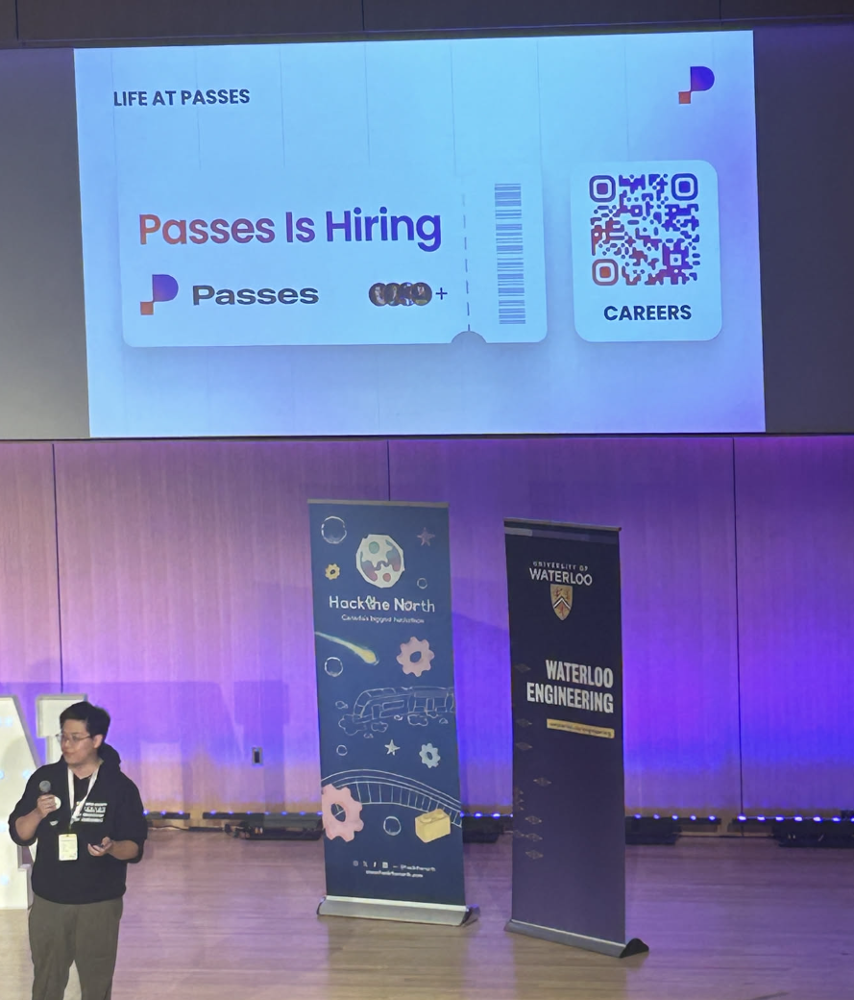

My badge

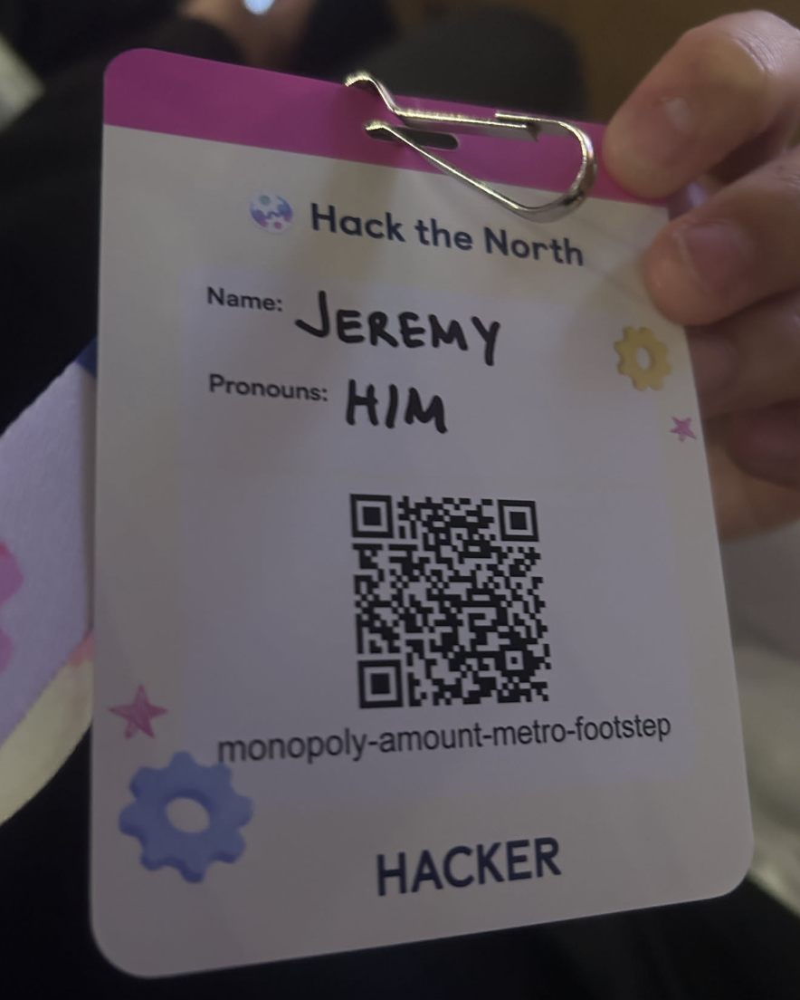

Stage

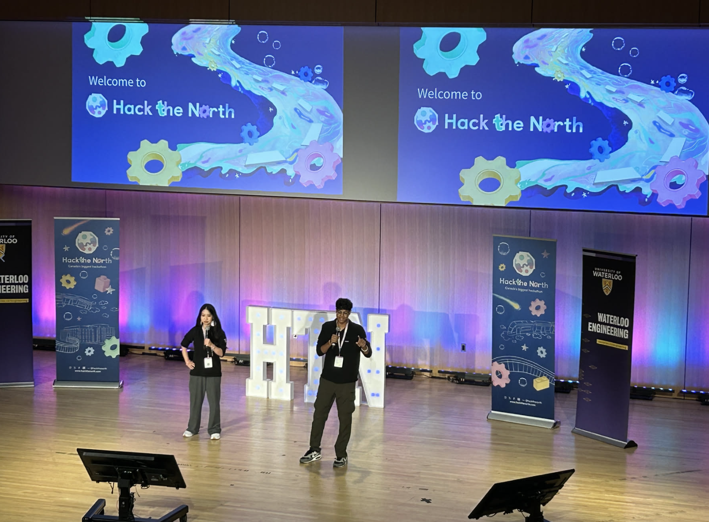

Man, to talk briefly on the experience I had at Hack The North, it was one of the best hackathons I've ever attended. Hack The North is notoriously the best hackathon to happen in Canada. Mainly because the sponsors they get is crazy. They have no problem funding food, that they have a "no pizza" policy, where any food they serve is NEVER pizza. All food was professionally catered and all tasted VERY good. They had food trucks come in at night and serve us soup and ice cream, professional catering, and more!

Ice cream sandwich

I grabbed a BUNCH of free beanies.

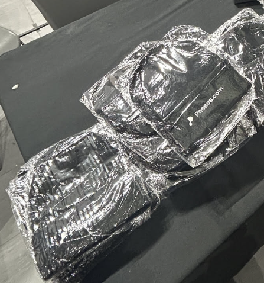

They had a free 3D printing service for competitors. Hardware hacks became a common trend in post COVID-19 hackathons. I asked them to print me a benchy for fun. They printed it with supports and it didn't turn out that great, but it's a great memory to keep and it has some character to it.

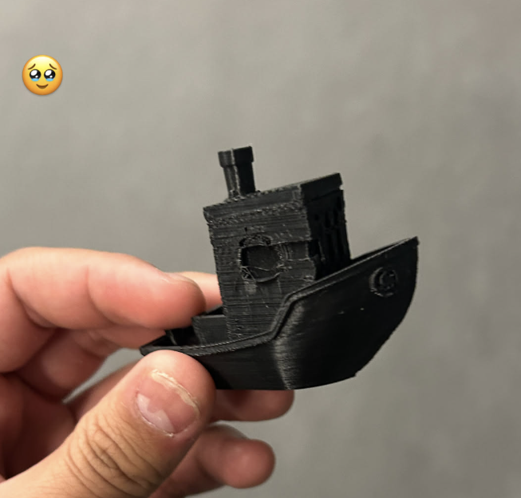

Their 3D printing lab was beautiful, with Prusa Mk3s and Mk4s, and some Bambu Lab X1Cs

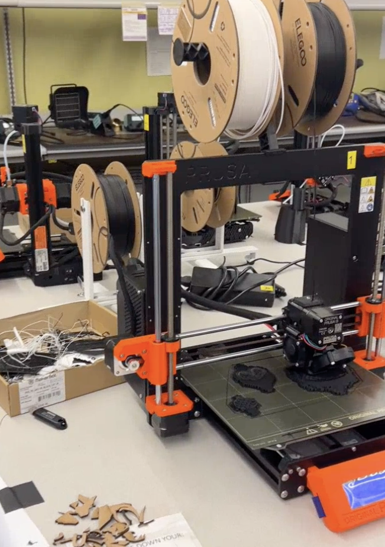

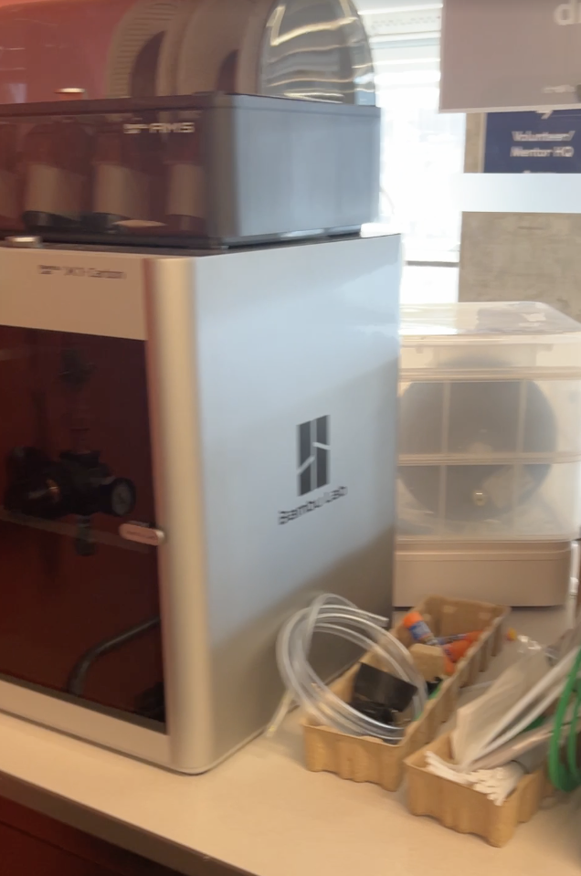

Their 3D printing shelf

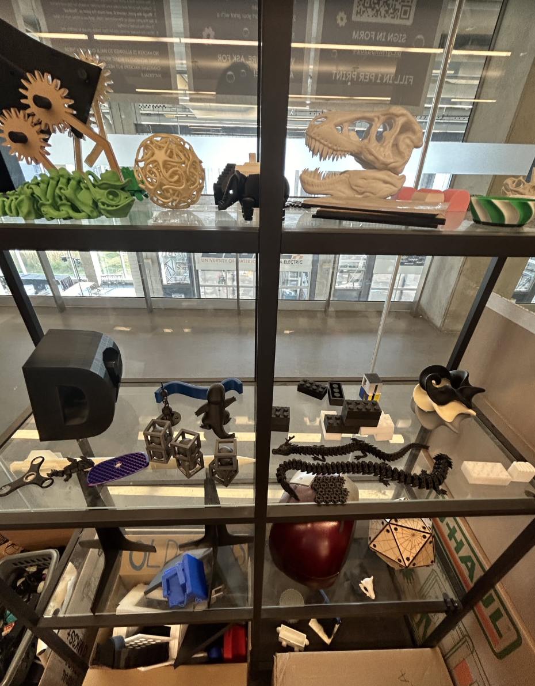

HTN 3D Printing Lab sign

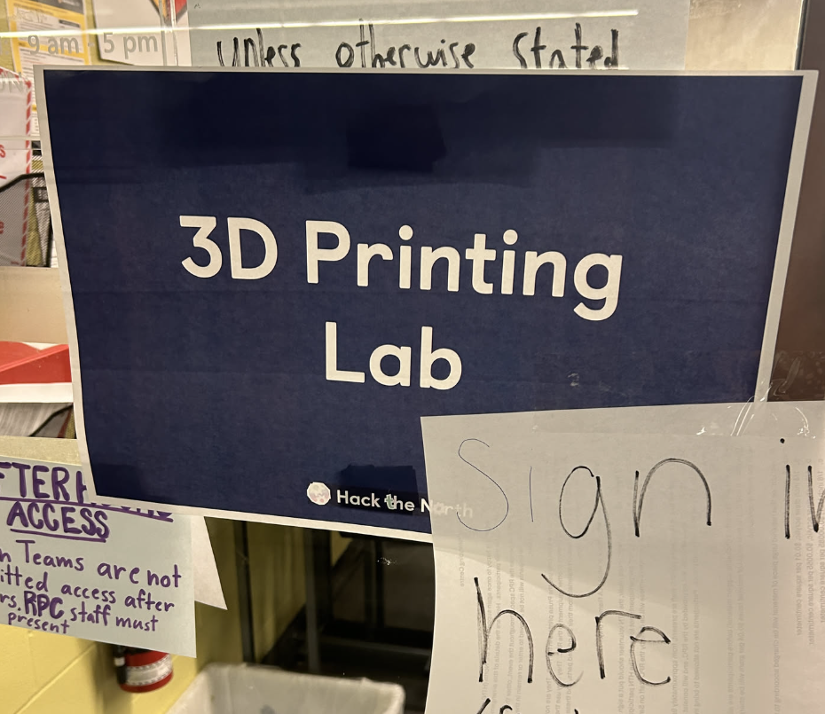

Hardware hub was sponsored by Shopify

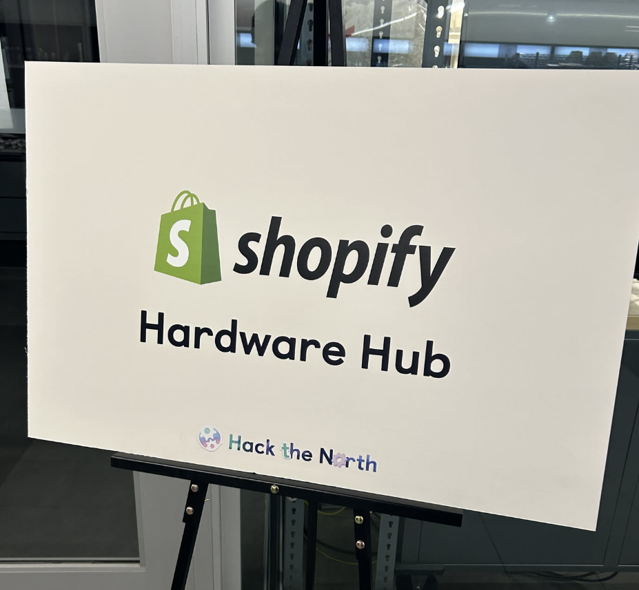

## Gallery

The end haul

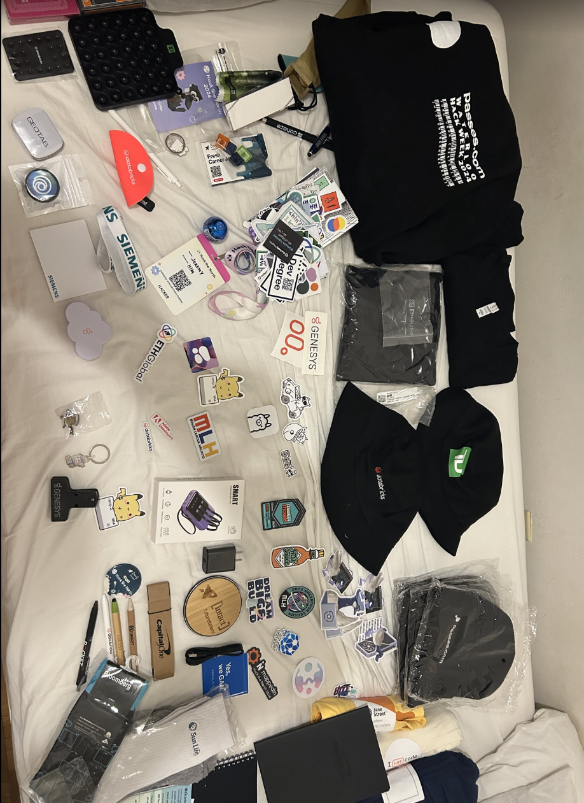

Cool Lego Goose

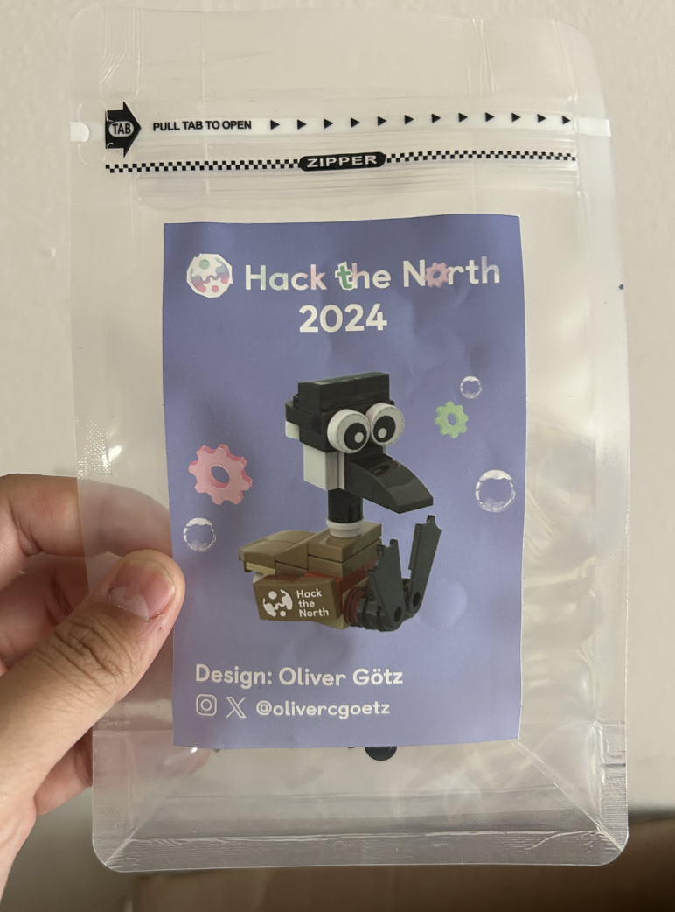

## Links

- [Project Link](/index/projects/connect_py/)
