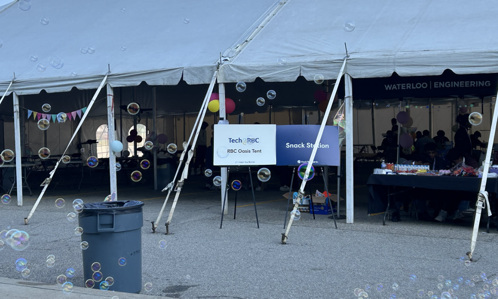
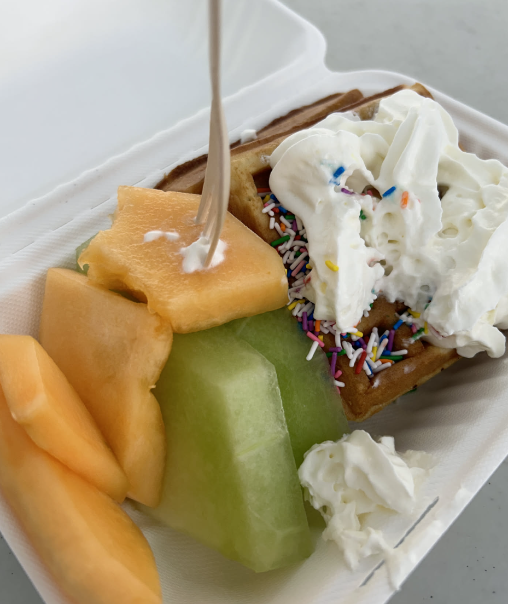

## Summary

Man, to talk briefly on the experience I had at Hack The North, it was one of the best hackathons I've ever attended. Hack The North is notoriously the best hackathon to happen in Canada. Mainly because the sponsors they get is crazy. They have no problem funding food, that they have a "no pizza" policy, where any food they serve is NEVER pizza. All food was professionally catered and all tasted VERY good. They had food trucks come in at night and serve us soup and ice cream, professional catering, and more!

Ice cream sandwich

## Gallery

## Links

- [Project Link](/index/projects/connect_py/)
