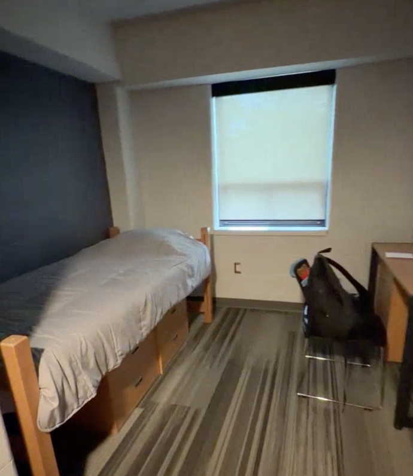
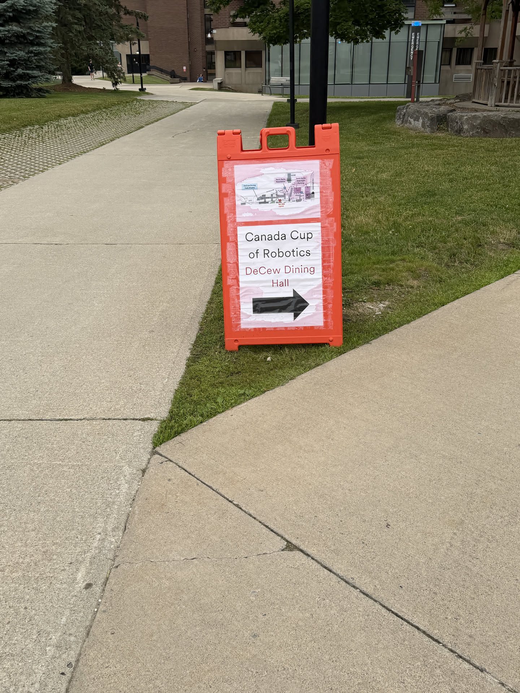
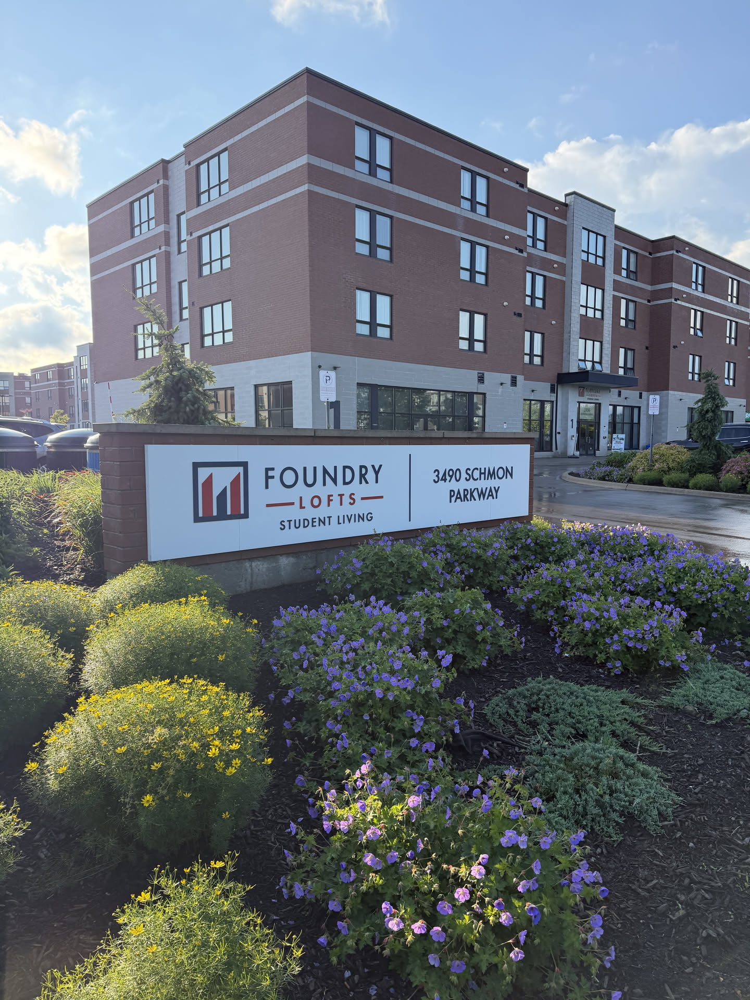
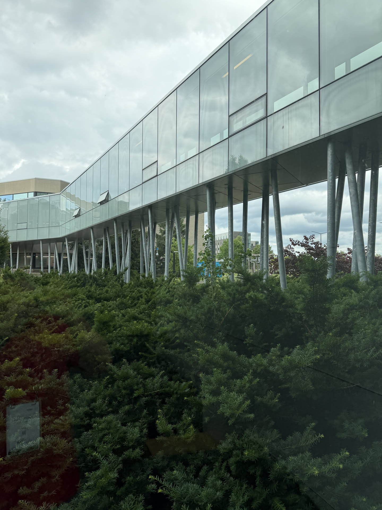
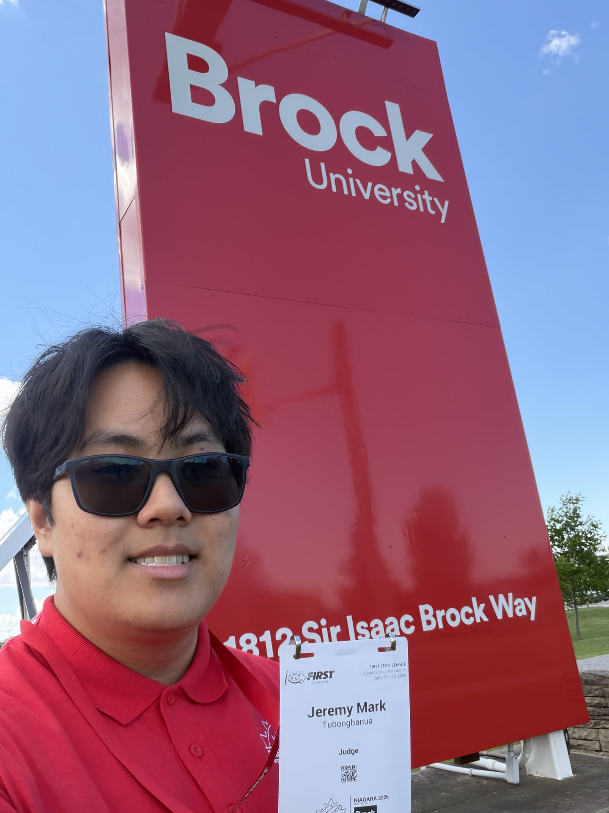
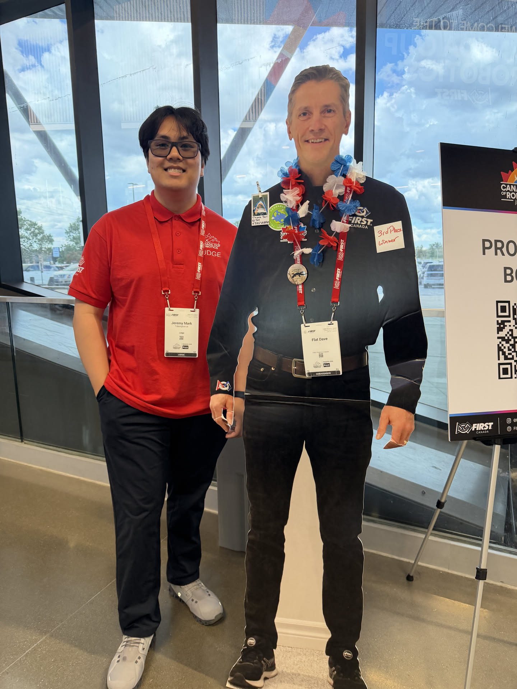
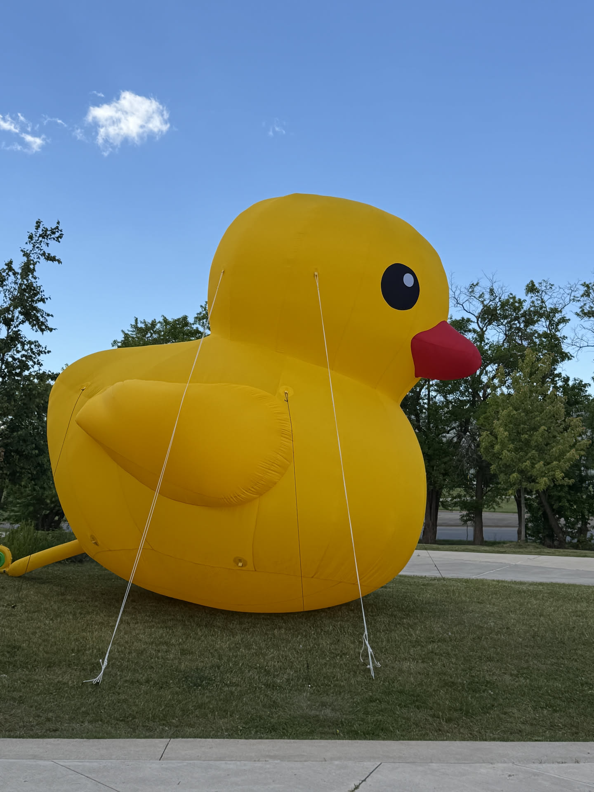

## Summary

From June 17 to 19, 2026, I had the opportunity to volunteer as a Judge at the FLL Canada Cup.

I paid ~$316 CAD for lodging at Residence 8 on Brock University (a student dormitory) for two nights. The $316 included access to the student meal plan at the DeCew residence. It included breakfast and dinner.

This competition is an open international compettion where teams from all across the world would come to compete in the FIRST Lego League challenge. Over 100 teams attended this event. Most were from the U.S., most were from Canada, and we had some teams come from places like Spain, France, and Mexico.

I soon found out that judges got fed separately, so most times, I would eat breakfast at the residence meal plan because I wanted to brush my teeth before arriving at the judges building. Then I would eat lunch at the judge's building since the meal plan was not serving lunch and it would be too much of a logistical issue to go back and forth throughout the day.

[FLL Canada Cup hosted by Brock University](https://firstroboticscanada.org/canadacupofrobotics/)

Overall, I had lots of fun judging the kid's innovation projects and robot designs as well as seeing familiar faces.

## First Day - June 17, 2026

The first day was mostly travel. I was very disappointed taking the Mega Bus to St. Catharines because my bus was delayed by over an hour, which means I had been waiting at Union Station for an hour and thirty minutes. I paid for a Mega Bus ticket to arrive at 2:30pm and arrive at St. Catharines by 3:40pm but ended up arriving to the venue at around 5:30pm, which was very disappointing because I had already missed opening ceremonies.

Alas, I arrived at the dormitory, which is where I was staying for the 2 nights.

An image of the one bed one bath dormitory where I was staying for the two nights.

In all honesty, the dormitory was better than I expected. Some nights, it felt like I was sleeping in a dungeon, but the AC was nice, it came with a desk and a chair, a window with functional and modern blinds, multiple drawers under teh bed, a wardrobe, and it came with a single bathroom. Most dormitories, you are sharing a bathroom with either another person (roommate) or with the entire floor.

When I arrived, I unpacked my things and went to the dining hall.

I did not take a picture of the food (I forgot and my nose was bleeding). But it tasted a lot like South Village's Dining Hall. They seemed to use the same ingredients. All else was pretty typical of a student dining hall. They had juice, coffee, and silverware that you had to put away in specific bins.

Overall, I'm lucky that I did not have to share a room or a washroom with another coach or person. The A/C was nice and strong given that it was pretty hot that day. I got one pillow and 3 blankets of varying thickness. 

## Second Day - June 18, 2026

After taking a shower, I realized I forgot my deodorant at home. So like any sane person, I searched up for convenient stores on Google Maps. I had to be at the judge's building by 8:00 AM for a introduction and orientation session. I found an Aisle 24 that was near the Foundry Lofts student living area and went to that. At Ontario Tech, we had an Aisle 24 so I was already aware that I had to download the app to open the door. Aisle 24 is a 24/7 convenience store where yo have to login to the app to open the door. There's no cashier, so you have to pick your items and self checkout. You'll mainly see Aisle 24s in condense cities or near student areas like on-campus or near student living areas. In this case, this Aisle 24 happened to be near Foundry Lofts. We had a Foundry at Ontario Tech as well, so I guess it is an infamous student living company.

After leaving the Aisle 24 with my item, I went straight to the dining hall to eat breakfast. I only had 5 minutes to eat breakfast or else I'd be late to the judging orientation. I ate two plates of eggs and ham yum,,

I ended up arriving 15 minutes late, but the judge advisor was going over information that I was already familiar, so I didn't really miss much.

Campus Window

The day went something like this:

- 9AM-12PM judging teams
- 12PM-1PM lunch
- 1PM-3PM judging teams

Since there were 100 teams at this event, each judging pod (a pod is a team of 2-4 judges) ended up seeing ~12 teams each. Each team gets 30 minutes to present their innovation project and robot design to the judges and then once the team leaves, the judges spend an additional 15 minutes discussing the scores they should give to that team.

Luckily, my pod had a couple of breaks where we would not get a team in a time slot where other pods did have a team during that time slot. So we had some time to breathe, go through our feedback, and ensure teams got scored accurately and an adequate amount of feedback.

Extra context: a judging pod has to each indvidually fill out an Innovation Project rubric and Robot Design rubric. Each rubric contains scores from 1-4 in different areas like "ideate", "create", "communicate", etc,. Then there is one consolidate "Judging Session Feedback" form where as a pod, write down what we liked and wat the team should work on for next season.

Once the day was over, I went back the dormitory and accidentally took a 3 hour nap. The day was exhausting because it had been 6 hours of straight listening to teams. I ended up missing the dinner window period (5-8PM) and so when I woke up at 8PM, I decided to walk to the DeCew dining hall and try my luck anyways. Luckily, the dining hall staff were cleaning up and encouraged me to take a take out box back home since there was still many leftovers.

After eating, I wrapped up the day taking calls and replying to emails on my laptop and fell asleep for the night.

## Third Day - June 19, 2026

On the second day, it was only judging in the morning (9AM-12PM), then lunch 12PM-1PM, then from 1PM-3PM, it was instead judge deliberation time.

Judge Deliberation is when all judging pods (who have inputted all of their scores in the online FLL Nexus system) and come together and decide which teams win what award. This is a confidential time where we discuss which teams should win what awards. There were a lot of awards given such as teh Champion's Award (the most prestiouge award) and other side core awards like Robot Design, Innovation Project, and Core Values. There are also other nominated awards like Rising All-star which is given to a team that the judges expect greater things from in the future.

Once deliberation was finished, I took this time to take some pictures:

Me in front of the Brock University sign:

Me with Flat Dave

Rubber Ducky floatie thing in front of the Canada Games Park

I then took a MegaBus back to Union station and then a Go train to get back home. During the mega bus trip back, our bus driver told us an extra one hour delay to arriving to Union Station. This was because of the traffic, I beleive from the FIFA stuff that's been happening downtown. Now that I recall, one of the judges was watching FIFA during deliberation and I later found out it was because Canada was playing at the very field that we drove by. The MegaBus had to drive THROUGH the traffic where the FIFA game was happening in which Canada was playing in, so this delay made a lot of sense.

Big thank you to Judge Advisor Calum for managing all of the judge volunteers.
