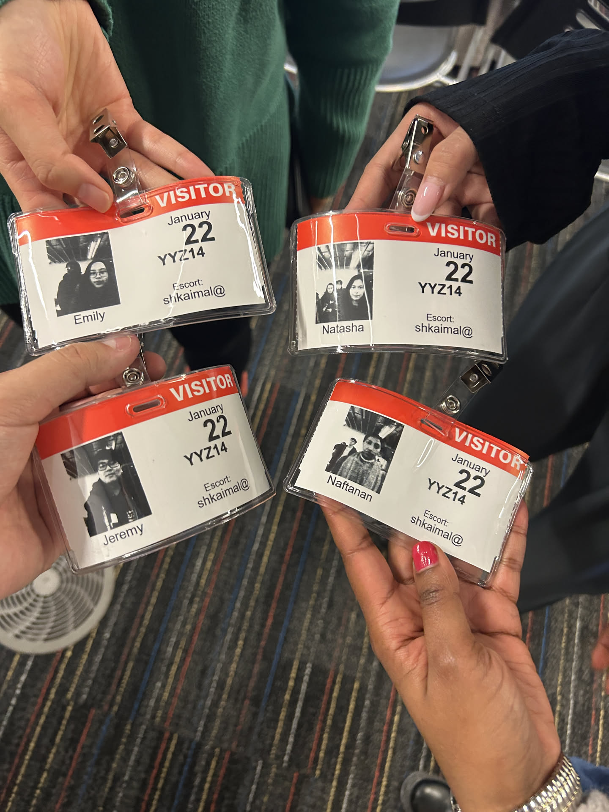
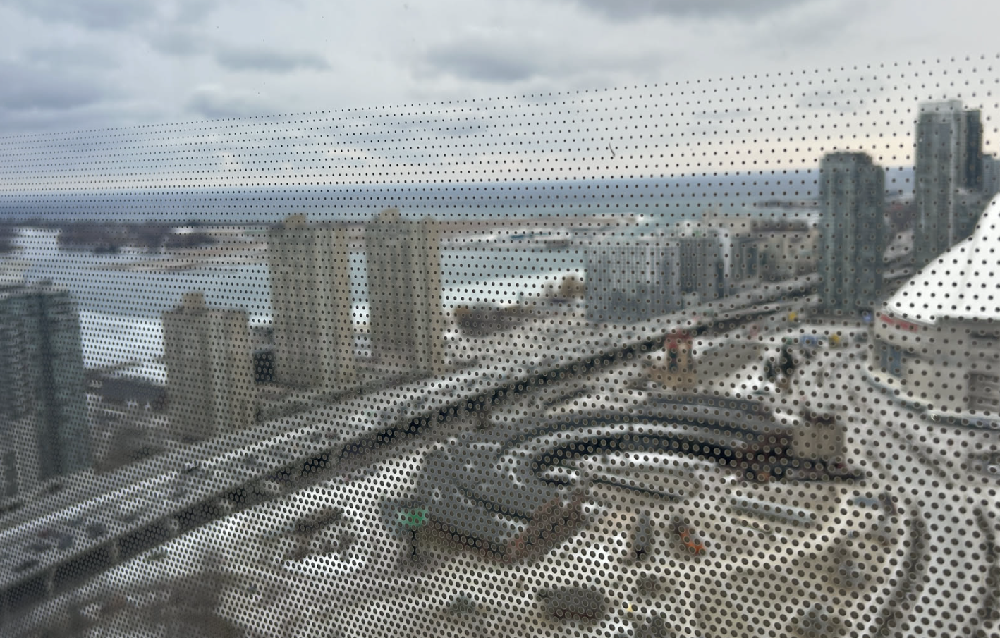

## Links

- [Amazon Award](/index/awards/amazon_tour_2024/)

## Summary

As part of Ontario Tech's co-op program, we got the opportunity to go on a career bus field trip to the Amazon office in downtown Toronto. This was an event that only a select few could sign up for.

Badges of my friends

Office view

