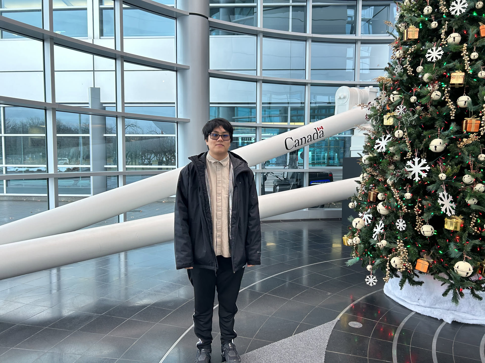
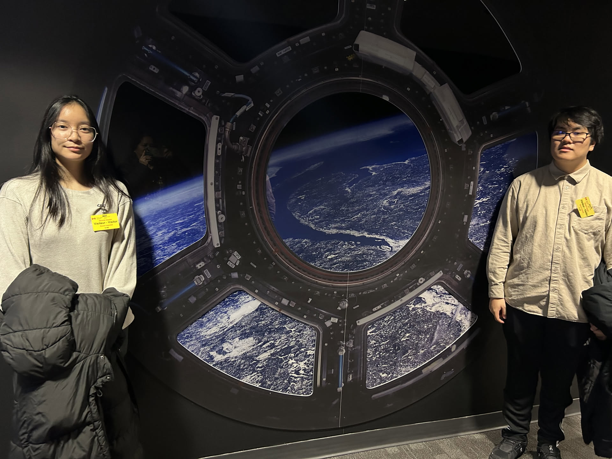
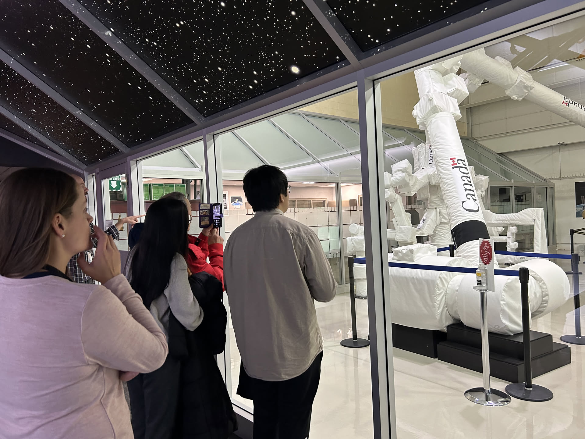
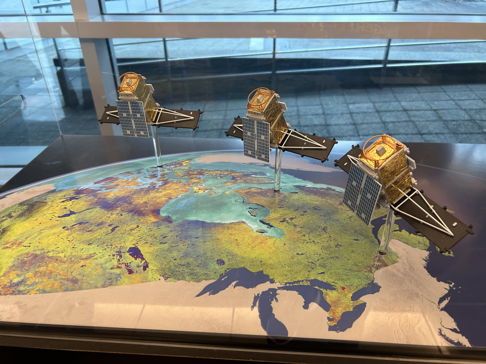
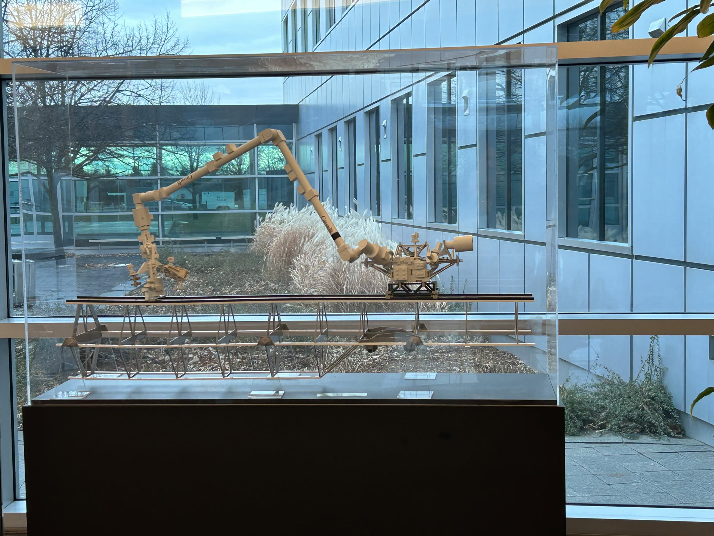
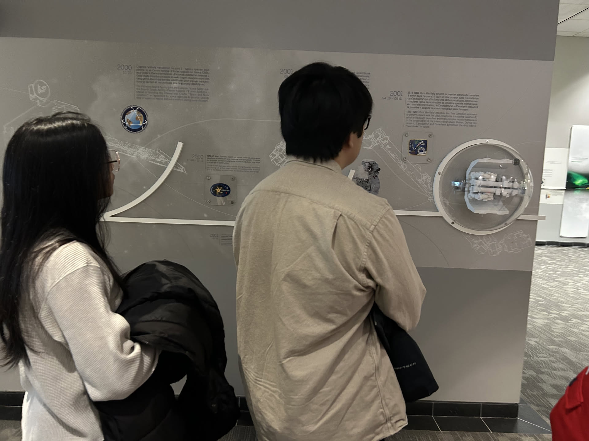
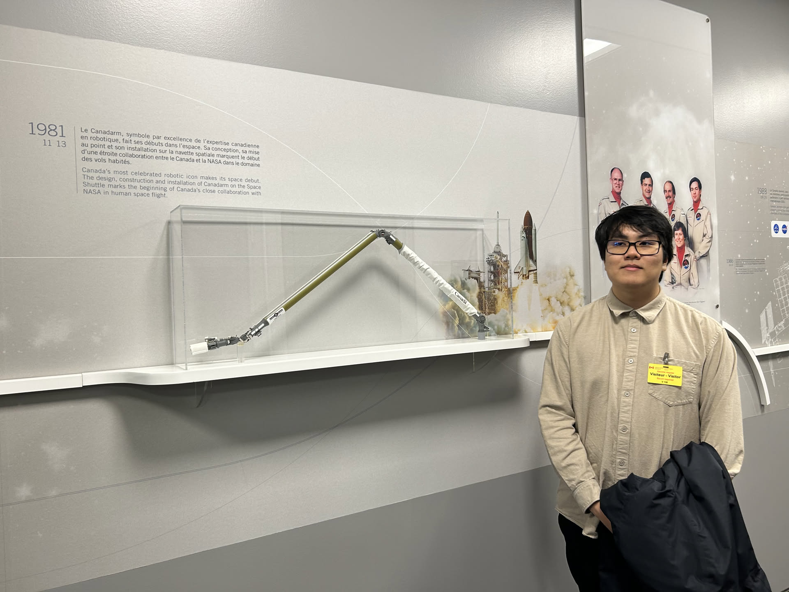
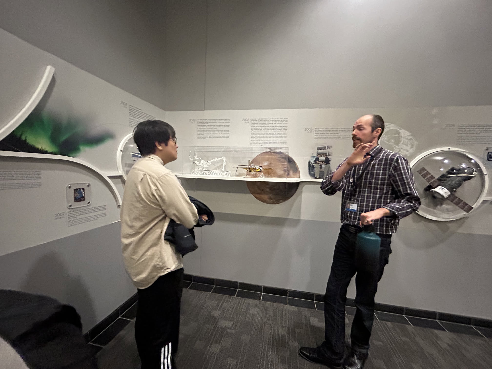

## Links

- [NASA Space Apps 2024 Award](/index/awards/nasa_space_apps_2025/)

## Summary

Upon winning the [NASA Space Apps 2024 Award](/index/awards/nasa_space_apps_2025/), I was invited to visit the Canadian Space Agency (CSA) for a tour. I was also given an internship offer but did not choose to accept.

Me and my family just happened to be visiting Montreal on a whim, I decided to ask our CSA connections for a tour. One of the hackathon judges was also an employee of the CSA which is how I made that connection.

## Gallery

Me with Canadarm and christmas tree. We were visiting in December, so it was nice to see a christmas tree at the entrance of their office!

Me and my sister

Us looking at 1:1 Canadarm to scale

RADARSAT constellation

Canadarm model

Me and my sister reading the wall

Me in front model

Me talking to our Tour guide

