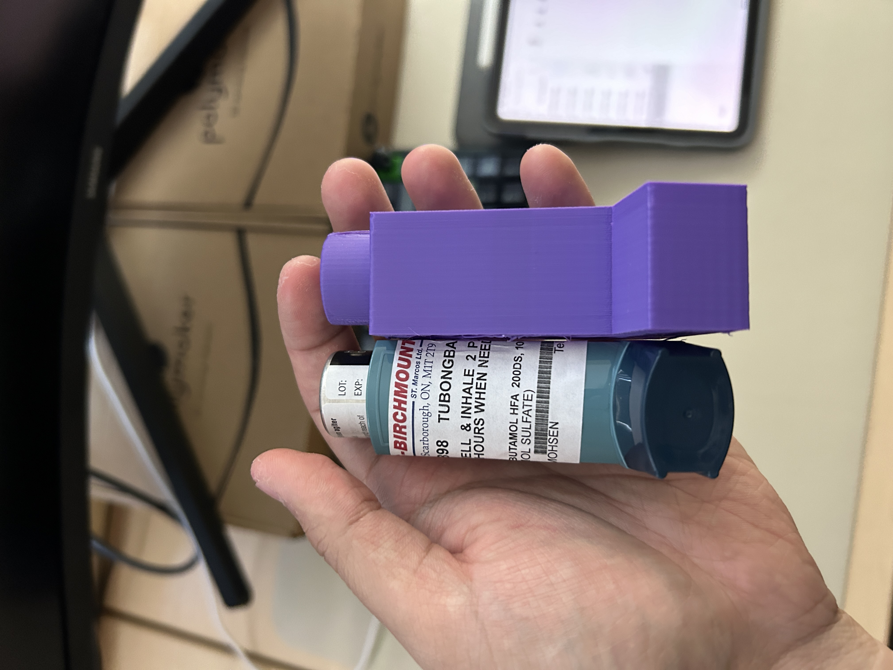
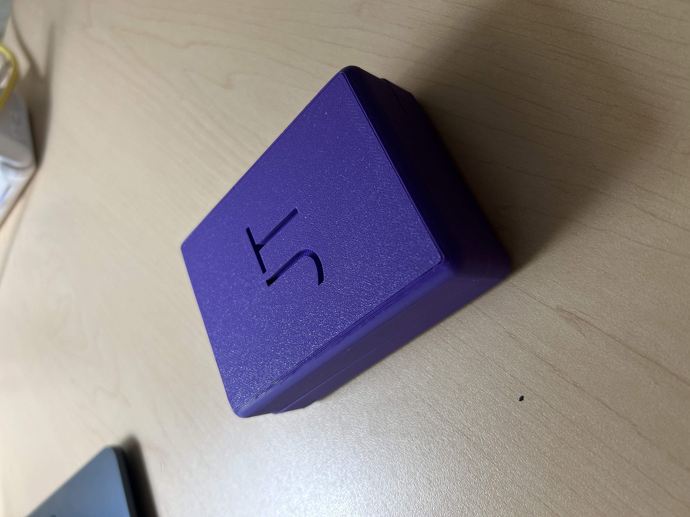
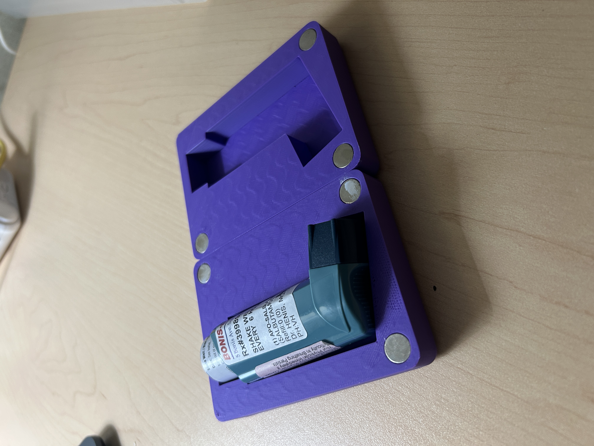
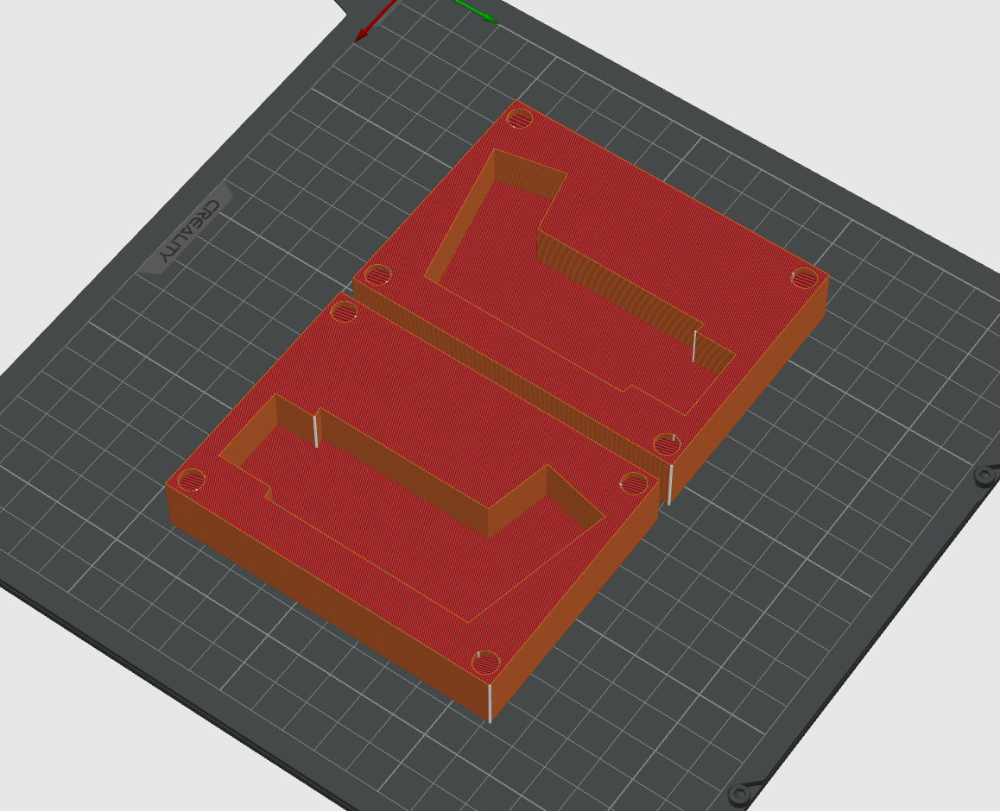

## Custom Inhaler Case

I have exercise-induced asthma and thought that I decide my own case.

### Volume

First thing I did is CAD the rough volume of the inhaler:

Then I simply subtracted that volume from a cube (which is the case)

### Outer case

### Inside

### CAD

