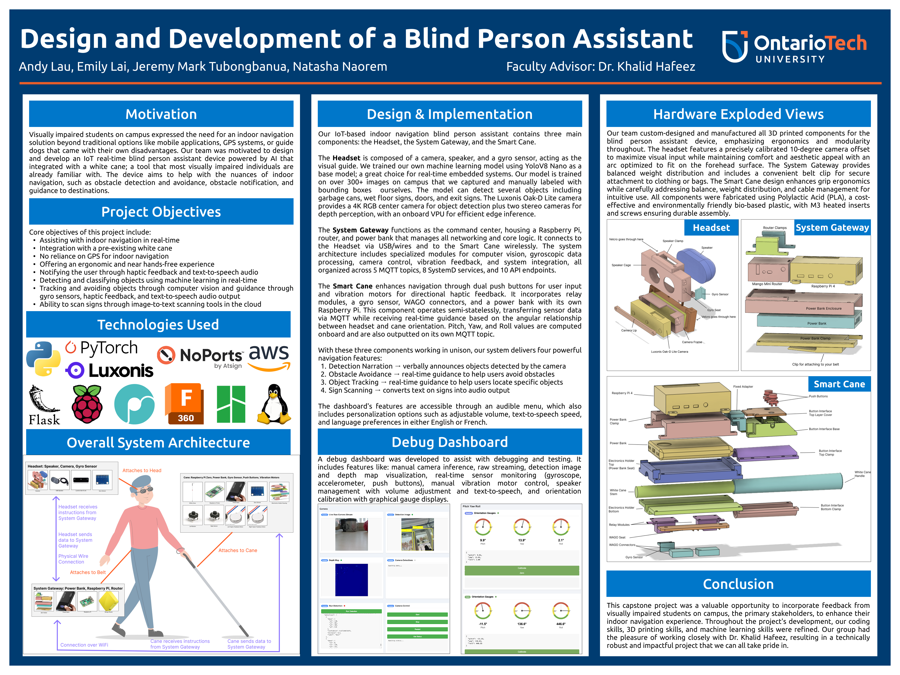
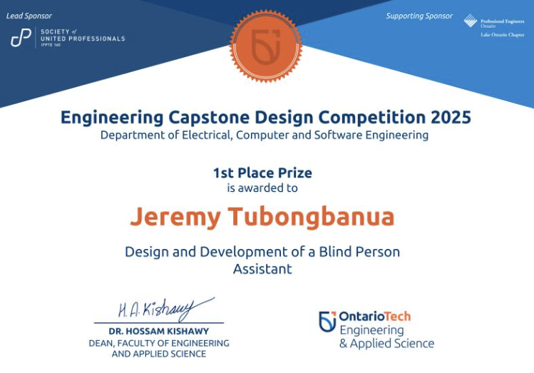
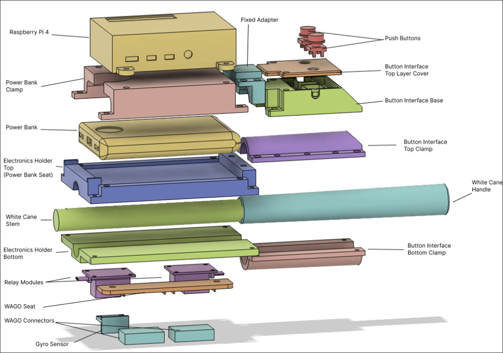
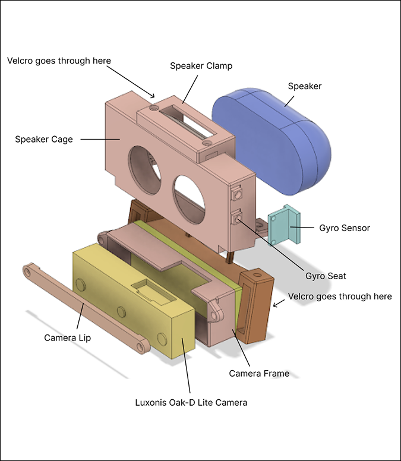
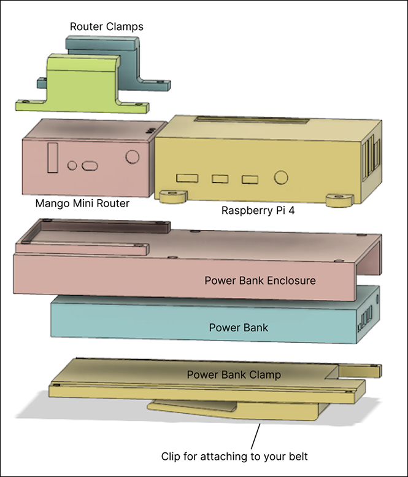

# Blind Person Assistant

## Links

- Source code: <https://github.com/JeremyTubongbanua/blind_person_assistant>
- 3 minute video: <https://www.youtube.com/watch?v=-XyYb4GPD1U>
- Official Ontario Tech Website: <https://engineering.ontariotechu.ca/current-students/current-undergraduate/capstone/2025-ecse-capstone-projects.php>

## Description

8-month long capstone project for Ontario Tech University Engineering capstone course.

Won 1st place among 32 other capstone projects at the annual ESCE capstone exhibition.

The [GitHub README](https://github.com/JeremyTubongbanua/blind_person_assistant?tab=readme-ov-file#blind_person_assistant) is very comprehensive, so I recommend going there.

## Gallery

