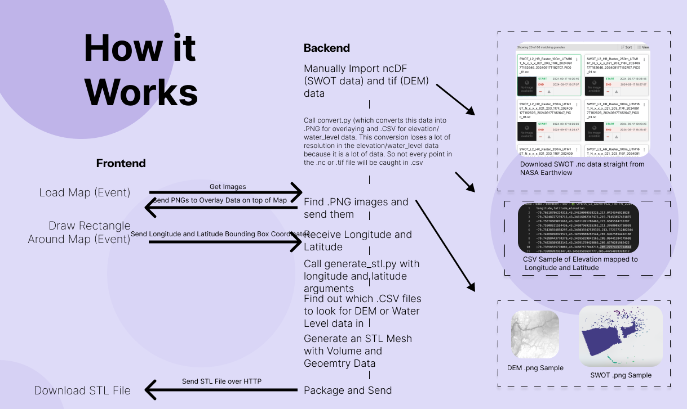
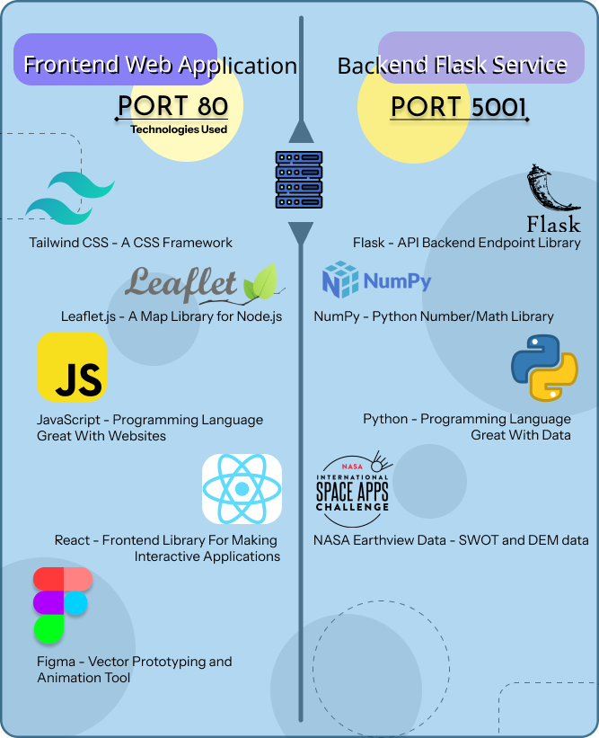
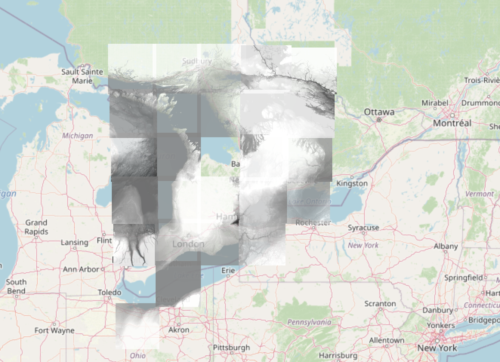
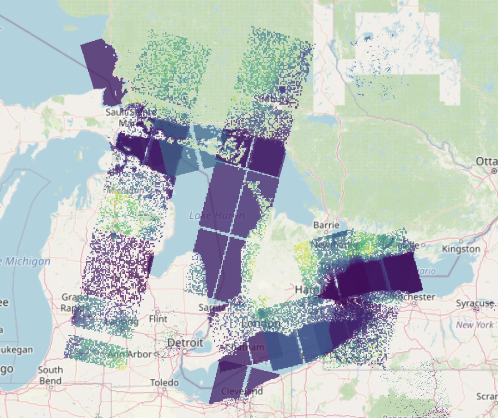
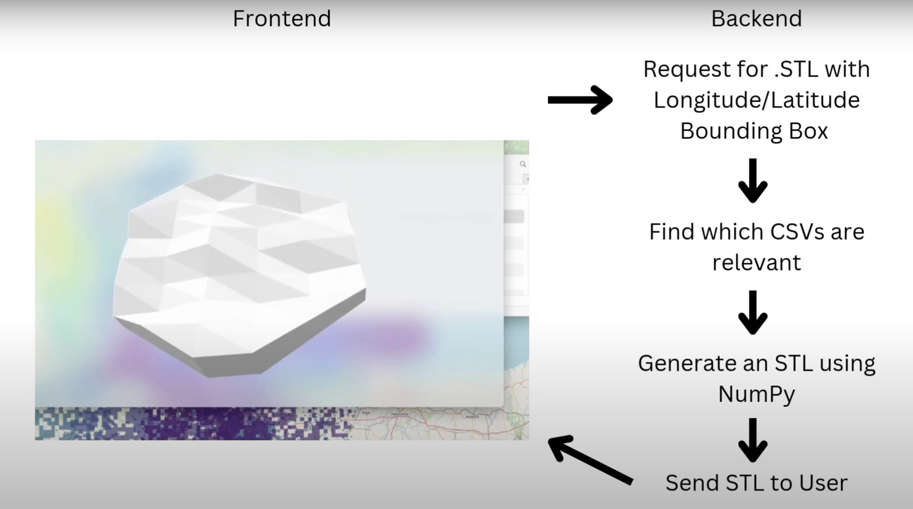

# Mapping X

Draw a rectangle on the map and a 3D printable STL mesh will be generated from DEM and/or SWOT data taken from open-source NASA Earthview Satellite data.

## Links

- GitHub Repo - <https://github.com/JeremyTubongbanua/nasa_space_apps_2024/>
- LinkedIn Post - <https://www.linkedin.com/posts/jeremy-tubongbanua_github-jeremytubongbanuanasaspaceapps-activity-7274621459656843264-T-qr?utm_source=share&utm_medium=member_desktop&rcm=ACoAADTZZtwBlltMyxapONmi3aGKyNzKw47Wgm4>
- 1st Place Award - [certificate](/awards/nasa_space_apps_2024/)
- Long form video (5 minutes) - <https://www.youtube.com/watch?v=ficv-n9h3qk>
- Short form video (30 seconds) - <https://www.youtube.com/watch?v=AShcmuF7qmU>

## Gallery

