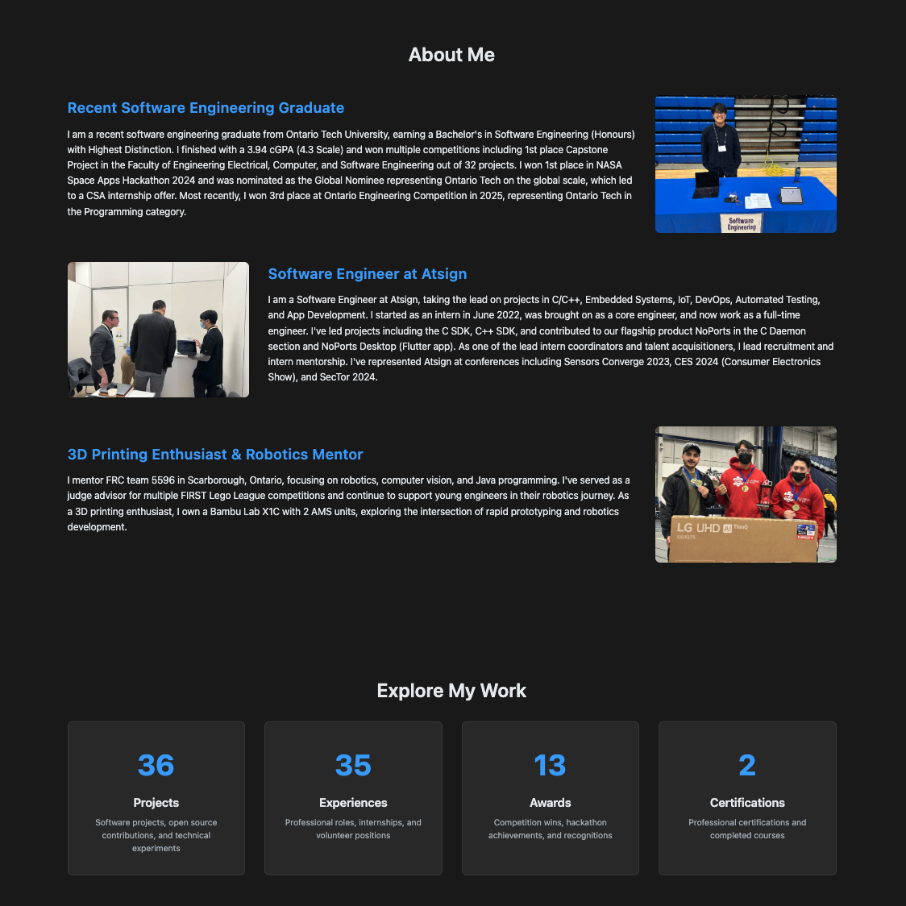
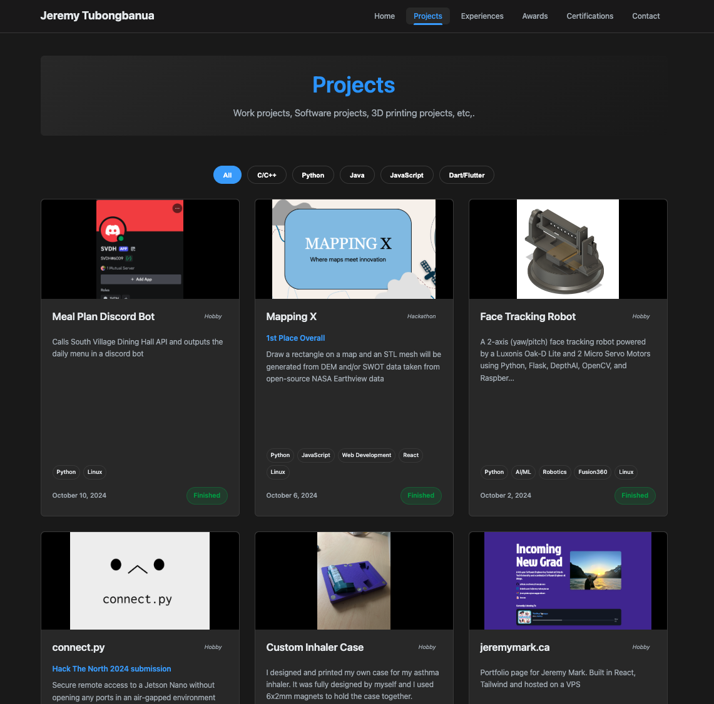
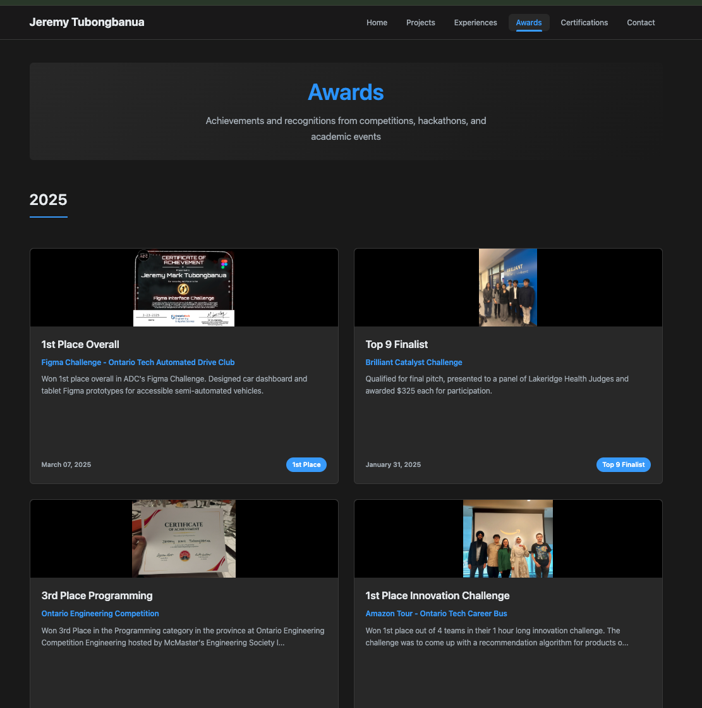
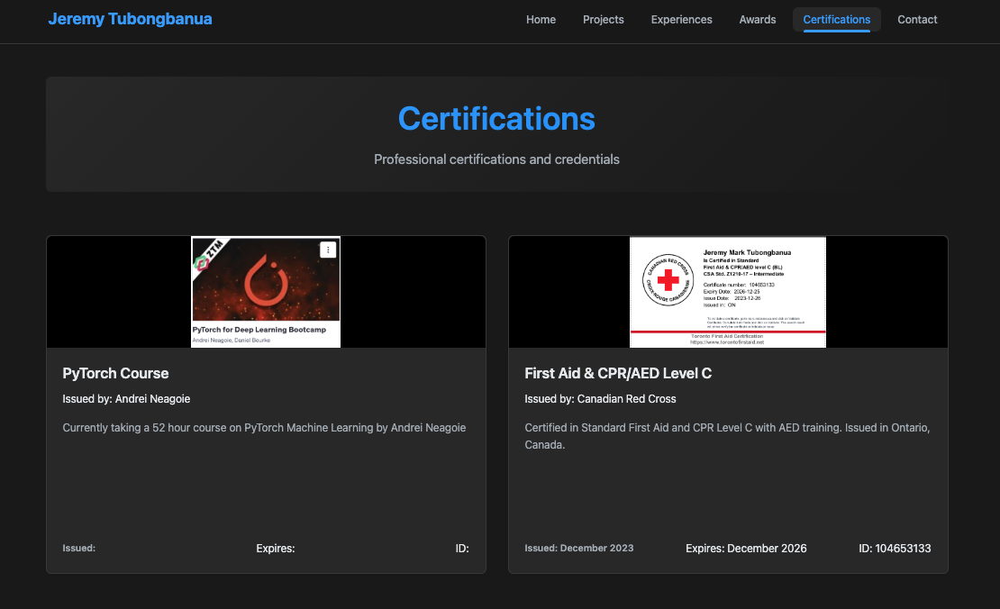

# old-jeremytubongbanua.github.io

## About

This is the 2nd iteration of my portfolio website.

My first iteration can be found [here](https://github.com/JeremyTubongbanua/jeremymark_ca) and my second iteration can be found [here](https://github.com/JeremyTubongbanua/old-portfolio-2)

## Links

- [2nd Iteration - Old Portfolio GitHub Repository](https://github.com/JeremyTubongbanua/old-jeremytubongbanua.github.io)

## Gallery

<!--  -->
<!---->
<!--  -->
<!---->
<!---->
<!--  -->
<!---->
<!---->
<!--  -->
<!---->
<!---->
<!--  -->

